<div class="absolute inset-0 bg-gradient-to-br from-[#0d1117] via-[#0d1117] to-[#0f1c29]"></div>

<div class="relative z-10">
  <p class="font-mono text-sm text-[#7ee787] mb-6">$ psql -c "SELECT ... FROM students JOIN courses ON ..."</p>
  <h1 class="text-5xl">
    <span class="accent-brand">SQL</span>
    <span class="text-white"> JOIN</span>
  </h1>
  <p class="mt-4 text-xl text-gray-300 font-mono">
    <span class="muted">//</span> 把兩張表橫向拼起來的五種姿勢
  </p>
  <div class="mt-14 grid grid-cols-5 gap-3 font-mono text-sm text-center">
    <div class="concept-card"><strong>INNER</strong><br><span class="muted">交集</span></div>
    <div class="concept-card"><strong>LEFT</strong><br><span class="muted">保留左表</span></div>
    <div class="concept-card"><strong>RIGHT</strong><br><span class="muted">保留右表</span></div>
    <div class="concept-card"><strong>FULL</strong><br><span class="muted">聯集</span></div>
    <div class="concept-card"><strong>CROSS</strong><br><span class="muted">笛卡爾積</span></div>
  </div>
</div>

<!--
開場：JOIN 是關聯式資料庫最強大的功能——根據共同欄位把相關資料組合起來。
全程用「學生／選課」兩張表。預計 35–45 分鐘。
-->

---
layout: default
hideInToc: true
---

<p class="font-mono text-xs text-gray-500"><span class="accent-green">$</span> cat query-plan.md</p>

# 今日路線

<div class="grid grid-cols-2 gap-4 mt-7">
  <div v-click class="concept-card"><strong>01 / 五種 JOIN</strong><br><span class="muted">交集、保左、保右、聯集、全組合</span></div>
  <div v-click class="concept-card"><strong>02 / 決策</strong><br><span class="muted">比較表與決策樹</span></div>
  <div v-click class="concept-card"><strong>03 / 經典陷阱</strong><br><span class="muted">ON vs WHERE 的差異</span></div>
  <div v-click class="concept-card"><strong>04 / 實戰</strong><br><span class="muted">多對多、效能、最佳實踐</span></div>
</div>

<div v-click class="mt-6 terminal-card text-sm">
  <span class="accent-orange">快速判斷法：</span>「右表沒匹配時，左表的資料還要顯示嗎？」要 = LEFT，不要 = INNER。
</div>

---
layout: section
transition: fade
---

<p class="font-mono accent-orange">PART 01</p>

# 五種 JOIN

<p class="font-mono muted">學生表 ID: 1,2,3,4 × 選課表 ID: 2,3,5</p>

---
layout: two-cols
layoutClass: gap-7
---

# INNER JOIN：找交集

```sql
SELECT
    s.student_id,
    s.name AS student_name,
    c.course_name
FROM students AS s
INNER JOIN courses AS c
    ON s.student_id = c.student_id;
```

<div v-click class="mt-4 concept-card text-sm">
  <strong>比喻</strong><br>
  <span class="muted">「既註冊又選課」的學生才出現——像數學的交集</span>
</div>

::right::

<div class="terminal-card mt-14">
  <p class="terminal-label">RESULT SET</p>
  <div>學生表 ID：1, 2, 3, 4</div>
  <div>選課表 ID：2, 3, 5</div>
  <div v-click class="mt-3 accent-green">→ 結果只剩 ID：2, 3</div>
  <div v-click class="mt-3">✗ 沒選課的學生（1, 4）不見了</div>
  <div v-click>✗ 沒人選的課程（5）也不見了</div>
</div>

---
layout: two-cols
layoutClass: gap-7
---

# LEFT JOIN：保留左表全部

```sql
SELECT
    s.name,
    c.course_name,
    CASE
        WHEN c.course_name IS NULL
        THEN '未選課' ELSE '已選課'
    END AS status
FROM students AS s
LEFT JOIN courses AS c
    ON s.student_id = c.student_id;
```

::right::

<div class="terminal-card mt-14">
  <p class="terminal-label">RESULT SET</p>
  <div v-click>→ 結果：ID 1, 2, 3, 4 <span class="accent-green">全部保留</span></div>
  <div v-click>→ 1 和 4 的課程欄位是 <span class="accent-orange">NULL</span></div>
</div>

<div v-click class="mt-4 concept-card text-sm">
  <strong>比喻</strong><br>
  <span class="muted">老師統計「所有學生」的選課狀況——沒選課的也要列在名單上</span>
</div>

---
---

# LEFT JOIN 的兩大絕活

<div class="grid grid-cols-2 gap-5 mt-6">
<div v-click>

**絕活 1：找出「沒有」的資料**

```sql
SELECT c.customer_name
FROM customers c
LEFT JOIN orders o
    ON c.customer_id = o.customer_id
WHERE o.order_id IS NULL;
-- 沒有訂單的客戶
```

</div>
<div v-click>

**絕活 2：統計關聯數量**

```sql
SELECT s.name,
       COUNT(c.course_id) AS course_count
FROM students s
LEFT JOIN courses c
    ON s.student_id = c.student_id
GROUP BY s.student_id, s.name;
-- 沒選課的學生 count = 0
```

</div>
</div>

<div v-click class="mt-5 terminal-card text-sm">
  <span class="accent-brand">LEFT JOIN + IS NULL</span> 是資料完整性檢查的標準招式——INNER JOIN 做不到。
</div>

---
---

# RIGHT、FULL OUTER、CROSS

<div class="grid grid-cols-3 gap-4 mt-6 text-sm">
  <div v-click class="concept-card">
    <strong>RIGHT JOIN</strong><br>
    <span class="muted">保留右表全部。實務少用：<br><code>A LEFT JOIN B</code> ≡ <code>B RIGHT JOIN A</code>，統一用 LEFT 更好讀</span>
  </div>
  <div v-click class="concept-card">
    <strong>FULL OUTER JOIN</strong><br>
    <span class="muted">兩邊全保留，沒匹配補 NULL。<br><span class="accent-orange">MySQL 不支援</span>：用 LEFT ∪ RIGHT（UNION）模擬</span>
  </div>
  <div v-click class="concept-card">
    <strong>CROSS JOIN</strong><br>
    <span class="muted">笛卡爾積：3 筆 × 4 筆 = 12 筆。<br>合法用途：產生「尺寸 × 顏色」所有組合</span>
  </div>
</div>

<div v-click class="mt-6">

```sql
-- MySQL 模擬 FULL OUTER JOIN
SELECT * FROM students s LEFT JOIN courses c ON s.student_id = c.student_id
UNION
SELECT * FROM students s RIGHT JOIN courses c ON s.student_id = c.student_id;
```

</div>

---
layout: section
transition: fade
---

<p class="font-mono accent-orange">PART 02</p>

# 怎麼選？

<p class="font-mono muted">一張表 + 一棵決策樹</p>

---
---

# 五種 JOIN 一覽

| JOIN 類型 | 左表 | 右表 | 無匹配時 | 使用頻率 |
| --- | --- | --- | --- | --- |
| INNER JOIN | 有匹配的 | 有匹配的 | 不顯示 | ⭐⭐⭐⭐⭐ |
| LEFT JOIN | <strong>全部</strong> | 有匹配的 | 右表補 NULL | ⭐⭐⭐⭐⭐ |
| RIGHT JOIN | 有匹配的 | 全部 | 左表補 NULL | ⭐⭐ |
| FULL OUTER | 全部 | 全部 | 另一邊補 NULL | ⭐⭐ |
| CROSS JOIN | 全部 | 全部 | 產生所有組合 | ⭐ |

<div v-click class="mt-5 terminal-card text-sm">
  <span class="accent-green">$</span> 90% 的查詢只用得到 INNER 和 LEFT —— 先把這兩個練熟。
</div>

---
---

# 決策樹

```mermaid {theme: 'dark', scale: 0.6}
flowchart TD
    A[需要關聯兩個表格] --> B{要保留哪邊的資料?}
    B -->|只要有匹配的| C[INNER JOIN]
    B -->|保留左表全部| D[LEFT JOIN]
    B -->|保留所有資料| F[FULL OUTER JOIN]
    B -->|所有組合| G[CROSS JOIN]
    D --> H{要找沒匹配的?}
    H -->|是| I["+ WHERE 右表.欄位 IS NULL"]
    H -->|否| J[正常 LEFT JOIN]
    style C fill:#13251a,stroke:#7ee787
    style D fill:#13202a,stroke:#336791
    style I fill:#2d1c13,stroke:#e76f00
```



---
layout: section
transition: fade
---

<p class="font-mono accent-orange">PART 03</p>

# 經典陷阱：ON vs WHERE

<p class="font-mono muted">90% 的 LEFT JOIN bug 都在這</p>

---
---

<JoinQuiz />

<p class="print-answer hidden mt-4 text-sm">
  列印版答案：B。WHERE 在 JOIN 後過濾，NULL 列被濾掉，LEFT JOIN 退化成 INNER 效果。
</p>

<!--
先投票再揭示。這是 LEFT JOIN 最著名的陷阱。
-->

---
---

# 條件放哪裡，結果差很大

```sql {1-4|6-10|12-15|all}
-- ❌ WHERE：JOIN 完才過濾 → NULL 列被濾掉，變 INNER 效果
SELECT * FROM students s
LEFT JOIN courses c ON s.student_id = c.student_id
WHERE c.course_name = 'Math';   -- 只剩有修 Math 的學生

-- ✅ ON：JOIN 階段就過濾 → 所有學生保留
SELECT * FROM students s
LEFT JOIN courses c
    ON s.student_id = c.student_id
    AND c.course_name = 'Math';  -- 沒修 Math 的顯示 NULL

-- ✅ 要找「沒修課的學生」→ IS NULL 放 WHERE
SELECT * FROM students s
LEFT JOIN courses c ON s.student_id = c.student_id
WHERE c.student_id IS NULL;
```

<div v-click class="mt-4 terminal-card text-sm">
  <span class="accent-brand">ON</span> = JOIN 階段過濾；<span class="accent-orange">WHERE</span> = JOIN 完成後過濾。
</div>

---
layout: section
transition: fade
---

<p class="font-mono accent-orange">PART 04</p>

# 實戰

<p class="font-mono muted">多對多、效能、最佳實踐</p>

---
---

# 多對多：透過中介表

```sql {1-2|4-10|all}
-- 學生選課系統：多對多關係
-- students ← enrollments → courses

SELECT
    s.name AS student_name,
    c.course_name,
    e.enrollment_date
FROM students s
INNER JOIN enrollments e ON s.student_id = e.student_id
INNER JOIN courses c ON e.course_id = c.course_id;
```

<div class="mt-5 grid grid-cols-2 gap-4 text-sm">
  <div v-click class="concept-card"><strong>中介表設計</strong><br><span class="muted">UNIQUE KEY (student_id, course_id) 防重複選課</span></div>
  <div v-click class="concept-card"><strong>串聯 JOIN</strong><br><span class="muted">兩段 INNER JOIN 走過中介表，就是多對多查詢</span></div>
</div>

---
---

# 為什麼我的 JOIN 很慢？

<div class="grid grid-cols-2 gap-5 mt-6">
<div v-click>

**兇手 1：忘記寫 ON**

```sql
-- ❌ 笛卡爾積
SELECT * FROM students s
INNER JOIN courses c;
-- 結果數 = 學生數 × 課程數
```

</div>
<div v-click>

**兇手 2：關聯欄位沒索引**

```sql
-- ✅ 為關聯欄位建索引
CREATE INDEX idx_courses_student_id
    ON courses(student_id);
```

</div>
</div>

<div v-click class="mt-5 terminal-card text-sm">
  <p class="terminal-label">DEBUG FLOW</p>
  <div>1. <code>EXPLAIN</code> 看執行計劃 → 2. 檢查 ON 條件 → 3. 檢查關聯欄位索引 → 4. JOIN 超過 5 張表就重新想設計</div>
</div>

---
---

# 最佳實踐

<div class="grid grid-cols-2 gap-5 mt-6">
  <div class="terminal-card">
    <p class="terminal-label">DO</p>
    <div v-click>✓ 用表格別名：<code>students AS s</code></div>
    <div v-click class="mt-2">✓ 明確指定欄位，不用 <code>SELECT *</code></div>
    <div v-click class="mt-2">✓ 統一用 LEFT JOIN 取代 RIGHT JOIN</div>
  </div>
  <div class="terminal-card">
    <p class="terminal-label">DON'T</p>
    <div v-click>× 忘記 ON 條件 → 笛卡爾積爆炸</div>
    <div v-click class="mt-2">× 該 LEFT 用 INNER → 資料默默消失</div>
    <div v-click class="mt-2">× 過濾條件誤放 WHERE → LEFT 變 INNER</div>
  </div>
</div>

---
---

# 今日重點

<div class="grid grid-cols-2 gap-4 mt-5">
  <div v-click class="concept-card"><strong>INNER = 交集</strong><br><span class="muted">只留兩邊都匹配的</span></div>
  <div v-click class="concept-card"><strong>LEFT = 保左</strong><br><span class="muted">最常用；+ IS NULL 找缺失資料</span></div>
  <div v-click class="concept-card"><strong>ON vs WHERE</strong><br><span class="muted">JOIN 階段過濾 vs JOIN 後過濾</span></div>
  <div v-click class="concept-card"><strong>效能</strong><br><span class="muted">關聯欄位建索引；別忘 ON 條件</span></div>
</div>

<div v-click class="mt-7 text-center text-lg font-mono">
  「右表沒匹配時還要顯示左表嗎？」—— <span class="accent-orange">要 = LEFT，不要 = INNER</span>。
</div>

---
layout: end
class: text-center
---

# Tables joined.

<p class="mt-5 font-mono muted">下一步：資料庫索引，讓 JOIN 快起來</p>

<div class="mt-10 terminal-card inline-block text-left text-sm">
  <div><span class="accent-green">$</span> EXPLAIN SELECT ... FROM a LEFT JOIN b ON ...</div>
  <div class="accent-orange mt-2">inner → left → on/where → index</div>
</div>

<!--
延伸閱讀回文章：四題實戰練習（含 CTE 挑戰題）、資料庫正規化、索引基礎。
-->
