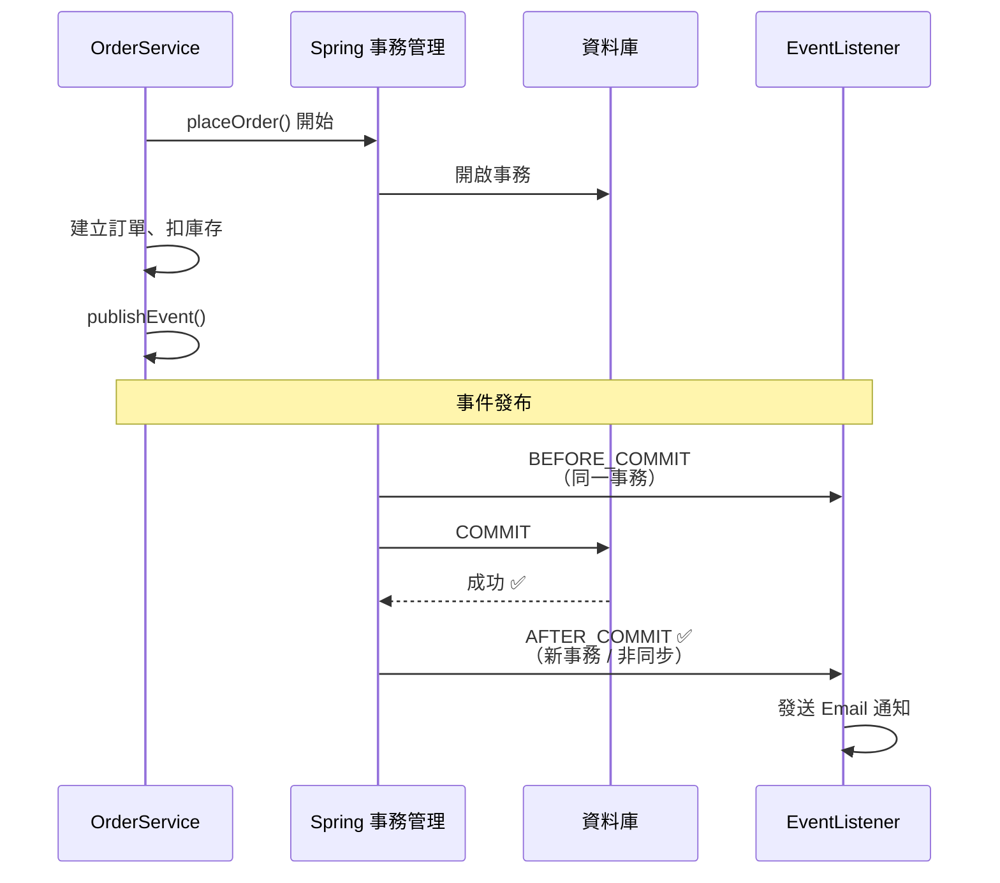

# Application Events：下單後發通知 + @TransactionalEventListener

> Spring 的 `ApplicationEventPublisher` 讓你發布事件，`@EventListener` 與 `@TransactionalEventListener` 讓你解耦處理。後者只在當前事務成功 commit 後才觸發，避免事務回滾了還發通知出去。適合下單後發 Email、註冊後送點數等場景。

這一篇會學到的

1. 事件驅動是什麼、為什麼需要
2. 核心元件有哪些
3. 怎麼定義事件、發布事件、監聽事件
4. `@TransactionalEventListener` 的事務階段怎麼用
5. 常見陷阱跟怎麼避開

## 為什麼需要事件驅動？

> 下單之後要發通知、送物流、給紅利⋯⋯這些全部塞在下單方法裡？那下單失敗是不是通知照發？

想像一個下單流程：

```java
@Service
@Transactional
public class OrderService {

    public void placeOrder(OrderDTO dto) {
        // 1. 建立訂單
        Order order = orderRepository.save(dto.toEntity());

        // 2. 扣庫存
        inventoryService.deduct(order);

        // 3. 發通知 Email（耦合！）
        emailService.sendOrderConfirmation(order);

        // 4. 通知物流系統（耦合！）
        logisticsService.notifyShipping(order);
    }
}
```

**問題：**
- 發 Email、通知物流這些「次要邏輯」跟「下單」耦合在一起
- 發 Email 失敗 → 下單也跟著失敗
- 業務邏輯與非核心關注點混雜，難以維護

**事件驅動解決方案：**

```java
@Service
@Transactional
public class OrderService {

    private final ApplicationEventPublisher publisher;

    public void placeOrder(OrderDTO dto) {
        // 1. 只做核心業務
        Order order = orderRepository.save(dto.toEntity());
        inventoryService.deduct(order);

        // 2. 發布事件，後續交給 Listener
        publisher.publishEvent(new OrderCreatedEvent(this, order));
    }
}
```

這樣下單只關心「下單本身」，發通知、送物流等行為由 Listener 各自處理，互不干擾。

## 核心元件

| 元件 | 說明 |
|------|------|
| `ApplicationEvent` | 事件的基底類別（可繼承，也可用任意 POJO） |
| `ApplicationEventPublisher` | 發布事件，注入即可使用 |
| `@EventListener` | 標註在方法上，監聽指定事件 |
| `@TransactionalEventListener` | 進階版，只在特定事務階段觸發 |

### 事件物件：兩種寫法

**寫法一：繼承 `ApplicationEvent`（傳統）**

```java
public class OrderCreatedEvent extends ApplicationEvent {
    private final Order order;

    public OrderCreatedEvent(Object source, Order order) {
        super(source);
        this.order = order;
    }

    public Order getOrder() { return order; }
}
```

**寫法二：純 POJO（推薦，不需繼承）**

```java
// 不需要繼承任何東西，輕量乾淨
public class OrderCreatedEvent {
    private final Order order;
    private final Instant occurredAt;

    public OrderCreatedEvent(Order order) {
        this.order = order;
        this.occurredAt = Instant.now();
    }

    // getter ...
}
```

> Spring 從 4.2 開始支援任意 POJO 作為事件。不用繼承，不用包袱，乾淨俐落。

## 實作：下單後自動發送通知

### Step 1：定義事件

```java
public class OrderCreatedEvent {
    private final Long orderId;
    private final Long userId;
    private final String userEmail;
    private final BigDecimal totalAmount;
    private final Instant occurredAt;

    public OrderCreatedEvent(Long orderId, Long userId, String userEmail, BigDecimal totalAmount) {
        this.orderId = orderId;
        this.userId = userId;
        this.userEmail = userEmail;
        this.totalAmount = totalAmount;
        this.occurredAt = Instant.now();
    }

    public Long getOrderId() { return orderId; }
    public Long getUserId() { return userId; }
    public String getUserEmail() { return userEmail; }
    public BigDecimal getTotalAmount() { return totalAmount; }
    public Instant getOccurredAt() { return occurredAt; }
}
```

### Step 2：在 Service 中發布事件

```java
@Service
@Transactional
@RequiredArgsConstructor
public class OrderService {

    private final OrderRepository orderRepository;
    private final InventoryService inventoryService;
    private final ApplicationEventPublisher publisher;

    public Order placeOrder(OrderDTO dto, Long userId) {
        // 1. 建立訂單
        Order order = new Order();
        order.setUserId(userId);
        order.setTotalAmount(dto.getTotalAmount());
        order.setStatus(OrderStatus.PENDING);
        order = orderRepository.save(order);

        // 2. 扣庫存
        inventoryService.deduct(order.getId(), dto.getItems());

        // 3. 發布事件（此時事務尚未提交）
        publisher.publishEvent(new OrderCreatedEvent(
            order.getId(),
            userId,
            getCurrentUserEmail(),
            order.getTotalAmount()
        ));

        return order;
    }

    private String getCurrentUserEmail() {
        return SecurityContextHolder.getContext()
            .getAuthentication().getName();
    }
}
```

### Step 3：建立 EventListener

#### 基本版：@EventListener（同步執行，同一事務）

```java
@Component
@RequiredArgsConstructor
public class OrderNotificationListener {

    private final EmailService emailService;
    private final NotificationService notificationService;

    @EventListener
    public void handleOrderCreated(OrderCreatedEvent event) {
        emailService.sendOrderConfirmation(
            event.getUserEmail(),
            event.getOrderId(),
            event.getTotalAmount()
        );

        notificationService.notify(
            event.getUserId(),
            "您的訂單 #" + event.getOrderId() + " 已成立"
        );
    }
}
```

#### 進階版：@TransactionalEventListener（事務提交後才執行）

```java
@Component
@RequiredArgsConstructor
public class OrderNotificationListener {

    private final EmailService emailService;

    @TransactionalEventListener(phase = TransactionPhase.AFTER_COMMIT)
    public void handleOrderCreated(OrderCreatedEvent event) {
        // ✅ 事務已成功提交，此時發通知才安全
        emailService.sendOrderConfirmation(
            event.getUserEmail(),
            event.getOrderId(),
            event.getTotalAmount()
        );
    }
}
```

## 同步 vs 非同步事件處理

### 預設：同步

```java
@EventListener
public void handle(OrderCreatedEvent event) {
    // 與發布者在同一個執行緒，同一個事務
    // Listener 拋例外 → 發布者的事務也回滾
}
```

### 非同步：加上 @Async

```java
@EventListener
@Async
public void handle(OrderCreatedEvent event) {
    // 在獨立執行緒執行，不會影響發布者的事務
}
```

搭配 `@TransactionalEventListener` 使用：

```java
@TransactionalEventListener(phase = TransactionPhase.AFTER_COMMIT)
@Async
public void handle(OrderCreatedEvent event) {
    // 1. 事務 commit 後才觸發
    // 2. 非同步執行，不阻塞回應
    emailService.sendOrderConfirmation(...);
}
```

:::tip 💡 最佳組合
`@TransactionalEventListener(AFTER_COMMIT)` + `@Async` 是實務上最穩的組合：
- 事務成功才觸發 → 不會發送失敗的訂單通知
- 非同步執行 → 不阻塞使用者回應
:::

## @TransactionalEventListener 的事務階段

```java
public enum TransactionPhase {
    BEFORE_COMMIT,      // 事務提交前（預設）
    AFTER_COMMIT,       // 事務提交後 ✅ 最常用
    AFTER_ROLLBACK,     // 事務回滾後
    AFTER_COMPLETION    // 事務完成後（不論 commit 或 rollback）
}
```

### 各階段的使用時機

| 階段 | 使用時機 | 範例 |
|------|---------|------|
| `BEFORE_COMMIT` | 提交前做最後檢查 | 審核通過前發送驗證 |
| `AFTER_COMMIT` | 提交後執行非關鍵動作 | ✅ 發通知、寫 Log、送 MQ |
| `AFTER_ROLLBACK` | 回滾時做補償 | 記錄錯誤、發警報 |
| `AFTER_COMPLETION` | 不論結果都執行 | 釋放資源、清理狀態 |

### 流程圖



## 常見陷阱

### ❌ 陷阱 1：同一個事務內，Listener 拋例外導致主流程回滾

```java
@Service
@Transactional
public class OrderService {
    public void placeOrder() {
        publisher.publishEvent(new OrderCreatedEvent(...));
        // 如果 Listener 拋例外，這裡也會回滾！
    }
}

@Component
public class OrderNotificationListener {
    @EventListener  // 同步監聽，同一事務
    public void handle(OrderCreatedEvent event) {
        emailService.send(); // 拋出 RuntimeException → 主流程也回滾
    }
}
```

> 解法：用 `@TransactionalEventListener(AFTER_COMMIT)` + `@Async`，讓 Listener 在提交後獨立執行。

### ❌ 陷阱 2：同一個 Bean 內部呼叫，事件不會被發布

```java
@Service
public class OrderService {

    @Transactional
    public void placeOrder() {
        // 正確：publishEvent 會發布事件
        publishEvent(new OrderCreatedEvent(...));
    }

    // ❌ 直接呼叫 this.sendNotification() 不會經過 Spring proxy
    private void publishEvent(OrderCreatedEvent event) {
        // ...
    }
}
```

### ❌ 陷阱 3：Listener 沒被 Spring 管理

```java
// ❌ 沒加 @Component，Spring 掃不到
public class OrderNotificationListener {
    @EventListener
    public void handle(OrderCreatedEvent event) { }
}

// ✅ 必須是 Spring Bean
@Component
public class OrderNotificationListener {
    @EventListener
    public void handle(OrderCreatedEvent event) { }
}
```

### ❌ 陷阱 4：事件類別有多個建構子

```java
public class OrderCreatedEvent {
    private final Order order;

    // Spring 可能會混淆用哪個建構子
    public OrderCreatedEvent(Order order) { this.order = order; }
    public OrderCreatedEvent(Long orderId) { this.order = null; }
}
```

> 解法：事件類別保持簡單，只有一個建構子，或使用 Builder 模式。

## 完整架構圖

```
Controller
    │
    ▼
OrderService.placeOrder()
    │
    ├── 1. 儲存訂單到 DB
    ├── 2. 扣庫存
    └── 3. publishEvent(OrderCreatedEvent)
              │
              ▼
    ┌──────────────────────────┐
    │  ApplicationEventPublisher │
    └─────────┬────────────────┘
              │
     ┌────────┴────────┐
     ▼                 ▼
OrderNotificationListener   LogisticsListener
@TransactionalEventListener @TransactionalEventListener
(AFTER_COMMIT)               (AFTER_COMMIT)
     │                 │
     ▼                 ▼
EmailService      LogisticsService
  └─ 發送訂單確認信    └─ 通知物流系統
```

### 解耦效果

```mermaid
graph LR
    subgraph "核心業務"
        OrderService -->|1. 建立訂單| DB[(資料庫)]
        OrderService -->|2. 扣庫存| Inventory
        OrderService -->|3. publishEvent| PUB[ApplicationEventPublisher]
    end

    subgraph "事件監聽（解耦）"
        PUB -->|事件| L1[OrderNotificationListener]
        PUB -->|事件| L2[LogisticsListener]
        PUB -->|事件| L3[PointListener]
    end

    subgraph "非同步處理"
        L1 -->|@Async| EMAIL[發送 Email]
        L2 -->|@Async| LOGISTICS[通知物流]
        L3 -->|@Async| POINT[贈送紅利點數]
    end
```

## 重點總結

### 什麼時候用 Application Events？

| 場景 | 範例 |
|------|------|
| 業務流程中有「順帶做的事」 | 下單後發通知、註冊後送折價券 |
| 多個 Listener 關心同一事件 | 下單後：通知 + 物流 + 紅利 + 發票 |
| 需要事務感知 | 只發送成功訂單的通知 |

### 技術選擇

| 情況 | 選擇 |
|------|------|
| 簡單同步處理 | `@EventListener` |
| 只想在 commit 後觸發 | `@TransactionalEventListener(AFTER_COMMIT)` |
| 不想阻塞主流程 | `@EventListener` + `@Async` |
| 最穩組合（推薦） | `@TransactionalEventListener(AFTER_COMMIT)` + `@Async` |

### 程式碼結構總結

```
事件類別（POJO，不繼承）
    │
發送端：注入 ApplicationEventPublisher → publishEvent()
    │
接收端：@Component + @TransactionalEventListener + @Async
```

1. **事件 = 普通的 POJO**，不需要繼承任何類別
2. **發布 = `ApplicationEventPublisher.publishEvent()`**
3. **監聽 = `@TransactionalEventListener(AFTER_COMMIT)` + `@Async`**
4. **解耦效果**：下單的不用管通知，通知的不用管下單
