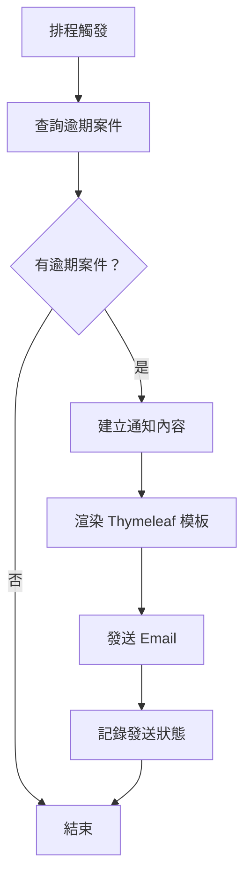
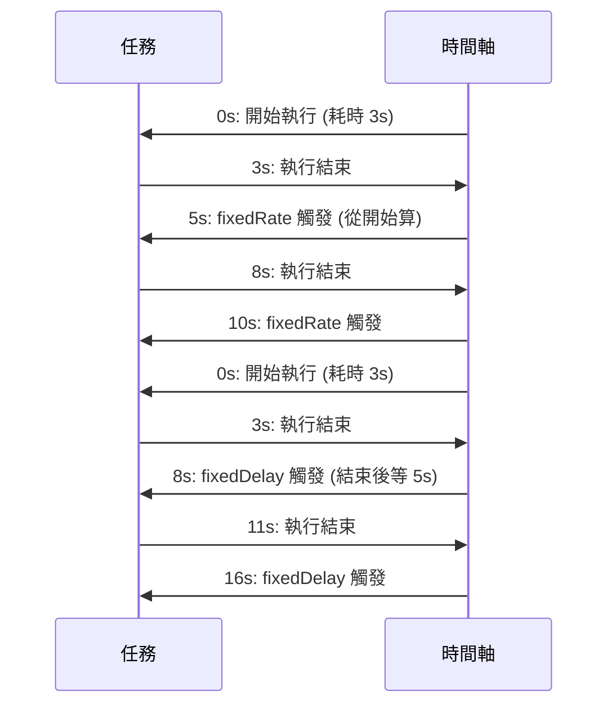

> 📝 TL;DR：別再手動發郵件了！用 Spring Boot + Thymeleaf + Cron，讓系統自動幫你發逾期提醒，連 Gmail 應用程式密碼都幫你搞定了，省到想哭 XD

## 前置知識

這篇要懂這些才不會卡住：

- **Spring Boot 是什麼？** - 就是幫你省掉一堆 XML 設定的 Java 框架，你只要寫業務邏輯就好。
- **什麼是 SMTP？** - 就是郵件伺服器的通訊協定，Gmail、Outlook 都用它發信。
- **Thymeleaf 是什麼？** - 一個能讓你用 HTML 寫郵件模板的工具，變數綁定超直觀，比拼字串爽多了。
- **Cron 表達式？** - 一種用數字和符號定義「什麼時候執行」的語言，聽起來很玄，其實就是「秒 分 時 日 月 星期」。

如果你連這些都沒聽過…先去翻一下 Spring Boot 入門，不然我講你也聽不懂 XD

## 什麼是 Email 與 Scheduled 排程？

### 為什麼需要學習它？

你有沒有遇過這種情況：

- 用戶註冊完，你手動發歡迎信？（你瘋了嗎？）
- 每天早上 9 點要發逾期通知？（你睡覺時系統就停了？）
- 每週一要發報表？（你週末加班？）

**解決方案：** 讓電腦幫你做！

- **Email 發送**：自動發送註冊確認、密碼重設、通知信，不用你動手。
- **Scheduled 排程**：設定時間自動執行任務，比如每天凌晨 2 點檢查逾期案件，自動發郵件。

**什麼時候會用到？**

- 用戶註冊/登入
- 訂閱到期提醒
- 逾期付款通知
- 每日/每週報表發送
- 資料清理任務

**優勢在哪？**

- **省時間**：不用你半夜爬起來發信。
- **不遺漏**：系統不會忘記，你會。
- **可擴展**：加個排程，幾百人同時發信，一點都不卡。

:::warning ⚠️ 注意
Gmail 密碼不能直接用！一定要用「應用程式密碼」，不然會被擋掉。別問我怎麼知道的，我被擋過三次，哭到睡著。
:::

## 💻 基本語法

### Email 發送語法

```java
// 1. 建立郵件訊息
MimeMessage message = javaMailSender.createMimeMessage();

// 2. 使用 Helper 設定內容（UTF-8 編碼！）
MimeMessageHelper helper = new MimeMessageHelper(message, true, "UTF-8");
helper.setTo("user@example.com");
helper.setSubject("你的主題");

// 3. 用 Thymeleaf 渲染 HTML 模板
String htmlContent = templateEngine.process("notification", context);
helper.setText(htmlContent, true); // true 表示是 HTML

// 4. 發送！
javaMailSender.send(message);
```

### Scheduled 排程語法

```java
// 啟用排程功能（加在主類別上）
@SpringBootApplication
@EnableScheduling // 這行是關鍵！
public class Application { ... }

// 建立排程服務
@Service
public class MyScheduler {

    // 每天凌晨 2:00 執行
    @Scheduled(cron = "0 0 2 * * ?")
    public void dailyTask() {
        System.out.println("每天 2 點，系統自動發信！");
    }

    // 每 5 秒執行一次（從上次開始算）
    @Scheduled(fixedRate = 5000)
    public void fixedRateTask() {
        System.out.println("每 5 秒一次，不管執行多久");
    }

    // 上次執行完，等 5 秒再執行
    @Scheduled(fixedDelay = 5000)
    public void fixedDelayTask() {
        System.out.println("上次結束後，等 5 秒才開始");
    }
}
```

### 參數說明

| 參數名稱 | 型別 | 說明 | 預設值 |
| -------- | ------ | -------- | ------ |
| `cron` | String | Cron 表達式（6 欄位：秒 分 時 日 月 星期） | - |
| `fixedRate` | long | 從上次**開始**計時，每 N 毫秒執行一次 | - |
| `fixedDelay` | long | 從上次**結束**計時，等待 N 毫秒後執行 | - |
| `zone` | String | 時區（如 "Asia/Taipei"） | 伺服器時區 |

## 實際範例

### 範例 1：發送通知信（Thymeleaf 模板）

**情境說明：** 用戶註冊成功，自動發一封歡迎信。

```java
// 1. 建立變數容器
Context context = new Context();
context.setVariable("userName", "小明");
context.setVariable("message", "歡迎加入我們！");
context.setVariable("actionUrl", "https://example.com/login");

// 2. 發送郵件
EmailUtils.sendHtmlEmail(
    "xiaoming@example.com", // 收件者
    "【歡迎】感謝註冊", // 主旨
    "notification", // 模板名稱（不含 .html）
    context // 變數
);
```

**模板檔案：** `src/main/resources/email/notification.html`

```html
<!DOCTYPE html>
<html xmlns:th="http://www.thymeleaf.org">
<head>
    <meta charset="UTF-8">
    <style>
        body { font-family: "Microsoft JhengHei", Arial, sans-serif; }
        .container { max-width: 600px; margin: 0 auto; padding: 20px; }
        .button { display: inline-block; padding: 10px 20px; background-color: #4CAF50; color: white; text-decoration: none; border-radius: 5px; }
    </style>
</head>
<body>
    <div class="container">
        <h2>🎉 您好，<strong th:text="${userName}">使用者</strong>！</h2>
        <p th:text="${message}">這是一則通知訊息。</p>
        <a th:href="${actionUrl}" class="button">立即登入</a>
        <hr>
        <p style="font-size: 12px; color: #666;">此為系統自動發送的通知信件，請勿直接回覆。</p>
    </div>
</body>
</html>
```

**程式碼說明：**

1. 用 `Context` 把變數塞進去（`userName`, `message`, `actionUrl`）。
2. 呼叫 `EmailUtils.sendHtmlEmail()`，傳入收件人、主旨、模板名稱、變數。
3. Thymeleaf 會自動把 `notification.html` 裡的 `${userName}` 換成「小明」。
4. 發送出去，收件人收到一封美美的 HTML 郵件。

### 範例 2：逾期通知系統（排程 + Email 整合）

**情境說明：** 每天凌晨 2 點，自動檢查所有逾期 3 天以上的案件，發郵件給負責人。

```java
// 1. 排程服務
@Service
@Slf4j
public class OverdueNotificationScheduler {

    @Autowired
    private CaseService caseService; // 查詢逾期案件的服務

    // 每天凌晨 2:00 執行
    @Scheduled(cron = "0 0 2 * * ?")
    public void sendOverdueNotifications() {
        log.info("開始執行逾期通知檢查");

        // 查詢所有逾期案件
        List<Case> overdueCases = caseService.findOverdueCases();

        if (overdueCases.isEmpty()) {
            log.info("沒有逾期案件");
            return;
        }

        // 逐一發送通知
        for (Case case : overdueCases) {
            try {
                sendOverdueEmail(case);
            } catch (MessagingException e) {
                log.error("發送失敗 - 案件編號: {}", case.getId(), e);
            }
        }
    }

    // 發送單一逾期通知
    private void sendOverdueEmail(Case case) throws MessagingException {
        Context context = new Context();
        context.setVariable("caseId", case.getId());
        context.setVariable("userName", case.getAssignedUserName());
        context.setVariable("daysOverdue", case.getDaysOverdue());
        context.setVariable("actionUrl", "https://example.com/cases/" + case.getId());

        EmailUtils.sendHtmlEmail(
            case.getAssignedUserEmail(),
            "【系統通知】案件逾期提醒 - " + case.getId(),
            "overdue_notification", // 模板名稱
            context
        );
    }
}
```

**模板檔案：** `src/main/resources/email/overdue_notification.html`

```html
<!DOCTYPE html>
<html xmlns:th="http://www.thymeleaf.org">
<head>
    <meta charset="UTF-8">
    <style>
        body { font-family: "Microsoft JhengHei", Arial, sans-serif; }
        .container { max-width: 600px; margin: 0 auto; padding: 20px; }
        .alert { background-color: #fff3cd; border-left: 4px solid #ffc107; padding: 15px; }
        .button { display: inline-block; padding: 10px 20px; background-color: #dc3545; color: white; text-decoration: none; border-radius: 5px; }
    </style>
</head>
<body>
    <div class="container">
        <h2 style="color: #dc3545;">⚠️ 案件逾期提醒</h2>
        <div class="alert">
            <p>親愛的 <strong th:text="${userName}">負責人</strong>，</p>
            <p>以下案件已逾期 <strong th:text="${daysOverdue}">5</strong> 天，請儘速處理：</p>
        </div>
        <ul>
            <li><strong>案件編號:</strong> <span th:text="${caseId}">A123456789</span></li>
            <li><strong>逾期天數:</strong> <span th:text="${daysOverdue}">5</span> 天</li>
        </ul>
        <a th:href="${actionUrl}" class="button">立即處理</a>
        <hr>
        <p style="font-size: 12px; color: #666;">此為系統自動發送的提醒信件，請勿直接回覆。</p>
    </div>
</body>
</html>
```

**程式碼說明：**

1. `@Scheduled(cron = "0 0 2 * * ?")`：每天凌晨 2 點執行。
2. `caseService.findOverdueCases()`：查詢所有逾期 3 天以上的案件。
3. 用 `for` 迴圈，一個一個發郵件。
4. 每封郵件都用 `overdue_notification.html` 模板，動態填入案件編號、負責人、逾期天數。
5. 用 `try-catch` 包住發信，避免一張信發失敗，整個排程崩掉。

## 視覺化說明

### 流程圖：逾期通知系統架構



### 概念圖解：fixedRate vs fixedDelay



## 實戰練習

### 練習 1：基礎應用（簡單）⭐

**任務：** 寫一個排程，每 10 秒在 Console 輸出「我愛 Spring Boot！」。

**提示：**
- 記得加 `@EnableScheduling`！
- `@Scheduled(fixedRate = 10000)`
- 用 `System.out.println()` 或 `log.info()`

:::details 參考答案
```java
@SpringBootApplication
@EnableScheduling
public class Application {
    public static void main(String[] args) {
        SpringApplication.run(Application.class, args);
    }
}

@Service
public class LoveSpringBootScheduler {

    @Scheduled(fixedRate = 10000) // 10 秒
    public void loveSpringBoot() {
        System.out.println("我愛 Spring Boot！");
    }
}
```
**說明：** 這是最簡單的排程，只要記住 `@EnableScheduling` 和 `@Scheduled` 就夠了。
:::

### 練習 2：概念驗證（簡單）⭐

**任務：** 解釋為什麼 `cron = "0 0 2 * * ?"` 是每天凌晨 2 點，而不是 2 點 0 分？

**思考方向：**
- Cron 表達式有幾個欄位？
- 每個欄位代表什麼？
- `?` 是什麼意思？

:::details 參考答案
Cron 表達式是「秒 分 時 日 月 星期」，共六個欄位。

`0 0 2 * * ?` 的意思是：
- 秒：0（整點）
- 分：0（整點）
- 時：2（凌晨 2 點）
- 日：*（每天）
- 月：*（每月）
- 星期：?（不指定）

所以，它就是在「每天」的「凌晨 2 點 0 分」執行。

`?` 是用來「不指定」星期的，因為「日」和「星期」不能同時指定，所以用 `?` 表示「我只用日」。
:::

### 練習 3：綜合應用（中等）⭐⭐

**任務：** 實作一個「每日氣溫提醒」系統。

**需求：**
1. 每天早上 8 點，自動發一封郵件給所有用戶。
2. 郵件內容包含：「今天氣溫是 25°C，記得帶傘！」
3. 氣溫資料從一個假的 API 取得（用 `Math.random()` 模擬）。
4. 如果氣溫 > 30°C，郵件主題改成「⚠️ 高溫警報！」。

**提示：**
- 先寫一個 `TemperatureService`，回傳一個隨機氣溫。
- 在排程裡呼叫它，判斷氣溫，決定郵件主題和內容。
- 用 `@Scheduled(cron = "0 0 8 * * ?")`。

:::details 參考答案與解題思路

**解題思路：**
1. 先寫一個 `TemperatureService`，用 `Math.random()` 模擬氣溫（15-35°C）。
2. 寫一個排程，每天 8 點執行。
3. 呼叫 `TemperatureService` 取得氣溫。
4. 根據氣溫決定郵件主題和內容。
5. 用 `EmailUtils` 發送。

**參考程式碼：**

```java
@Service
public class TemperatureService {

    public double getTemperature() {
        return 15 + Math.random() * 20; // 15-35°C
    }
}

@Service
@Slf4j
public class WeatherNotificationScheduler {

    @Autowired
    private TemperatureService temperatureService;

    @Autowired
    private EmailService emailService; // 假設你有個 EmailService

    @Scheduled(cron = "0 0 8 * * ?")
    public void sendWeatherNotification() {
        double temp = temperatureService.getTemperature();
        String subject = temp > 30 ? "⚠️ 高溫警報！" : "今日氣溫提醒";
        String message = "今天氣溫是 " + String.format("%.1f", temp) + "°C，" + (temp > 30 ? "記得多喝水！" : "記得帶傘！");

        // 假設所有用戶的郵件都存在
        List<String> emails = Arrays.asList("user1@example.com", "user2@example.com");

        for (String email : emails) {
            try {
                Context context = new Context();
                context.setVariable("temperature", String.format("%.1f", temp));
                context.setVariable("message", message);
                EmailUtils.sendHtmlEmail(email, subject, "weather_notification", context);
            } catch (MessagingException e) {
                log.error("發送失敗：{}", email, e);
            }
        }
    }
}
```

**延伸思考：**
- 如何優化效能？→ 用 `@Async` 並行發信，別一個一個等。
- 還有其他實作方式嗎？→ 用 `@Scheduled` + `@Value` 從 `application.yml` 讀取氣溫閾值。
- 在實際專案中如何應用？→ 連接天氣 API，而不是用 `Math.random()`。
:::

## 常見問題 FAQ

### Q1: 信件發送時出現 "Authentication failed" 錯誤？

**A:** 你是不是用 Gmail 密碼？你瘋了嗎？

Gmail 需要「應用程式密碼」，不是你的登入密碼！

1. 去 [Google 帳戶設定](https://myaccount.google.com/apppasswords)
2. 選擇「郵件」
3. 產生一個密碼
4. 把這個密碼貼到 `application.yml` 裡

**別再用你的 Gmail 密碼了！** 我被擋過三次，哭到睡著。

### Q2: 信件內容亂碼？

**A:** 你是不是沒設 UTF-8？

三個地方都要設：

1. `MimeMessageHelper` 要加 `"UTF-8"`：
```java
new MimeMessageHelper(message, true, "UTF-8");
```
2. `application.yml` 裡：
```yaml
spring:
  thymeleaf:
    encoding: UTF-8
```
3. HTML 模板檔案本身，用 UTF-8 儲存！

**反正就是 UTF-8 用到底就對了**，別問為什麼，照做就對了。

### Q3: 排程任務沒有執行？

**A:** 你有加 `@EnableScheduling` 嗎？

**檢查清單：**

1. 主類別有 `@EnableScheduling` 嗎？
2. 排程類別有 `@Service` 嗎？
3. 方法有 `@Scheduled` 嗎？
4. 方法是 `public void` 嗎？
5. Cron 表達式是 6 欄位嗎？（不是 5 欄位！）
6. 查看啟動日誌，有看到 `Scheduled task registered` 嗎？

**如果都對了還不行…** 你是不是在 `application-test.yml` 裡關掉了？

### Q4: 如何停用排程（測試環境）？

**A:** 你有兩種方法：

**方法 1：用 Profile**
```java
@Service
@Profile("!test") // 非 test 環境才啟用
public class MyScheduler { ... }
```

**方法 2：用配置**
```yaml
# application-test.yml
scheduler:
  enabled: false
```

```java
@Service
@ConditionalOnProperty(name = "scheduler.enabled", havingValue = "true", matchIfMissing = true)
public class MyScheduler { ... }
```

**反正就是：測試環境，關掉就對了。**

### Q5: 如何在本機測試排程？

**A:** 別等凌晨 2 點！

**步驟：**

1. 把 `@Scheduled(cron = "0 0 2 * * ?")` 改成 `@Scheduled(cron = "0 * * * * ?")`（每分鐘執行）
2. 啟動應用程式：`./gradlew bootRun`
3. 看 Console，每分鐘都有 log 輸出，就對了！
4. 測試完，**記得改回去！** 別讓系統半夜發 1000 封信。

**你以為你很聰明？** 我看過有人忘記改，結果半夜被郵件淹沒，第二天被老闆罵到狗血淋頭。

### Q6: `fixedRate` 和 `fixedDelay` 有什麼差？

**A:** 一個是「從開始算」，一個是「從結束算」。

假設任務要跑 3 秒：

- `fixedRate = 5000`：每 5 秒執行一次，不管執行多久。→ 0s、5s、10s、15s…
- `fixedDelay = 5000`：上次結束後，等 5 秒再執行。→ 0s、8s、16s、24s…

**簡單記：**

- `fixedRate`：**固定頻率**，適合短任務。
- `fixedDelay`：**避免重疊**，適合長任務。

**反正就是：任務長就用 `fixedDelay`，短就用 `fixedRate`。**

## 最佳實踐

### ✅ 推薦做法

1. **用應用程式密碼**：Gmail 密碼不能用，應用程式密碼是唯一正解。
2. **用 `@PostConstruct` 初始化**：`EmailUtils` 要在 Spring 啟動後才初始化，別手動呼叫。
3. **用 `@Scheduled(cron = "0 0 2 * * ?")`**：每天凌晨 2 點，系統最閒的時候，別在上班時間發信。
4. **用 `try-catch` 包住發信**：一張信失敗，別讓整個排程崩掉。
5. **用 `@Profile("!test")`**：測試環境關掉排程，別讓你同事收到一堆測試信。

### ❌ 常見錯誤

1. **用 Gmail 密碼**：你會被擋掉，而且不知道為什麼。
2. **沒設 UTF-8**：中文變亂碼，客戶以為你系統有 bug。
3. **Cron 用 5 欄位**：Spring 是 6 欄位！你會以為「0 0 2 * *」是每天 2 點，其實是每秒 2 分鐘執行。
4. **排程方法不是 public**：Spring 找不到，你還以為是沒啟用。
5. **在 `@Scheduled` 裡做複雜邏輯**：排程只負責觸發，業務邏輯丟給 Service，好維護。

## 延伸閱讀

### 相關文章

- [後端技術總覽](/) - 後端文章入口
- [Spring Boot Swagger 教學](/springboot/swagger-docs) - API 文件整合做法
- [Spring Boot 分頁與 N+1 問題](/springboot/data-pagination) - 效能觀念一起補

### 推薦資源

- [Spring Boot 官方文件 - Email](https://docs.spring.io/springboot/docs/2.6.6/reference/htmlsingle/#io.email) - 官方，最權威
- [Baeldung - Spring Email](https://www.baeldung.com/spring-email) - 實戰範例超多
- [Cron 表達式產生器](https://crontab.guru/) - 用來驗證你的 Cron 是否正確（記得轉成 6 欄位）

### 下一步學習

- 如果你想深入了解排程，建議閱讀 [Spring Task Execution](https://docs.spring.io/spring-framework/docs/5.3.x/reference/html/integration.html#scheduling)。
- 想把資料查詢一起顧好？接著看 [Spring Boot 分頁與 N+1 問題](/springboot/data-pagination)。
- 想把 API 文件一起補齊？接著看 [Swagger 教學](/springboot/swagger-docs)。

## 總結

1. **Email 發送**：用 `JavaMailSender` + `Thymeleaf`，模板變數超直觀，別再拼字串了。
2. **排程觸發**：`@EnableScheduling` + `@Scheduled`，記得是 6 欄位 Cron，不是 5 欄位！
3. **Gmail 密碼**：用「應用程式密碼」，別用登入密碼，不然你會哭。
4. **固定頻率**：`fixedRate` 是從開始算，`fixedDelay` 是從結束算，任務長就用 `fixedDelay`。
5. **測試排程**：改 `cron = "0 * * * * ?"`，每分鐘跑一次，別等半夜。

**反正就是：照著做，別想太多，系統會幫你發信。**

> 你現在，已經是 Spring Boot 郵件排程大師了。:D
