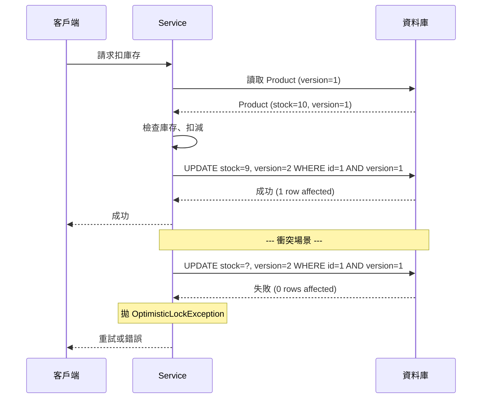
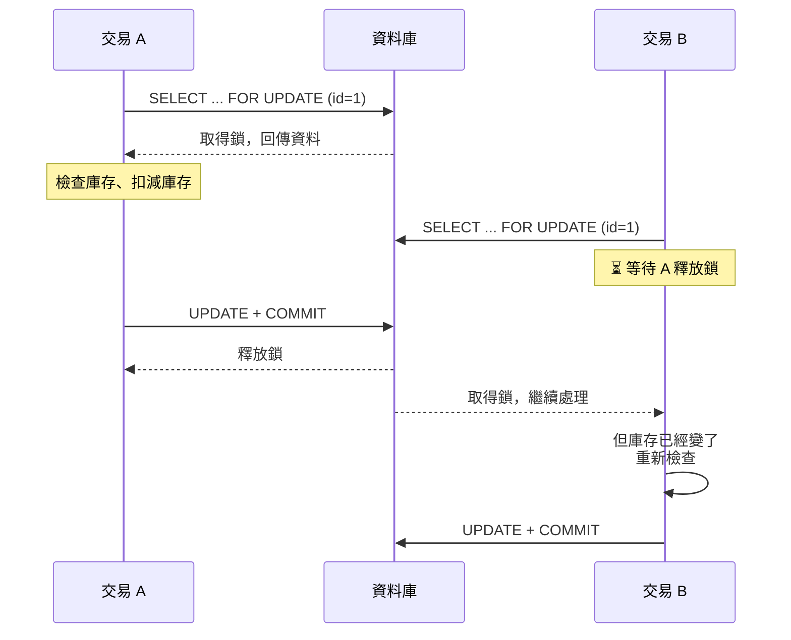

# Spring Boot 樂觀鎖與悲觀鎖 ｜ 實作教學

> 📝 TL;DR：Spring Boot 透過 JPA/Hibernate 提供了兩種鎖機制的開箱實作。樂觀鎖用 `@Version` 讓 Hibernate 自動維護版本號，衝突時丟 `OptimisticLockException`，你只要補重試邏輯；悲觀鎖用 `@Lock(LockModeType.PESSIMISTIC_WRITE)` 直接下 `SELECT ... FOR UPDATE`，讓資料庫幫你擋人。實戰中通常混用——庫存扣減用悲觀鎖，使用者資料更新用樂觀鎖。

這一篇會學到的

1. @Version 怎麼用
2. @Lock(PESSIMISTIC_WRITE) 怎麼用
3. 衝突發生時怎麼重試
4. 這些陷阱你遲早會踩到

## 為什麼在 Spring Boot 需要特別處理鎖？

> 資料庫的鎖像大門，JPA 的鎖像保全——保全不開門，你還是進不去

在 Spring Boot / JPA 的世界，鎖多了一層抽象：

1. **Entity 是 Java 物件不是資料列** — Hibernate 幫你管版本號，但你要告訴它怎麼做
2. **事務邊界由 Spring 管理** — `@Transactional` 決定鎖的生命週期
3. **一級快取讓你讀到舊資料** — 鎖沒做好等於白鎖

接下來的範例用一個簡單的庫存管理系統：

```java
@Entity
@Table(name = "products")
public class Product {
    @Id
    @GeneratedValue(strategy = GenerationType.IDENTITY)
    private Long id;

    private String name;

    private Integer stock;

    // getters and setters
}
```

## 樂觀鎖（Optimistic Locking）實作

> 樂觀鎖就是那種「先按送出再說，有衝突再重來」的類型

### 使用 @Version

加一個 `@Version` 欄位就搞定：

```java
@Entity
@Table(name = "products")
public class Product {

    @Id
    @GeneratedValue(strategy = GenerationType.IDENTITY)
    private Long id;

    private String name;

    private Integer stock;

    @Version
    private Integer version;

    // getters and setters
}
```

Hibernate 自動幫你做的：

1. **讀取時** — 把 `version` 一起讀進 Entity
2. **更新時** — 產生 `UPDATE products SET stock = ?, version = version + 1 WHERE id = ? AND version = ?`
3. **衝突偵測** — `WHERE version = ?` 沒命中 → 丟 `OptimisticLockException`
4. **寫入後** — 自動增加 Entity 內的 `version`

:::warning
`@Version` 只能用於 `int`、`Integer`、`short`、`Short`、`long`、`Long`、`java.sql.Timestamp` 這幾種型別。最常見的是 `Integer` 或 `Long`。
:::

資料表也要有 `version` 欄位：

```sql
CREATE TABLE products (
    id BIGINT AUTO_INCREMENT PRIMARY KEY,
    name VARCHAR(255) NOT NULL,
    stock INT NOT NULL DEFAULT 0,
    version INT NOT NULL DEFAULT 0
);
```

Hibernate 不會自動建這個欄位（除非你用 `ddl-auto: update`）。

### 樂觀鎖流程



### Service 層：處理衝突與重試

衝突發生時會拋 `ObjectOptimisticLockingFailureException`，你要自己重試：

```java
@Service
public class OrderService {

    @Autowired
    private ProductService productService;

    private static final int MAX_RETRIES = 3;

    public void placeOrder(Long productId, int quantity) {
        for (int attempt = 1; attempt <= MAX_RETRIES; attempt++) {
            try {
                productService.deductStock(productId, quantity);
                return;
            } catch (ObjectOptimisticLockingFailureException e) {
                if (attempt == MAX_RETRIES) {
                    throw new RuntimeException("下單失敗，請稍後再試", e);
                }
                try {
                    Thread.sleep(50 * attempt);
                } catch (InterruptedException ie) {
                    Thread.currentThread().interrupt();
                    throw new RuntimeException(ie);
                }
            }
        }
    }
}
```

有引 Spring Retry 的話更優雅：

```java
@Service
public class OrderService {

    @Autowired
    private ProductService productService;

    @Retryable(
        retryFor = ObjectOptimisticLockingFailureException.class,
        maxAttempts = 3,
        backoff = @Backoff(delay = 50, multiplier = 2)
    )
    public void placeOrder(Long productId, int quantity) {
        productService.deductStock(productId, quantity);
    }
}
```

```xml
<dependency>
    <groupId>org.springframework.retry</groupId>
    <artifactId>spring-retry</artifactId>
</dependency>
<dependency>
    <groupId>org.springframework.boot</groupId>
    <artifactId>spring-boot-starter-aop</artifactId>
</dependency>
```

:::tip
重試間隔加上隨機抖動（jitter）可以避免多個請求同時重試造成的**驚群效應**（thundering herd problem）。
:::

## 悲觀鎖（Pessimistic Locking）實作

> 悲觀鎖就是「先舉手跟老師說我要用這台電腦，誰都不准碰」

### 使用 @Lock

在 Repository 方法上加 `@Lock`：

```java
public interface ProductRepository extends JpaRepository<Product, Long> {

    @Lock(LockModeType.PESSIMISTIC_WRITE)
    @Query("SELECT p FROM Product p WHERE p.id = :id")
    Optional<Product> findByIdWithPessimisticLock(@Param("id") Long id);

    @Lock(LockModeType.PESSIMISTIC_READ)
    @Query("SELECT p FROM Product p WHERE p.id = :id")
    Optional<Product> findByIdWithSharedLock(@Param("id") Long id);
}
```

| LockModeType | SQL 效果 | 白話 |
|---|---|---|
| `PESSIMISTIC_WRITE` | `SELECT ... FOR UPDATE` | 這筆我鎖了，誰都不能改 |
| `PESSIMISTIC_READ` | `SELECT ... FOR SHARE`（MySQL 8+） | 你可以看，但不能改 |

### Service 層使用

悲觀鎖**一定要在 `@Transactional` 內用**，不然鎖發完就提交了：

```java
@Service
public class ProductService {

    @Autowired
    private ProductRepository productRepository;

    @Transactional
    public void deductStockWithPessimisticLock(Long productId, int quantity) {
        Product product = productRepository.findByIdWithPessimisticLock(productId)
            .orElseThrow(() -> new RuntimeException("商品不存在"));

        if (product.getStock() < quantity) {
            throw new RuntimeException("庫存不足");
        }

        product.setStock(product.getStock() - quantity);
    }
}
```

Hibernate 產生的 SQL：

```sql
select p1_0.id, p1_0.name, p1_0.stock, p1_0.version
from products p1_0
where p1_0.id = ?
for update
```

### 鎖等待超時

MySQL InnoDB 預設鎖等待 50 秒。用 `@QueryHints` 控制：

```java
@Lock(LockModeType.PESSIMISTIC_WRITE)
@QueryHints({@QueryHint(name = "jakarta.persistence.lock.timeout", value = "3000")})
@Query("SELECT p FROM Product p WHERE p.id = :id")
Optional<Product> findByIdWithPessimisticLock(@Param("id") Long id);
```

`3000` = 3 秒。超過時間丟 `CannotAcquireLockException`。

:::warning
`lock.timeout` 的行為因資料庫而異。MySQL InnoDB 支援這個 hint，但某些資料庫（如 PostgreSQL）可能忽略。永遠在目標資料庫上測過再說。
:::

### 悲觀鎖流程



### 死鎖風險與對策

兩個交易互相等對方釋放鎖就死了：

```java
// 交易 A：鎖 id=1 → 等 id=2
// 交易 B：鎖 id=2 → 等 id=1
```

解法：固定鎖定順序

```java
@Transactional
public void transfer(Account from, Account to, BigDecimal amount) {
    Account first = from.getId() < to.getId() ? from : to;
    Account second = from.getId() < to.getId() ? to : from;

    Account lockedFirst = accountRepo.findByIdWithPessimisticLock(first.getId());
    Account lockedSecond = accountRepo.findByIdWithPessimisticLock(second.getId());

    lockedFirst.debit(amount);
    lockedSecond.credit(amount);
}
```

## 樂觀鎖 vs 悲觀鎖：實戰比較

| 比較維度 | 樂觀鎖（@Version） | 悲觀鎖（@Lock） |
|---|---|---|
| Spring Boot 實作方式 | Entity 加 `@Version` | Repository 方法加 `@Lock` |
| 資料庫鎖資源 | 無（只在提交時檢查） | 有（row lock） |
| 併發度 | 高，讀取完全不阻塞 | 低，寫入要排隊 |
| 實作難度 | 低，加一個註解就行 | 中，要注意事務邊界 |
| 重試處理 | 必要（手動或 Spring Retry） | 選擇性（處理死鎖即可） |
| 適合場景 | 讀多寫少、衝突低 | 寫入頻繁、衝突高、不容許失敗 |
| 典型錯誤 | `ObjectOptimisticLockingFailureException` | `CannotAcquireLockException` |
| 事務時間要求 | 不嚴格 | 必須短 |

## 常見陷阱

### 1. 樂觀鎖在 Batch Update

同一個事務內對同一筆做多次更新，version 只會 1→2→3，不會跳躍。行為正確，不用擔心。

### 2. 悲觀鎖沒走索引 = 表鎖

`SELECT ... FOR UPDATE` 的 WHERE 條件沒對應索引，InnoDB 會從 row lock 升級成 table lock：

```java
@Lock(LockModeType.PESSIMISTIC_WRITE)
@Query("SELECT p FROM Product p WHERE p.name = :name")
List<Product> findByNameWithLock(@Param("name") String name);
```

```sql
-- 如果 name 沒有索引，整張 products 表被鎖住！
SELECT * FROM products WHERE name = 'iPhone' FOR UPDATE;
```

### 3. 樂觀鎖 + 非事務操作

沒有 `@Transactional` 時衝突檢查還是有作用，但失敗時之前的操作無法回滾。

### 4. 悲觀鎖與 N+1 問題

Lazy loading 觸發的額外查詢**不會**帶 `FOR UPDATE`：

```java
@Transactional
public void processOrder(Long orderId) {
    Order order = orderRepo.findByIdWithLock(orderId);     // 有鎖
    for (Item item : order.getItems()) {                    // 沒鎖！
    }
}
```

解法：`JOIN FETCH` 一次載入

```java
@Lock(LockModeType.PESSIMISTIC_WRITE)
@Query("SELECT o FROM Order o JOIN FETCH o.items WHERE o.id = :id")
Optional<Order> findByIdWithLockAndFetchItems(@Param("id") Long id);
```

## 實戰建議

**優先選樂觀鎖：**
- 使用者個人資料編輯（很少同時改）
- 文章或評論編輯（衝突低）
- 發生衝突時讓使用者重試即可的場景

**優先選悲觀鎖：**
- 庫存扣減、搶票、秒殺（衝突機率接近 100%）
- 金流交易（不允許失敗）
- 需要「讀到的資料保證當下最新」

同一個系統混著用完全合理：

```java
@Service
public class InventoryService {

    @Autowired
    private ProductRepository productRepository;

    @Transactional
    public Product getProductWithCurrentStock(Long productId) {
        return productRepository.findByIdWithPessimisticLock(productId)
            .orElseThrow(() -> new RuntimeException("商品不存在"));
    }

    @Transactional
    public void updateProductDescription(Long productId, String desc) {
        Product product = productRepository.findById(productId)
            .orElseThrow(() -> new RuntimeException("商品不存在"));
        product.setDescription(desc);
    }
}
```

## FAQ

### Q1：@Version 可以用在哪些型別？

A：`int`、`Integer`、`short`、`Short`、`long`、`Long`、`java.sql.Timestamp`。實務上 `Integer` 最常見。

### Q2：Entity 沒有 @Version，樂觀鎖會生效嗎？

A：**不會**。沒有 `@Version` 時 Hibernate 的更新就是一般 `UPDATE`，不檢查版本號。這是最常見的陷阱。

### Q3：@Lock 可以用在自訂查詢嗎？

A：可以。`@Lock` 可以跟 `@Query` 搭配，也可以用於 Spring Data JPA 的命名查詢方法。

### Q4：PESSIMISTIC_WRITE 和 PESSIMISTIC_READ 差在哪？

A：`PESSIMISTIC_WRITE` 對應 `FOR UPDATE`（排他鎖），`PESSIMISTIC_READ` 對應 `FOR SHARE`（共享鎖）。實務上 `PESSIMISTIC_WRITE` 佔絕大多數。

### Q5：悲觀鎖有隔離層級限制嗎？

A：理論上任何隔離層級都能用，但建議用 `READ_COMMITTED`。`REPEATABLE_READ` 的 Next-Key Lock 可能導致更多鎖競爭。

### Q6：同一個 Entity 可以同時用 @Version 和 @Lock 嗎？

A：可以，這是合理組合。`@Version` 檢查在 flush 時，`@Lock` 鎖定在查詢時，兩者不衝突。

## 延伸閱讀

- [資料庫樂觀鎖與悲觀鎖](/database/optimistic-pessimistic-locking) — 資料庫層級的鎖概念詳解
- [@Transactional 事務管理](/springboot/transactional) — 鎖的生命週期與事務邊界
- [JPA 持久化上下文](/springboot/persistence-context) — Dirty Checking 與 Entity 生命週期
- [Spring Boot 分頁與 N+1 問題](/springboot/data-pagination) — 悲觀鎖與 N+1 的搭配陷阱
