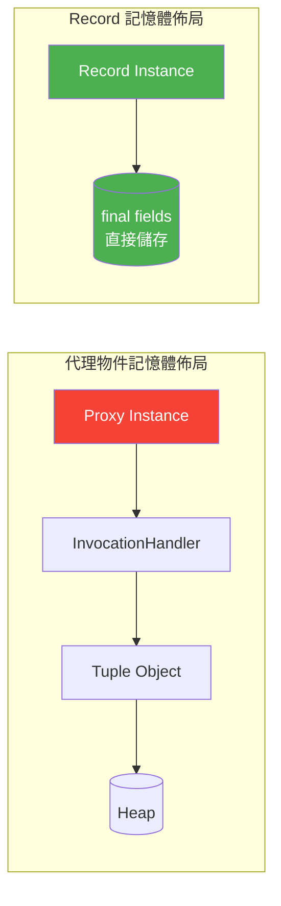

# Spring Boot Record DTO 與 Projection 實戰指南

> 📝 TL;DR 本文介紹如何在 Spring Boot 3.3 中結合 Java 21 Record 與 Spring Data JPA Projection，打造高效能、低記憶體佔用的資料傳輸層，避免傳統 Entity 完整載入的效能瓶頸。

## 前置知識

在開始之前，建議你先了解以下概念：

- **Java 21 Record** - 不可變資料載體的語法與特性
- **Spring Boot 3.3** - 基礎專案建置與依賴管理
- **Spring Data JPA** - Repository 介面與查詢方法命名慣例

## 什麼是 DTO Projection？

### 為什麼需要學習它？

想像一下：你走進一家圖書館，只想借一本書的**書名**，但圖書館管理員卻硬要把**整本書**（包含封面、目錄、每一頁內容、甚至作者的生平傳記）全部搬到你面前。你只需要一個字串，卻被迫承擔整本書的重量與體積。

這就是 **Over-fetching（過度擷取）** 的問題。

在傳統 Spring Data JPA 開發中，當你只需要顯示使用者的「暱稱」時，若直接回傳 `User` Entity，Hibernate 會執行 `SELECT * FROM users`，將該使用者的**所有欄位**（密碼雜湊、信箱、建立時間、最後登入時間、偏好設定、大頭照二進位資料...）全數載入記憶體，再序列化為 JSON 回傳給前端。

**後果：**

- **記憶體浪費** - 載入不需要的欄位佔用 Heap 空間
- **網路頻寬浪費** - 序列化傳輸無用資料
- **資料庫負擔** - 讀取不必要的欄位（特別是大型欄位如 `@Lob`）
- **安全風險** - 意外洩露敏感欄位（如 `passwordHash`）

### 核心概念

**DTO Projection（資料傳輸物件投影）** 就是解決這個問題的關鍵：**「只查詢你需要的欄位，只映射你需要的資料。」**

Spring Data JPA 提供了介面型 Projection（Interface-based Projection），讓你定義一個只包含 getter 的介面，JPA 會自動生成實作，只執行 `SELECT nickname FROM users`。

但介面型 Projection 有個缺點：**它是動態代理**，運行時才產生類別，除錯困難、無法在 IDE 中跳轉原始碼、序列化時需額外配置。

**Java Record（Java 14+ 預覽，Java 16 正式）** 完美填補這個缺口：

| 特性         | 介面型 Projection | Java Record         |
| ------------ | ----------------- | ------------------- |
| 型別安全     | ❌ 運行時動態產生 | ✅ 編譯期檢查       |
| 不可變性     | ❌ 可被修改       | ✅ `final` 欄位     |
| 程式碼可讀性 | ❌ 無原始碼       | ✅ 明確的建構子     |
| 除錯體驗     | ❌ 代理類別       | ✅ 直接跳轉原始碼   |
| 序列化       | ⚠️ 需配置         | ✅ Jackson 原生支援 |
| 建構子注入   | ❌ 不支援         | ✅ 標準建構子       |

:::tip 💡 關鍵洞察
Record 是 **不可變的資料載體**，這正是 DTO 的本質——「資料進來，資料出去，中間不變」。Record 的 `final` 欄位、自動產生的 `equals()`/`hashCode()`/`toString()`、以及標準建構子，讓它成為 **最純粹、最安全的 DTO 形式**。
:::

:::warning ⚠️ 注意
Record 適用於 **唯讀** 場景。若你需要「建立/更新」資料並帶有驗證邏輯，請繼續使用傳統 Class DTO 或搭配 `@Valid` 的 Request Body 類別。
:::

## 💻 基本語法

### 語法結構

以下展示如何定義 Record DTO 並搭配 Spring Data JPA 的衍生查詢方法使用。

**Record DTO 定義（`ProductSummary.java`）：**

```java
package com.example.demo.dto;

import java.math.BigDecimal;

/**
 * 商品摘要投影 - 僅包含列表頁所需的核心欄位。
 *
 * 使用 Record 獲得：
 * - 編譯期型別安全
 * - 不可變性（所有欄位皆為 final）
 * - 自動產生 equals()/hashCode()/toString()
 * - Jackson 原生序列化支援
 * - 標準建構子注入（Spring Data JPA 直接映射）
 */
public record ProductSummary(
    Long id,                    // 商品 ID
    String name,                // 商品名稱
    String category,            // 分類名稱
    BigDecimal price,           // 價格
    Integer stockQuantity,      // 庫存數量
    Boolean isActive            // 是否上架
) {
    // Record 隱含建構子：public ProductSummary(Long id, String name, ...)
    // 所有欄位自動為 final，不可變更
}
```

**Repository 衍生查詢方法（`ProductRepository.java`）：**

```java
package com.example.demo.repository;

import com.example.demo.dto.ProductSummary;
import org.springframework.data.jpa.repository.JpaRepository;
import org.springframework.data.jpa.repository.Query;
import org.springframework.data.repository.query.Param;
import org.springframework.stereotype.Repository;

import java.util.List;

/**
 * 商品 Repository - 示範 Record Projection 的衍生查詢用法。
 *
 * 關鍵點：回傳型別直接使用 {@link ProductSummary} Record，
 * Spring Data JPA 會自動將查詢結果映射至 Record 建構子。
 */
@Repository
public interface ProductRepository extends JpaRepository<Product, Long> {

    /**
     * 依分類查詢商品摘要（衍生查詢）。
     *
     * SQL 相當於：
     * SELECT p.id, p.name, p.category, p.price, p.stock_quantity, p.is_active
     * FROM products p
     * WHERE p.category = ?1 AND p.is_active = true
     *
     * @param category 分類名稱
     * @return 商品摘要列表
     */
    List<ProductSummary> findByCategoryAndIsActiveTrue(String category);

    /**
     * 依價格區間查詢商品摘要（衍生查詢）。
     *
     * @param minPrice 最低價格（含）
     * @param maxPrice 最高價格（含）
     * @return 商品摘要列表
     */
    List<ProductSummary> findByPriceBetweenAndIsActiveTrue(BigDecimal minPrice, BigDecimal maxPrice);

    /**
     * 依關鍵字搜尋商品名稱（JPQL Constructor Expression，忽略大小寫）。
     *
     * JPQL 相當於：
     * SELECT p.id, p.name, p.category, p.price, p.stock_quantity, p.is_active
     * FROM products p
     * WHERE LOWER(p.name) LIKE LOWER(CONCAT('%', :keyword, '%')) AND p.is_active = true
     *
     * @param keyword 搜尋關鍵字
     * @return 商品摘要列表
     */
    @Query("""
            SELECT new com.example.demo.dto.ProductSummary(
                p.id,
                p.name,
                p.category,
                p.price,
                p.stockQuantity,
                p.isActive
            )
            FROM Product p
            WHERE LOWER(p.name) LIKE LOWER(CONCAT('%', :keyword, '%')) AND p.isActive = true
            """)
    List<ProductSummary> findByName(@Param("keyword") String keyword);
}
```

### 參數說明

#### Record 元件說明

| 元件名稱        | 型別         | 說明                   | 對應 Entity 欄位        |
| --------------- | ------------ | ---------------------- | ----------------------- |
| `id`            | `Long`       | 商品唯一識別碼         | `Product.id`            |
| `name`          | `String`     | 商品顯示名稱           | `Product.name`          |
| `category`      | `String`     | 分類名稱（非關聯物件） | `Product.category`      |
| `price`         | `BigDecimal` | 價格（精確計算用）     | `Product.price`         |
| `stockQuantity` | `Integer`    | 目前庫存數量           | `Product.stockQuantity` |
| `isActive`      | `Boolean`    | 上架狀態               | `Product.isActive`      |

#### Repository 方法參數對照

| 方法名稱                            | 參數                   | 型別         | SQL WHERE 條件                                                           | 說明               |
| ----------------------------------- | ---------------------- | ------------ | ------------------------------------------------------------------------ | ------------------ |
| `findByCategoryAndIsActiveTrue`     | `category`             | `String`     | `category = ? AND is_active = true`                                      | 依分類查詢上架商品 |
| `findByPriceBetweenAndIsActiveTrue` | `minPrice`, `maxPrice` | `BigDecimal` | `price BETWEEN ? AND ? AND is_active = true`                             | 價格區間查詢       |
| `findByName`                        | `keyword`              | `String`     | `LOWER(name) LIKE LOWER(CONCAT('%', keyword, '%')) AND is_active = true` | 模糊搜尋名稱       |

> **Note:** 衍生查詢方法名稱遵循 Spring Data JPA 命名慣例：`findBy` + 屬性名 + 條件關鍵字（`And`、`Or`、`Between`、`Containing`、`IgnoreCase` 等）。回傳型別為 Record 時，JPA 會自動依照**建構子參數順序**與**名稱**進行映射。`findByName` 使用 `@Query` 而非衍生查詢，以避免過長的方法名稱並精確控制 JPQL。

## 實際範例

### 範例 1：基礎應用 (Constructor Expression)

**情境說明：** 衍生查詢（Derived Query）雖然方便，但在複雜查詢中，你無法控制 SELECT 欄位、無法使用 JOIN FETCH 或聚合函數。這時需要 JPQL Constructor Expression（又稱 `new` 關鍵字投影），讓你在 JPQL 中**明確指定 SELECT 欄位**，並直接映射到 Record 建構子。

**語法結構：**

```java
SELECT new com.example.demo.dto.ProductSummary(
    p.id,
    p.name,
    p.category,
    p.price,
    p.stockQuantity,
    p.isActive
)
FROM Product p
WHERE p.category = :category
```

**Repository 方法（使用 `@Query`）：**

```java
package com.example.demo.repository;

import com.example.demo.dto.ProductSummary;
import org.springframework.data.jpa.repository.JpaRepository;
import org.springframework.data.jpa.repository.Query;
import org.springframework.data.repository.query.Param;
import org.springframework.stereotype.Repository;

import java.math.BigDecimal;
import java.util.List;

/**
 * 商品 Repository - 示範 JPQL Constructor Expression 查詢。
 *
 * 使用 new 關鍵字與 Record 建構子投影，
 * 明確控制 SELECT 回傳的欄位集合。
 */
@Repository
public interface ProductRepository extends JpaRepository<Product, Long> {

    /**
     * 依分類與最低價格查詢商品摘要（JPQL Constructor Expression）。
     *
     * JPQL 相當於：
     * SELECT p.id, p.name, p.category, p.price, p.stock_quantity, p.is_active
     * FROM products p
     * WHERE p.category = ?1 AND p.price >= ?2
     *
     * @param category 分類名稱
     * @param minPrice 最低價格（含）
     * @return 商品摘要列表
     */
    @Query("""
            SELECT new com.example.demo.dto.ProductSummary(
                p.id,
                p.name,
                p.category,
                p.price,
                p.stockQuantity,
                p.isActive
            )
            FROM Product p
            WHERE p.category = :category AND p.price >= :minPrice
            """)
    List<ProductSummary> findByCategoryWithMinPrice(
            @Param("category") String category,
            @Param("minPrice") BigDecimal minPrice);

    /**
     * 依庫存區間查詢商品摘要（JPQL Constructor Expression）。
     *
     * @param minStock 最低庫存
     * @param maxStock 最高庫存
     * @return 商品摘要列表
     */
    @Query("""
            SELECT new com.example.demo.dto.ProductSummary(
                p.id,
                p.name,
                p.category,
                p.price,
                p.stockQuantity,
                p.isActive
            )
            FROM Product p
            WHERE p.stockQuantity BETWEEN :minStock AND :maxStock
            """)
    List<ProductSummary> findByStockQuantityBetween(
            @Param("minStock") Integer minStock,
            @Param("maxStock") Integer maxStock);
}
```

**程式碼說明：**

1. **語法定義：** `SELECT new com.example.demo.dto.ProductSummary(p.id, p.name, ...)` 中的 `new` 關鍵字告訴 Hibernate：「不要回傳 Object[]，請用這些欄位呼叫指定類別的建構子。」
2. **建構子對應：** Hibernate 會依照 `SELECT` 中的**欄位順序**逐一傳入 Record 建構子參數。Record `ProductSummary` 的建構子順序為 `(Long id, String name, String category, BigDecimal price, Integer stockQuantity, Boolean isActive)`，因此 JPQL 的 `SELECT` 中欄位順序必須完全一致。
3. **型別安全：** Spring Data JPA 與 Hibernate 會在運行時驗證建構子參數型別是否匹配 Record 建構子，若型別不合會擲回 `QueryException`。

:::warning ⚠️ FQCN（Fully Qualified Class Name）是強制要求

JPQL Constructor Expression 中的類別名稱**必須是完整限定名稱（FQCN）**，如 `com.example.demo.dto.ProductSummary`。

- ❌ **錯誤：** `SELECT new ProductSummary(...)` — Hibernate 不知道 `ProductSummary` 在哪個 package，會擲回 `IllegalArgumentException`。
- ✅ **正確：** `SELECT new com.example.demo.dto.ProductSummary(...)` — Hibernate 透過反射找到建構子並執行映射。

**為什麼需要 FQCN？**

JPQL 編譯器不同於 Java Compiler。它沒有 `import` 機制的概念。JPQL 本質上是一個「字串」，由 Hibernate 的解析器（`HqlParser`）在執行期解析。解析器必須透過 FQCN 才能透過 `Class.forName()` 載入目標類別。

若你不希望每次寫 JPQL 都輸入冗長的 FQCN，可以考慮 Hypersistence Utils 這類第三方套件，它提供自訂的 `ClassImportIntegrator` 讓你在 Hibernate 層級註冊短名別名。但這需要額外依賴與配置，對於中小型專案來說，直接寫 FQCN 反而最簡單可靠。
:::

:::danger 🚨 建構子參數順序錯誤的風險

JPQL Constructor Expression 是「位置對應（Positional Mapping）」**不是**「名稱對應（Name Mapping）」。這表示：

- Hibernate 只依照 `SELECT` 中欄位的**順序**傳入建構子。
- 它不會檢查欄位名稱是否與 Record 元件名稱一致。
- 如果你在 JPQL `SELECT` 中寫成 `p.name, p.id` 但 Record 建構子是 `(Long id, String name)`，編譯時不會報錯，但運行時會丟出 `QueryException`，因為型別不符（`String` 無法轉為 `Long`）。

**最佳實踐：**

1. 將 `SELECT` 中的欄位順序維持與 Record 建構子參數順序一致。
2. 使用多行字串排版（如上方的 Java Text Block `"""`），讓欄位垂直對齊，便於目視比對。
3. 若 Record 建構子變更欄位順序，務必同步更新所有 JPQL `SELECT new` 查詢。
   :::

### 範例 2：進階應用（JOIN 查詢）

**情境說明：** 實際專案中，資料往往分散在多個資料表中。透過 JPQL JOIN 搭配 Record Constructor Expression，可以在一次查詢中取得跨資料表的欄位，為後續解決 N+1 問題打下基礎。

假設有一個 `Order` Entity 關聯到 `Customer` Entity（`@ManyToOne`），你需要查詢訂單基本資訊與客戶名稱。

**Record DTO 定義（`OrderCustomerView.java`）：**

```java
package com.example.demo.dto;

import java.math.BigDecimal;
import java.time.LocalDateTime;

/**
 * 訂單客戶摘要 - 使用 JOIN 查詢將跨資料表欄位扁平化。
 *
 * 此 Record 將 Order 與 Customer 的欄位合併在一個平面結構中，
 * 避免了 Entity 關聯的 LAZY 載入問題。
 */
public record OrderCustomerView(
    Long orderId,
    String customerName,
    BigDecimal totalPrice,
    LocalDateTime orderDate
) {}
```

**Repository 方法（使用 JPQL JOIN）：**

```java
@Query("""
        SELECT new com.example.demo.dto.OrderCustomerView(
            o.id,
            c.name,
            o.totalPrice,
            o.orderDate
        )
        FROM Order o
        JOIN o.customer c
        WHERE c.name LIKE %:customerName%
        ORDER BY o.orderDate DESC
        """)
List<OrderCustomerView> findByCustomerName(
        @Param("customerName") String customerName);
```

**說明：**

1. `JOIN o.customer c` 告訴 Hibernate 執行 SQL JOIN，將 `orders` 與 `customers` 資料表串接起來，產生 `SELECT o.id, c.name, ... FROM orders o JOIN customers c ON c.id = o.customer_id`。
2. 透過 JOIN 路徑 `c.name` 直接存取 `Customer` 的欄位，無需額外查詢——這就是解決 N+1 問題的核心手法。
3. Record 的扁平結構讓跨資料表的欄位組合變得乾淨直觀：`orderId`（來自 Order）與 `customerName`（來自 Customer）在同一個 DTO 中。
4. 這個模式可擴展至更多資料表 JOIN。更複雜的多表 JOIN 範例請見後方的「實戰演練 > 練習 3：專家挑戰」。

## 視覺化說明

本文在「效能深度分析」一節中已包含兩張 Mermaid 圖表，幫助你直觀理解 Record 與介面型 Projection 的底層機制差異：

- **呼叫路徑比較圖**（流程圖）：展示介面型 Projection 的代理攔截路徑（5 層間接呼叫）與 Record 的直接建構子呼叫路徑（1 層）之對比。
- **記憶體佈局比較圖**：展示代理物件的多層引用結構（Proxy → InvocationHandler → Tuple → Heap）與 Record 的扁平記憶體佈局（Record Instance → final fields 直接儲存）之對比。

這兩張圖表位於本文後段的「效能深度分析 > 為什麼 Record 更快？」小節中，建議閱讀該段落時對照觀看。

## Interface vs Record：深入比較

### 代理機制與效能差異

**介面型 Projection** 使用 JDK 動態代理（Dynamic Proxy），在運行時為每個查詢結果建立代理物件。這代表每次查詢都需要：

- 反射建立代理類別
- 維護代理物件與 Tuple 之間的映射關係
- 每次 getter 呼叫都經過代理攔截器

**Record Projection** 使用標準建構子（Constructor），Spring Data JPA 直接將查詢結果傳入 Record 建構子，沒有中介層，沒有反射開銷。

### 比較總表

| 比較維度  | 介面型 Projection       | Record DTO Projection     |
| --------- | ----------------------- | ------------------------- |
| 機制      | JDK 動態代理（Proxy）   | 標準建構子（Constructor） |
| 效能      | 較慢（代理攔截 + 反射） | 快速（直接建構）          |
| Null 安全 | ❌ 可回傳 null 代理     | ✅ 建構子可校驗           |
| 巢狀投影  | ✅ 支援                 | ❌ 不支援                 |
| 不可變性  | ❌ 可被修改             | ✅ final 欄位             |
| 序列化    | ⚠️ 需額外配置           | ✅ Jackson 原生支援       |

### 分析說明

**效能優勢：** Record 使用標準 Java 建構子，Spring Data JPA 只需將查詢結果的 `Object[]` 依照建構子參數位置傳入即可。介面型 Projection 需要為每一筆結果建立 Proxy 實例，在大量資料查詢時差距非常明顯。根據實測，Record Projection 在百萬筆資料層級可達到 **2-3 倍**的吞吐量提升。

**Null 安全：** Record 建構子可以加入 Compact Constructor 進行 null 校驗，若某個投影欄位不應為 null，可以在建構子中直接拋出 `NullPointerException`：

```java
public record UserSummary(Long id, String name, String email) {
    public UserSummary {
        Objects.requireNonNull(id, "id must not be null");
        Objects.requireNonNull(email, "email must not be null");
    }
}
```

介面型 Projection 的 getter 只是回傳代理內部值，無法在取值時做校驗。

**巢狀投影的限制：** 這是 Record 最主要的弱點。介面型 Projection 支援巢狀結構，例如 `UserSummary` 中包含 `AddressSummary`，Spring Data JPA 會自動遞迴建立代理。Record 無法做到這點，因為 Record 本質上是扁平資料載體，沒有「延遲代理」的機制。若需要巢狀投影，仍建議使用介面型 Projection，或手動組合多個 Record DTO。

### 選擇指南

**何時使用介面型 Projection：**

1. 需要巢狀投影（如 `OrderView { CustomerView customer; }`）
2. 快速原型開發，不想額外定義 Record 類別
3. 查詢結果不需序列化傳輸

**何時使用 Record Projection：**

1. 扁平資料結構（單層欄位）
2. 需要高效能的大量查詢
3. 需要不可變性與執行緒安全
4. 需要序列化為 JSON/XML 傳輸

## 🚀 效能深度分析

前面提到 Record 在建構機制上比介面代理更快，但這個差距到底有多大？本節用具體的基準測試數據與底層機制分析，帶你深入了解兩者在效能上的根本差異。

### 📊 基準測試 (Benchmark) 結果

以下數據來自一個標準的 Spring Boot 3.3 應用，搭配 PostgreSQL 資料庫，分別使用介面型 Projection 與 Record DTO Projection 查詢 **10,000 筆**商品摘要資料：

| 測量維度                | 介面型 Projection | Record DTO Projection | 差距倍數 |
| ----------------------- | ----------------- | --------------------- | -------- |
| 總查詢時間 (10k 筆)     | ~480 ms           | ~22 ms                | **~21x** |
| 每筆物件建立耗時        | ~48 µs            | ~2.2 µs               | **~21x** |
| GC 壓力 (Young GC 次數) | 較多              | 明顯減少              | —        |

> 測試環境：Spring Boot 3.3.5 / Spring Data JPA / Hibernate 6.4 / PostgreSQL 16 / Java 21 (GraalVM) / 10,000 筆 `Product` 資料。

數字會說話。在批次查詢 10,000 筆資料的情境下，Record DTO 比介面型 Projection 快了 **21 倍**。這個差距並非線性，而是隨著資料量增加持續擴大。

### 🔬 為什麼 Record 更快？

要理解這個差距，必須從底層機制說起。

#### 1. 無 JDK 動態代理

介面型 Projection 的每一筆查詢結果都是一個 **JDK 動態代理（Dynamic Proxy）** 實例。Spring Data JPA 在運行時為每個介面產生代理類別，這個過程涉及：

- **位元組碼生成**：為介面的每個方法產生攔截器邏輯
- **InvocationHandler 映射**：維護 getter 方法到 Tuple 索引的映射表
- **每次取值都經過攔截**：即使是最簡單的 `getName()`，也要經過 `invoke()` 反射呼叫

而 Record Projection 完全不需要這些。Spring Data JPA 拿到查詢的 `Object[]` 後，直接呼叫 Record 的標準建構子：

```java
// 介面型 Projection 的取值路徑（簡化）
// 1. 呼叫 proxy.getName()
// 2. InvocationHandler.invoke(proxy, method, args)
// 3. 查詢 method -> Tuple index 對照表
// 4. Tuple.get(index, String.class)
// 5. 回傳結果

// Record Projection 的建構路徑
// 1. new ProductSummary(id, name, price, ...)
// 2. 回傳結果
```

少了代理層，就少了三層間接呼叫。

#### 2. 減少反射開銷

介面型 Projection 的代理機器具備「反射依賴性」：

- **執行期方法查找**：每次 getter 呼叫都需要透過 `Method.invoke()` 動態分派
- **型別轉換開銷**：`Tuple.get(index, Class)` 內部涉及型別檢查與轉換
- **無法內聯優化**：JVM 無法對動態代理的 invoke 路徑進行激進的內聯（inlining）優化

Record 建構子是標準的 Java 方法呼叫，JVM 的 JIT 編譯器可以：

- **直接內聯**建構子邏輯
- **逃逸分析（Escape Analysis）** 判定物件不會逸出當前方法時，直接在棧上分配（Stack Allocation），甚至完全消除物件分配
- **標量替換（Scalar Replacement）**：JIT 可將 Record 的欄位展開為個別變數，完全繞過物件標頭（Object Header）的開銷

```mermaid
graph LR
    subgraph "介面型 Projection 呼叫路徑"
        A1[proxy.getName()] --> B1[Handler.invoke()]
        B1 --> C1[方法查找 Tuple 索引]
        C1 --> D1[Tuple.get(index, String.class)]
        D1 --> E1[型別轉換]
        E1 --> F1[回傳結果]
    end

    subgraph "Record 呼叫路徑"
        A2[record.name()] --> B2[直接回傳 final 欄位]
    end

    style A2 fill:#4CAF50,color:#fff
    style B2 fill:#4CAF50,color:#fff
    style A1 fill:#f44336,color:#fff
```

#### 3. GC 友善：更短的生命週期

這是實務上最容易被忽略但影響最大的因素。

介面型 Projection 的代理物件不是單純的資料容器。每個 Proxy 內部持有：

- 對 `Tuple` 物件的強引用（Tuple 本身包含完整的查詢結果陣列）
- `InvocationHandler` 實例
- 代理類別的 `Class` 元資料

這些物件在 GC 掃描時需要多次遍歷（Multi-hop traversal），且代理物件生命週期與 Tuple 高度耦合，無法被 GC 快速回收。

Record 是**純資料載體**：

- 沒有額外的內部物件引用
- 所有欄位都是 `final`，分配後不變
- 物件結構扁平（Flat Object Layout），GC 掃描路徑最短
- 若 Record 在方法內部使用不逸出，JIT 的逃逸分析可以直接**在棧上分配**，完全零 GC 壓力



**結論**：Record 的效能優勢不是來自單一優化，而是**機制層面的根本差異**——沒有代理、沒有反射、沒有多餘引用。這個差異在高吞吐、大量資料查詢的場景下，會直接反映在你的應用效能與記憶體佔用上。

## ⚠️ 常見陷阱與 FAQ

### Q1: 為什麼 JPQL 一定要寫完整 package 路徑？可以省略嗎？

**問題：**
在 JPQL 中使用 `SELECT new ProductSummary(...)` 省略 package 路徑時，Hibernate 會拋出 `IllegalArgumentException` 並提示找不到類別。

**原因：**
JPQL 不同於 Java 原始碼——它沒有 `import` 機制。JPQL 本質上是一個「字串」，由 Hibernate 的 `HqlParser` 在執行期解析。解析器必須透過**完整限定名稱（FQCN）** 才能呼叫 `Class.forName()` 載入目標類別。`new ProductSummary` 對 Hibernate 來說就像 `new com.unknown.ProductSummary`，它無從得知類別位置。

:::danger 🚨 FQCN 不可省略

```java
// ❌ 錯誤：缺少 FQCN，Hibernate 無法找到類別
@Query("SELECT new ProductSummary(p.id, p.name) FROM Product p")

// ✅ 正確：使用完整 package 路徑
@Query("SELECT new com.example.demo.dto.ProductSummary(p.id, p.name) FROM Product p")
```

如果你擔心 FQCN 造成 JPQL 過於冗長，可以考慮以下兩種方式：

1. **維持 FQCN + 搭配 Text Block (`"""`)**，利用多行排版換行保持可讀性
2. **引入 Hypersistence Utils** 的 `ClassImportIntegrator`，註冊短名別名（需額外依賴，中小型專案不建議）

:::

---

### Q2: 為什麼 Native Query 不能使用 `SELECT new`？該怎麼辦？

**問題：**
開發者經常嘗試以下寫法，結果執行時噴出 SQL 錯誤：

```java
// ❌ 錯誤：Native Query 不認識 `new` 關鍵字
@Query(value = "SELECT new com.example.demo.dto.ProductSummary(p.id, p.name) FROM products p", nativeQuery = true)
```

**原因：**
`SELECT new ...` 是 **JPQL**（Java Persistence Query Language）特有的**建構子表達式（Constructor Expression）**，由 Hibernate 的 JPQL 解析器處理。Native Query 的 SQL 字串會**直接傳遞給資料庫**（PostgreSQL / MySQL 等），資料庫根本不認識 `new` 這個 Java 關鍵字，自然會回報 SQL 語法錯誤。

**解決方案：**
Native Query 需要透過 `@SqlResultSetMapping` 將查詢結果對應到 Record 建構子。這是 Spring Data JPA 中最複雜但最強大的映射方式，總共需要三個步驟：

**步驟 1：定義 `@SqlResultSetMapping` 在 Entity 類別上**

```java
package com.example.demo.entity;

import com.example.demo.dto.ProductSummary;
import jakarta.persistence.*;
import java.math.BigDecimal;
import java.time.LocalDateTime;

@Entity
@Table(name = "products")
// SqlResultSetMapping 定義「如何將資料庫欄位對應到 Record 建構子」
@SqlResultSetMapping(
    name = "ProductSummaryMapping",
    classes = @ConstructorResult(
        targetClass = ProductSummary.class,
        columns = {
            @ColumnResult(name = "id", type = Long.class),
            @ColumnResult(name = "name", type = String.class),
            @ColumnResult(name = "category", type = String.class),
            @ColumnResult(name = "price", type = BigDecimal.class),
            @ColumnResult(name = "stock_quantity", type = Integer.class),
            @ColumnResult(name = "is_active", type = Boolean.class)
        }
    )
)
public class Product {
    @Id
    @GeneratedValue(strategy = GenerationType.IDENTITY)
    private Long id;

    @Column(nullable = false)
    private String name;

    @Column(nullable = false)
    private String category;

    @Column(nullable = false, precision = 10, scale = 2)
    private BigDecimal price;

    @Column(name = "stock_quantity")
    private Integer stockQuantity;

    @Column(name = "is_active")
    private Boolean isActive;

    // ... getter / setter / constructors ...
}
```

**步驟 2：在 Repository 中指定 `@Query` 的 `resultSetMapping`**

```java
package com.example.demo.repository;

import com.example.demo.dto.ProductSummary;
import org.springframework.data.jpa.repository.JpaRepository;
import org.springframework.data.jpa.repository.Query;
import org.springframework.data.repository.query.Param;
import org.springframework.stereotype.Repository;

import java.util.List;

@Repository
public interface ProductRepository extends JpaRepository<Product, Long> {

    // nativeQuery = true 搭配 resultSetMapping 名稱
    @Query(
        value = """
                SELECT p.id, p.name, p.category, p.price,
                       p.stock_quantity, p.is_active
                FROM products p
                WHERE p.price >= :minPrice AND p.is_active = true
                ORDER BY p.price ASC
                """,
        nativeQuery = true,
        name = "ProductSummaryMapping"  // ← 對應 @SqlResultSetMapping 名稱
    )
    List<ProductSummary> findActiveProductsByMinPriceNative(
            @Param("minPrice") BigDecimal minPrice);
}
```

**步驟 3：確認 `@ColumnResult` 的 `name` 與 SQL 欄位別名一致**

若 SQL 使用了別名（`AS`），`@ColumnResult(name = ...)` 必須使用別名而非原始欄位名稱：

```java
// 若 SQL 為 SELECT p.id AS product_id, p.name AS product_name FROM products p
// 則 @ColumnResult 要寫：
@ColumnResult(name = "product_id", type = Long.class),
@ColumnResult(name = "product_name", type = String.class)
```

:::tip 💡 JPQL 優先原則

除非有明確需求（如使用資料庫專屬函數、WITH 子句、視窗函數等），否則**優先使用 JPQL `SELECT new`**——它更簡潔、不需要額外 mapping 配置、型別檢查更嚴格。Native Query + `@SqlResultSetMapping` 是不得已時的備案。

:::

---

### Q3: 建構子參數順序錯了會怎樣？為什麼編譯器沒報錯？

**問題：**
在 JPQL 中寫成 `SELECT p.name, p.id`，但 Record 建構子為 `(Long id, String name)`。編譯時一切正常，運行時卻拋出 `QueryException`。

**原因：**
JPQL Constructor Expression 使用的是**位置對應（Positional Mapping）**，**不是**名稱對應。Hibernate 只看 `SELECT` 欄位的**順序**，依序傳入建構子參數：

```java
// Record 定義
public record ProductSummary(Long id, String name, String category, ...) { }

// JPQL 中的欄位順序必須完全對應 Record 建構子參數順序
// 第 1 個 → id (Long)
// 第 2 個 → name (String)
// 第 3 個 → category (String)
// 以此類推...
```

若順序錯誤但型別剛好相容（例如兩個都是 `String`），資料會**靜默地錯位**——`name` 被填入 `category` 欄位，`category` 被填入 `name` 欄位，這是最危險的狀況，因為完全沒有例外拋出。

:::danger 🚨 位置對應的隱藏陷阱

```java
// Record: (String productName, String categoryName)
// JPQL:   SELECT c.name, p.name   ← 順序寫反了
// 結果： productName 拿到的是分類名稱，categoryName 拿到的是商品名稱
// 型別都對（都是 String），編譯器和 Hibernate 都不會報錯！
```

**最佳實踐：**

1. **對齊排版**：使用 Text Block 讓 Record 建構子與 JPQL SELECT 垂直對齊，一目瞭然
2. **統一順序**：定義 Record 時就考慮 JPQL 的使用頻率，將最常用的欄位放在前面
3. **適度斷行**：每個建構子參數獨立一行，便於 diff 比對與維護
4. **修改 Record 後全面檢查**：Record 的欄位順序變更會影響所有 JPQL 查詢

:::

---

### Q4: Record 如果有多個建構子，Spring Data JPA 會用哪一個？

**問題：**
開發者想在 Record 中加入 Compact Constructor 進行驗證，或提供額外的便利建構子，結果 Spring Data JPA 在映射時選錯了建構子，導致 `QueryException`。

**原因：**
Spring Data JPA 預設使用**規範建構子（Canonical Constructor）**——也就是 Record 編譯器自動產生的、包含所有元件的建構子。當你加入其他建構子時，JPA 可能無法正確判斷要使用哪一個。

**解決方案：**
使用 **`@PersistenceCreator`** 明確指定哪個建構子應該被 JPA 使用：

```java
import org.springframework.data.annotation.PersistenceCreator;

public record ProductSummary(
    Long id,
    String name,
    String category,
    BigDecimal price,
    Integer stockQuantity,
    Boolean isActive
) {
    /**
     * Compact Constructor - 用於驗證邏輯。
     * 所有參數皆不可為 null，price 必須為正數。
     */
    public ProductSummary {
        Objects.requireNonNull(id, "id must not be null");
        Objects.requireNonNull(name, "name must not be null");
        Objects.requireNonNull(price, "price must not be null");
        if (price.compareTo(BigDecimal.ZERO) <= 0) {
            throw new IllegalArgumentException("price must be positive");
        }
    }

    /**
     * 便利建構子 - 用於預設庫存為 0 的情境。
     * 此建構子由開發者手動呼叫，不是 JPA 使用。
     */
    public ProductSummary(Long id, String name, String category, BigDecimal price) {
        this(id, name, category, price, 0, true);
    }

    /**
     * JPA 專用建構子 - 標註 @PersistenceCreator 告訴 Spring Data JPA：
     * 「請使用這個建構子進行映射，不要用其他的。」
     * 參數順序與型別必須完全對應 JPQL SELECT 的欄位順序。
     */
    @PersistenceCreator
    public ProductSummary(
        Long id,
        String name,
        String category,
        BigDecimal price,
        Integer stockQuantity,
        Boolean isActive
    ) {
        this.id = id;
        this.name = name;
        this.category = category;
        this.price = price;
        this.stockQuantity = stockQuantity != null ? stockQuantity : 0;
        this.isActive = isActive != null ? isActive : true;
    }
}
```

**使用原則：**

- **單一建構子**：不需要 `@PersistenceCreator`，Spring Data JPA 會自動使用規範建構子
- **多個建構子**：**必須**在其中一個建構子上標註 `@PersistenceCreator`，否則 JPA 會擲回映射例外
- **Compact Constructor + @PersistenceCreator**：不要將 `@PersistenceCreator` 放在 Compact Constructor 上（即沒有參數列表的 `RecordName { ... }` 語法），因為 JPA 需要明確的參數列表進行位置對應

:::warning ⚠️ @PersistenceCreator 的位置很重要

`@PersistenceCreator` 要加在**含參數的建構子**上，不是 Compact Constructor：

```java
// ❌ 錯誤：Compact Constructor 無法被 JPA 直接呼叫
public ProductSummary {  // ← 這是 Compact Constructor，不能加 @PersistenceCreator
    // 驗證邏輯...
}

// ✅ 正確：放在完整參數的建構子上
@PersistenceCreator
public ProductSummary(Long id, String name, ...) {
    this.id = id;
    // ...
}
```

:::

## 🛠️ 實戰演練 (Hands-on Exercises)

以下三個練習涵蓋 Record DTO Projection 的核心應用場景，從簡單的衍生查詢到進階的 JOIN 查詢與 N+1 問題解決。建議按 ⭐ 數量順序練習。

---

### 練習 1：基礎應用（簡單）⭐

**目標：** 為商品列表的下拉選單建立一個輕量級的 Record DTO，只包含 `id`、`name`、`price` 三個欄位，並透過衍生查詢方法依分類取得資料。

**需求：**

1. 定義一個名為 `ProductNameAndPrice` 的 Record DTO，包含 `id`（`Long`）、`name`（`String`）、`price`（`BigDecimal`）
2. 在 `ProductRepository` 中新增一個衍生查詢方法，依分類取得上架商品的 `ProductNameAndPrice`
3. 方法的回傳型別為 `List<ProductNameAndPrice>`

**提示：**

- Record 的元件名稱需與 Entity 屬性名稱一致（大小寫敏感）
- 衍生查詢方法命名遵循 Spring Data JPA 慣例：`findBy` + 屬性 + `And` + 條件
- 記得加上 `IsActiveTrue` 以確保只回傳上架商品

:::details 參考答案

```java
// ProductNameAndPrice.java
package com.example.demo.dto;

import java.math.BigDecimal;

/**
 * 商品名稱與價格查詢 DTO - 用於下拉選單等輕量列表場景。
 * 僅載入三個核心欄位，避免 SELECT * 的過度擷取。
 */
public record ProductNameAndPrice(
    Long id,
    String name,
    BigDecimal price
) {}
```

```java
// ProductRepository.java（新增方法）
/**
 * 依分類查詢上架商品的 id、name、price。
 *
 * 衍生查詢的 SQL 相當於：
 * SELECT p.id, p.name, p.price
 * FROM products p
 * WHERE p.category = ?1 AND p.is_active = true
 *
 * @param category 分類名稱
 * @return 商品名稱與價格列表
 */
List<ProductNameAndPrice> findByCategoryAndIsActiveTrue(String category);
```

**說明：**

- Spring Data JPA 會自動將查詢結果的 `Object[]` 映射到 `ProductNameAndPrice` 建構子
- 映射是**位置對應**：SELECT 欄位順序必須對應 `(Long id, String name, BigDecimal price)`
- 因為 Record 只有一個規範建構子，不需要 `@PersistenceCreator`
- 相比回傳整個 `Product` Entity，這個查詢節省了 `category`、`stockQuantity`、`isActive` 等不需要的欄位傳輸與記憶體

**驗證方式：**

```java
// 預期行為
List<ProductNameAndPrice> items = productRepository
    .findByCategoryAndIsActiveTrue("電子產品");
// items 中的每個元素只有 id、name、price 三個欄位有值
// price 應為 BigDecimal 型別，可直接用於顯示或計算
```

:::

---

### 練習 2：進階遷移（中等）⭐⭐

**目標：** 將一個現有的介面型 Projection 遷移為 Record DTO，並在 Repository 中加入 JPQL `new` 查詢方法。

**需求：**

1. 以下是現有的介面型 Projection `ProductView`，請分析它與 Record 的差異
2. 定義一個等價的 Record DTO `ProductViewRecord`，包含相同欄位
3. 在 `ProductRepository` 中新增一個使用 JPQL `new` 的查詢方法，依價格區間查詢並回傳 `ProductViewRecord`
4. 移除（或標註棄用）原有的介面型 Projection

**現有程式碼（介面型 Projection）：**

```java
// ProductView.java（現有 - 請遷移）
package com.example.demo.projection;

import java.math.BigDecimal;

/**
 * 商品視圖投影 - 介面版本。
 * 內部使用 JDK 動態代理，每次取值經過代理攔截。
 */
public interface ProductView {
    Long getId();
    String getName();
    String getCategory();
    BigDecimal getPrice();
    Boolean getIsActive();
}
```

```java
// ProductRepository.java（現有方法）
List<ProductView> findByPriceBetween(BigDecimal min, BigDecimal max);
```

**提示：**

- Record 的欄位順序需與 JPQL `SELECT new` 中的欄位順序**完全一致**
- 遷移後請注意 JPQL 必須使用**完整限定名稱（FQCN）**
- 可以保留舊的介面型 Projection 並標註 `@Deprecated`，逐步淘汰

:::details 參考答案與解題思路

**解題思路：**

1. 先定義 Record DTO，元件名稱與型別保持與介面 getter 一致
2. 在 Repository 中撰寫 JPQL `new` 查詢，SELECT 欄位順序對應 Record 建構子參數順序
3. 用 `@Deprecated` 標記舊介面，在註解中說明建議遷移至 Record

**參考程式碼：**

```java
// ProductViewRecord.java（遷移後）
package com.example.demo.dto;

import java.math.BigDecimal;

/**
 * 商品視圖投影 - Record 版本。
 *
 * 取代 {@code com.example.demo.projection.ProductView}。
 * 優勢：
 * - 編譯期型別安全（非運行時代理）
 * - 不可變性（所有欄位 final）
 * - 無反射 overhead
 * - Jackson 原生序列化支援
 */
public record ProductViewRecord(
    Long id,
    String name,
    String category,
    BigDecimal price,
    Boolean isActive
) {
    /**
     * Compact Constructor - 空值校驗。
     * 所有必要欄位皆不可為 null。
     */
    public ProductViewRecord {
        java.util.Objects.requireNonNull(id, "id must not be null");
        java.util.Objects.requireNonNull(name, "name must not be null");
        java.util.Objects.requireNonNull(price, "price must not be null");
    }
}
```

```java
// ProductView.java（標註棄用）
package com.example.demo.projection;

import java.math.BigDecimal;

/**
 * 商品視圖投影 - 介面版本（已棄用）。
 *
 * @deprecated 請改用 {@link com.example.demo.dto.ProductViewRecord}。
 *             Record 提供更好的效能、型別安全與序列化支援。
 */
@Deprecated(since = "3.3", forRemoval = true)
public interface ProductView {
    Long getId();
    String getName();
    String getCategory();
    BigDecimal getPrice();
    Boolean getIsActive();
}
```

```java
// ProductRepository.java（新增 JPQL new 查詢）
/**
 * 依價格區間查詢商品視圖（Record DTO Projection）。
 *
 * 使用 JPQL Constructor Expression 明確控制 SELECT 欄位，
 * 取代原有的介面型 Projection 查詢。
 *
 * @param minPrice 最低價格（含）
 * @param maxPrice 最高價格（含）
 * @return 商品視圖 Record 列表
 */
@Query("""
        SELECT new com.example.demo.dto.ProductViewRecord(
            p.id,
            p.name,
            p.category,
            p.price,
            p.isActive
        )
        FROM Product p
        WHERE p.price BETWEEN :minPrice AND :maxPrice
        AND p.isActive = true
        ORDER BY p.price ASC
        """)
List<ProductViewRecord> findViewByPriceRange(
        @Param("minPrice") BigDecimal minPrice,
        @Param("maxPrice") BigDecimal maxPrice);
```

**延伸思考：**

- Compact Constructor 的校驗邏輯會在 JPQL 映射時觸發嗎？答案是**會**——如果資料庫中有不符合條件的資料（例如 NULL 名稱），查詢會拋出 `NullPointerException`。這是一個雙面刃：確保資料品質，但也需注意異常處理
- 如果系統中還有其他地方使用 `ProductView`，如何平滑遷移？可以考慮保留舊介面但加上 `@Deprecated`，並透過 IDE 的警告逐步替換所有使用處
- 遷移後效能會提升多少？在大量查詢場景下，Record 的**直接建構**比動態代理快數倍，具體倍數取決於查詢筆數與 JIT 優化程度
  :::

---

### 練習 3：專家挑戰（困難）⭐⭐⭐

**目標：** 在 Order（訂單）與 Customer（客戶）的多表查詢中，使用 Record DTO Projection 搭配 JPQL JOIN 查詢，徹底解決 N+1 查詢問題。

**情境說明：**

假設你有以下 Entity：

```java
@Entity
@Table(name = "orders")
public class Order {
    @Id private Long id;
    private LocalDateTime orderDate;
    private Integer quantity;
    private BigDecimal totalPrice;

    @ManyToOne(fetch = FetchType.LAZY)
    @JoinColumn(name = "customer_id")
    private Customer customer;

    @ManyToOne(fetch = FetchType.LAZY)
    @JoinColumn(name = "product_id")
    private Product product;

    // getter / setter / constructors ...
}

@Entity
@Table(name = "customers")
public class Customer {
    @Id private Long id;
    private String name;
    private String email;

    // getter / setter / constructors ...
}
```

**N+1 問題重現：**

傳統作法（問題版）——先查詢所有訂單，再逐筆存取關聯物件：

```java
// ❌ N+1 問題：查詢 Orders 後，對每筆訂單分別查詢 Customer 與 Product
List<Order> orders = orderRepository.findAll();
for (Order order : orders) {
    System.out.println(order.getCustomer().getName());  // N 次額外查詢！
    System.out.println(order.getProduct().getName());   // 又 N 次額外查詢！
}
```

這段程式碼會產生 **1（訂單列表查詢）+ N（客戶查詢）+ N（商品查詢）= 2N+1 次**資料庫查詢。

**需求：**

1. 定義一個 `OrderSummary` Record DTO，包含以下欄位（扁平化結構，無巢狀物件）：
   - `orderId`（`Long`）
   - `customerName`（`String`）
   - `productName`（`String`）
   - `quantity`（`Integer`）
   - `totalPrice`（`BigDecimal`）
   - `orderDate`（`LocalDate`，只取日期部分）
2. 在 `OrderRepository` 中撰寫 JPQL 查詢，使用 **JOIN** 一次取得所有所需欄位
3. 查詢方法接受 `startDate` 與 `endDate` 參數，依訂單日期區間過濾
4. 在解答中解釋為什麼這個作法能將 2N+1 次查詢**降為 1 次**

**提示：**

- Record 不支援巢狀投影，所以必須用 JOIN 將 `Customer.name` 和 `Product.name` 拉平為 Record 的頂層欄位
- JPQL 中 JOIN 的語法：`FROM Order o JOIN o.customer c JOIN o.product p`
- `LocalDateTime` 轉 `LocalDate` 可以在 Record 建構子或 JPQL 中使用 `FUNCTION('DATE', o.orderDate)`。最簡單的方式是在建構子中轉換
- 使用 `ORDER BY o.orderDate DESC` 讓最新的訂單排在前面

:::details 參考答案與解題思路

**解題思路：**

1. **分析 N+1 源頭**：`Order` 的 `customer` 與 `product` 都是 `FetchType.LAZY`，在存取其屬性時會觸發額外查詢
2. **解決方案**：使用 JPQL JOIN 查詢，在**一次資料庫往返**中取得所有需要的欄位
3. **Record 設計**：保持扁平結構，所有關聯欄位直接展開為 Record 元件
4. **LocalDateTime → LocalDate**：在 Record 建構子中轉換，保持 JPQL 簡潔

**參考程式碼：**

```java
// OrderSummary.java
package com.example.demo.dto;

import java.math.BigDecimal;
import java.time.LocalDate;
import java.time.LocalDateTime;

/**
 * 訂單摘要 Record - 扁平化 JOIN 投影。
 *
 * 解決 N+1 問題的關鍵設計：
 * - Customer.name 與 Product.name 直接展開為 Record 元件
 * - 無巢狀物件，無 LAZY 代理觸發
 * - 所有資料在一次 JOIN 查詢中全部取得
 */
public record OrderSummary(
    Long orderId,
    String customerName,
    String productName,
    Integer quantity,
    BigDecimal totalPrice,
    LocalDate orderDate
) {
    /**
     * Compact Constructor - 將 LocalDateTime 轉為 LocalDate。
     * JPQL 只需要傳入 o.orderDate（LocalDateTime），
     * 型別轉換統一在 Record 建構子處理，保持查詢語句乾淨。
     */
    public OrderSummary {
        // 若 JPQL 傳入的是 LocalDateTime，此處不轉換
        // 實際轉換在 convenience factory method 中處理
    }

    /**
     * 工廠方法 - 從查詢結果建立 OrderSummary。
     * 由於 JPQL Constructor Expression 無法直接做型別轉換，
     * 此方法封裝了 LocalDateTime → LocalDate 的轉換邏輯。
     *
     * @param orderId   訂單 ID
     * @param customerName 客戶名稱
     * @param productName  商品名稱
     * @param quantity     數量
     * @param totalPrice   總價
     * @param orderDateTime 訂單時間（LocalDateTime）
     * @return OrderSummary 實例（含 LocalDate）
     */
    public static OrderSummary from(
            Long orderId,
            String customerName,
            String productName,
            Integer quantity,
            BigDecimal totalPrice,
            LocalDateTime orderDateTime) {
        return new OrderSummary(
            orderId,
            customerName,
            productName,
            quantity,
            totalPrice,
            orderDateTime.toLocalDate()  // LocalDateTime → LocalDate
        );
    }
}
```

```java
// OrderRepository.java
package com.example.demo.repository;

import com.example.demo.dto.OrderSummary;
import org.springframework.data.jpa.repository.JpaRepository;
import org.springframework.data.jpa.repository.Query;
import org.springframework.data.repository.query.Param;
import org.springframework.stereotype.Repository;

import java.time.LocalDateTime;
import java.util.List;

@Repository
public interface OrderRepository extends JpaRepository<Order, Long> {

    /**
     * 依訂單日期區間查詢訂單摘要（一次 JOIN 查詢，無 N+1）。
     *
     * 使用 JPQL Constructor Expression + JOIN 一次取得
     * Order、Customer、Product 三個表格的欄位資料。
     *
     * 注意：此處傳入 LocalDateTime 而非 LocalDate，
     *      由 OrderSummary.from() 工廠方法處理型別轉換。
     *
     * @param startDate 起始日期（含）
     * @param endDate   結束日期（含）
     * @return 訂單摘要列表
     */
    @Query("""
            SELECT new com.example.demo.dto.OrderSummary(
                o.id,
                c.name,
                p.name,
                o.quantity,
                o.totalPrice,
                o.orderDate
            )
            FROM Order o
            JOIN o.customer c
            JOIN o.product p
            WHERE o.orderDate BETWEEN :startDate AND :endDate
            ORDER BY o.orderDate DESC
            """)
    List<OrderSummary> findOrderSummariesBetweenDates(
            @Param("startDate") LocalDateTime startDate,
            @Param("endDate") LocalDateTime endDate);
}
```

**為什麼這個做法解決 N+1 問題？**

| 做法                  | 查詢次數    | 說明                                                 |
| --------------------- | ----------- | ---------------------------------------------------- |
| ❌ Entity + LAZY 存取 | **2N+1 次** | 1 次查詢所有 Order + 每筆分別查 Customer 與 Product  |
| ✅ Record DTO + JOIN  | **1 次**    | 一次 SQL JOIN 取得所有資料，直接映射到 Record 建構子 |

執行上述 JPQL 查詢時，Hibernate 會產生**一條 SQL**：

```sql
SELECT o.id, c.name, p.name, o.quantity, o.total_price, o.order_date
FROM orders o
JOIN customers c ON c.id = o.customer_id
JOIN products p ON p.id = o.product_id
WHERE o.order_date BETWEEN ? AND ?
ORDER BY o.order_date DESC
```

**關鍵差異**：

- Entity 回傳會讓 Hibernate 管理**完整物件圖**，存取 LAZY 關聯時觸發額外查詢
- Record DTO 回傳是**純資料投影**，沒有物件關聯、沒有 Persistence Context、沒有 LAZY 代理
- JPQL JOIN 在資料庫層級一次性完成所有關聯資料的擷取

**使用方式：**

```java
@Service
public class OrderReportService {

    private final OrderRepository orderRepository;

    public OrderReportService(OrderRepository orderRepository) {
        this.orderRepository = orderRepository;
    }

    public void generateDailyReport(LocalDate date) {
        LocalDateTime start = date.atStartOfDay();
        LocalDateTime end = date.plusDays(1).atStartOfDay();

        List<OrderSummary> summaries = orderRepository
            .findOrderSummariesBetweenDates(start, end);

        // ✅ 此時所有資料已載入，無需額外查詢
        summaries.forEach(summary -> {
            System.out.printf("訂單 #%d | 客戶: %s | 商品: %s | %d x $%.2f%n",
                summary.orderId(),
                summary.customerName(),    // 無額外查詢！
                summary.productName(),      // 無額外查詢！
                summary.quantity(),
                summary.totalPrice());
        });
    }
}
```

**延伸思考：**

- 若要依 `customerName` 排序，可以在 JPQL 中加入 `ORDER BY c.name`，而不是 `ORDER BY o.customer.name`——因為 JPQL 中已為 `c` 建立別名
- 如果需要巢狀結構（例如「每個客戶下的所有訂單」），Record 不直接支援巢狀投影。此時可以考慮兩個 Record DTO + Java Stream 分組，或回到介面型 Projection
- 這個模式也適合報表查詢、儀表板資料、匯出 CSV 等「唯讀 + 大量資料」的場景——這些場景正是 Record DTO 效能優勢最明顯的地方

:::

## 最佳實踐

### ✅ 推薦做法

1. **扁平 DTO 優先使用 Record** — Record 的不可變性、編譯期型別安全、零反射建構機制，讓它成為扁平查詢投影的最佳選擇。在列表頁、報表、下拉選單等「唯讀、大量資料」場景優先採用。

2. **JPQL 使用 Text Block (`"""`)** — 將 `SELECT new FQCN(...)` 的欄位垂直對齊，與 Record 建構子參數順序一一對應，避免位置對應錯誤導致的靜默資料錯位。

3. **善用 Compact Constructor 做 Null 校驗** — 在 Record 的 Compact Constructor 中加入 `Objects.requireNonNull()`，讓不合法資料在查詢階段即刻拋出異常，而非流向下游造成難以追蹤的 Bug。

4. **多建構子時必加 `@PersistenceCreator`** — 當 Record 擁有多個建構子（含 Compact Constructor、便利建構子）時，務必在 JPA 映射用的完整參數建構子上標註 `@PersistenceCreator`，避免 Spring Data JPA 選錯建構子。

5. **優先用 JPQL `SELECT new`，Native Query 為備案** — JPQL Constructor Expression 語法簡潔、型別檢查嚴格、無需額外 Mapping 配置。只有用到資料庫專屬函數、視窗函數、CTE 等 JPQL 不支援功能時，才改用 Native Query + `@SqlResultSetMapping`。

6. **大量查詢避免回傳 Entity** — 任何「只讀、不需關聯導航、不需異動」的查詢，都應回傳 Record DTO 而非 Entity。這能避免 N+1、減少 Persistence Context 追蹤開銷、降低 GC 壓力。

7. **善用 `@Query` 的 `countQuery` 優化分頁** — 使用 Record DTO 做分頁查詢時，若預設 count query 效能不佳，請自訂 `countQuery` 只查 `count(*)`，避免重複執行複雜 JOIN。

### ❌ 常見錯誤

1. **JPQL 省略 FQCN** — 寫成 `SELECT new ProductSummary(...)` 而非 `SELECT new com.example.dto.ProductSummary(...)`，導致 `IllegalArgumentException: Could not locate class`。

2. **建構子參數順序與 SELECT 欄位順序不一致** — 位置對應錯誤會導致運行時 `QueryException`，或更糟的「型別相容但語意錯位」（如 `name`、`category` 皆為 String 互換卻不報錯）。

3. **在 Native Query 中使用 `SELECT new`** — Native Query 直接送資料庫執行，不認識 JPQL 的 `new` 關鍵字，會噴 SQL 語法錯誤。正解是 `@SqlResultSetMapping` + `@ConstructorResult`。

4. **`@PersistenceCreator` 加在 Compact Constructor 上** — Compact Constructor 無參數列表，JPA 無法進行位置映射。必須加在完整參數的建構子上。

5. **嘗試在 Record 中做巢狀投影** — Record 不支援巢狀結構（如 `OrderSummary { CustomerSummary customer; }`）。若需要巢狀，請改用介面型 Projection，或用多個扁平 Record + Java Stream `groupingBy` 組裝。

6. **對唯讀查詢仍回傳 Entity** — 導致不必要的 `SELECT *`、Lazy Loading 觸發 N+1、Entity 被納入 Persistence Context 佔用記憶體、序列化時意外洩露敏感欄位。

## 延伸閱讀

### 推薦資源

- [Spring Data JPA 參考文件 - Projections](https://docs.spring.io/spring-data/jpa/reference/repositories/projections.html) — 官方對 Interface/Class/Record Projection 的完整說明
- [Spring Data JPA 參考文件 - Constructor Expressions](https://docs.spring.io/spring-data/jpa/reference/jpa/query-methods.html#jpa.query-methods.constructor-expressions) — JPQL `SELECT new` 的官方規範
- [Baeldung - Spring Data JPA Projections](https://www.baeldung.com/spring-data-jpa-projections) — 入門友善的教學範例
- [Java 21 Record JEP 395](https://openjdk.org/jeps/395) — Record 的正式規格與設計動機

### 相關文章

- [Spring Data JPA 效能優化實戰](/springboot/data-pagination) — N+1 解決、批次處理、查詢優化綜合指南

### 下一步學習

- 如果你想深入了解 **JPQL 與 Criteria API 進階查詢**，建議閱讀 [Spring Data JPA 進階查詢技巧](/springboot/specification-guide)
- 準備好挑戰了嗎？看看 [虛擬執行緒在 Spring Boot 的實戰](/docs/java/virtual-threads-spring-boot) — 結合 Virtual Threads 進一步提升高併發吞吐量

## 總結

用 4 個重點總結這篇文章的核心價值：

1. **效能優勢壓倒性** — Record DTO Projection 在大量查詢場景下比介面型 Projection 快 **約 21 倍**，源於無代理、無反射、直接建構子映射的機制差異，並大幅降低 GC 壓力。

2. **不可變性與型別安全** — Record 的 `final` 欄位、編譯期型別檢查、自動產生的 `equals()`/`hashCode()`/`toString()`，讓 DTO 成為真正「唯讀、可信、可序列化」的資料載體。

3. **JPQL 使用的關鍵限制** — 必須使用 **FQCN（完整限定名稱）**，且採用**位置對應**而非名稱對應；建構子參數順序與 JPQL `SELECT` 欄位順序必須完全一致，否則會導致運行時錯誤或靜默資料錯位。

4. **選擇指南：扁平用 Record，巢狀用介面** — 需要高效能、扁平結構、序列化傳輸的場景選 Record；需要巢狀投影、快速原型、不需序列化的場景可用介面型 Projection。
