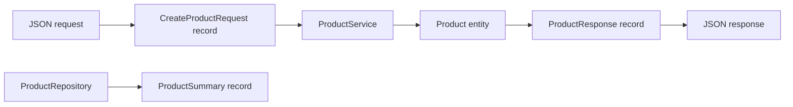

# Spring Boot 為什麼值得使用 Record DTO

如果一個類別的工作只是「帶著幾個值在系統間移動」，卻需要建構子、getter、`equals()`、`hashCode()`、`toString()`，那不是業務邏輯，只是樣板程式碼。

```java
public record ProductResponse(
    Long id,
    String name,
    BigDecimal price
) {}
```

這一行宣告已經說清楚三件事：

1. 這是資料載體，不是會持續改變狀態的物件。
2. 三個 component 都是 `final`，建立後不能重新指定。
3. Java 自動提供建構子、accessor、`equals()`、`hashCode()`、`toString()`。

> **先記結論：** Record 最重要的價值不是「跑得比較快」，而是用語言本身表達 DTO 的意圖，讓錯誤更少、程式碼更容易讀。

## 你只需要知道這三種用途

| 場景 | Record 的角色 | 得到什麼 |
| --- | --- | --- |
| 接收 API 輸入 | Request DTO | 驗證規則靠近欄位，沒有多餘 setter |
| 回傳 API 結果 | Response DTO | 不直接暴露 Entity，JSON 結構清楚 |
| 查詢列表資料 | JPA Projection | 只選需要的欄位，避免 `SELECT *` |

Record 在 Java 16 正式推出；使用 Spring Boot 3 的專案通常已具備良好支援，不必等到 Java 21 才能使用。

## 30 秒看懂 Record

傳統 DTO：

```java
public final class ProductResponse {
    private final Long id;
    private final String name;

    public ProductResponse(Long id, String name) {
        this.id = id;
        this.name = name;
    }

    public Long getId() { return id; }
    public String getName() { return name; }
}
```

Record：

```java
public record ProductResponse(Long id, String name) {}
```

Accessor 的名稱是 `id()`、`name()`，不是 `getId()`、`getName()`：

```java
ProductResponse product = new ProductResponse(1L, "Keyboard");

product.id();   // 1
product.name(); // Keyboard
```

Record 是淺層不可變（shallowly immutable）。Component 不能重新指定，但若 component 本身是可變集合，集合內容仍可能被修改：

```java
public record OrderResponse(List<String> items) {}
```

需要真正不可變時，在建構時複製：

```java
public record OrderResponse(List<String> items) {
    public OrderResponse {
        items = List.copyOf(items);
    }
}
```

## 用途一：Request DTO 可以直接驗證

Record 不只適合唯讀 response，也能搭配 Bean Validation 接收建立或更新請求。

```java
public record CreateProductRequest(
    @NotBlank String name,
    @NotNull @Positive BigDecimal price
) {}
```

Controller：

```java
@PostMapping("/products")
ResponseEntity<ProductResponse> create(
    @Valid @RequestBody CreateProductRequest request
) {
    Product product = productService.create(request.name(), request.price());
    return ResponseEntity
        .status(HttpStatus.CREATED)
        .body(ProductResponse.from(product));
}
```

這裡沒有 setter，也不需要為了驗證改回普通 class。Jackson 會透過 record 的 canonical constructor 反序列化 JSON。

### Compact constructor 適合做什麼？

可以放「資料載體自身應永遠成立」的簡單規則，例如正規化文字：

```java
public record CreateProductRequest(
    @NotBlank String name,
    @NotNull @Positive BigDecimal price
) {
    public CreateProductRequest {
        name = name.strip();
    }
}
```

不要在 constructor 呼叫資料庫或執行複雜業務流程；那些仍屬於 Service。

## 用途二：Response DTO 守住 Entity 邊界

直接回傳 JPA Entity 會讓 API 與資料表結構綁死，也可能帶來：

- 不小心輸出 `passwordHash` 等敏感欄位。
- Lazy association 在序列化時觸發額外查詢。
- Entity 雙向關聯造成循環序列化。
- 資料表欄位一改，API 合約跟著改。

用 record 明確定義 API 想公開的資料：

```java
public record ProductResponse(
    Long id,
    String name,
    BigDecimal price
) {
    public static ProductResponse from(Product product) {
        return new ProductResponse(
            product.getId(),
            product.getName(),
            product.getPrice()
        );
    }
}
```

```java
@GetMapping("/products/{id}")
ProductResponse find(@PathVariable Long id) {
    return ProductResponse.from(productService.getById(id));
}
```

`from()` 不是必要語法，但它讓 mapping 有固定入口，Controller 不必重複 `new ProductResponse(...)`。

## 用途三：JPA Projection 只查需要的欄位

列表頁通常只需要 id、名稱、價格；若載入完整 Entity，可能連同大欄位與關聯一起進入 persistence context。

先定義查詢結果：

```java
package com.example.product.dto;

public record ProductSummary(
    Long id,
    String name,
    BigDecimal price
) {}
```

再使用 JPQL constructor expression：

```java
public interface ProductRepository extends JpaRepository<Product, Long> {

    @Query("""
        select new com.example.product.dto.ProductSummary(
            p.id,
            p.name,
            p.price
        )
        from Product p
        where p.active = true
        order by p.name
        """)
    List<ProductSummary> findActiveSummaries();
}
```

好處不是 Record 自己創造了效能，而是這個查詢只選三個欄位：

```sql
select id, name, price
from product
where active = true
order by name
```

### 為什麼 JPQL 要寫完整類名？

`select new ...` 由 JPA provider 依類名尋找 constructor，因此通常必須使用完整 package：

```java
select new com.example.product.dto.ProductSummary(...)
```

欄位的型別與順序必須和 record constructor 一致。重構後應用 repository test 確認查詢，不要只等到正式環境才執行。

## Interface Projection 還是 Record？

兩者都能只查需要的欄位，沒有絕對輸家。

```java
public interface ProductView {
    Long getId();
    String getName();
    BigDecimal getPrice();
}
```

| 選擇 | 適合情境 |
| --- | --- |
| Interface Projection | 很短的 derived query、nested projection、想讓 Spring 自動代理 |
| Record Projection | 想要明確的值物件、可直接建立與測試、需要穩定 API DTO |

Interface projection 並非「可變物件」，也不是一定難以序列化；它的主要差異是實例通常由 Spring 以 proxy 建立。Record 則是一個你能直接 `new`、能在測試中比較的具體型別。

## Record 不適合放哪裡？

### 不要把 Record 當 JPA Entity

JPA Entity 需要配合 persistence lifecycle、代理與狀態變更；record 隱含 `final`，component 也是 `final`，不符合一般 Entity 模型。

```java
// 不建議
@Entity
public record Product(...) {}
```

正確分工：

```text
Entity：資料庫狀態與關聯
Record DTO：API 或查詢邊界上的資料快照
Service：業務規則
```

### 其他不適合情況

- 物件生命週期中需要逐步修改欄位。
- 框架明確要求 JavaBean setter 或無參數建構子。
- 需要繼承另一個 class（record 已繼承 `java.lang.Record`）。
- component 太多，代表 DTO 可能承擔了過大的 API。

## 一個完整但不冗長的資料流


```mermaid
flowchart LR
    JSON[JSON request] --> Request[CreateProductRequest record]
    Request --> Service[ProductService]
    Service --> Entity[Product entity]
    Entity --> Response[ProductResponse record]
    Response --> JSON2[JSON response]
    Repository[ProductRepository] --> Summary[ProductSummary record]
```

Request、Response、Projection 可以都是 record，但用途不同。命名比共用一個「萬用 DTO」更重要。

## 常見問題

### Record 可以加方法嗎？

可以。Record 不能增加額外 instance field，但能加入 instance method、static method、factory 與 constructor。

### 更新資料沒有 setter 怎麼辦？

Request DTO 只描述「這次要求改成什麼」，真正修改的是 Entity：

```java
public record RenameProductRequest(@NotBlank String name) {}

product.rename(request.name());
```

### Record 一定比較省記憶體或更快嗎？

不一定。Record 仍是一般物件；實際配置與普通 final class 很接近。應為了清楚的資料語意與較少樣板使用它，不要引用未針對自己系統測量的效能數字。

### Native Query 能直接使用 `select new` 嗎？

不能，`select new` 是 JPQL 語法。Native query 可使用 interface projection、`@SqlResultSetMapping`，或先取得結果再明確 mapping。

## 實作檢查表

- [ ] API 不直接回傳 Entity。
- [ ] Request record component 有必要的 validation annotation。
- [ ] 可變集合使用 `List.copyOf()` 等方式防禦性複製。
- [ ] JPQL projection 的完整類名、型別、順序都有測試。
- [ ] 沒有因為「想共用」而讓 request、response 使用同一個巨大 DTO。
- [ ] 使用 Record 是為了表達資料，而不是宣稱沒有證據的效能提升。

## 小練習

1. 把一個只有欄位、建構子與 getter 的 `UserResponse` 改成 record。
2. 建立含 `@Email`、`@NotBlank` 的 `RegisterRequest`，由 Controller 使用 `@Valid` 接收。
3. 為商品列表建立只查 id、name、price 的 `ProductSummary` projection。

## 延伸閱讀

- [Java Language Guide：Record Classes](https://docs.oracle.com/en/java/javase/21/language/records.html)
- [Spring Data JPA：Projections](https://docs.spring.io/spring-data/jpa/reference/repositories/projections.html)
- [Bean Validation 與 Service 驗證](./valid-service)
- [JPA Lazy Loading](./lazy)
