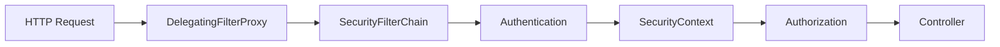

# Spring Security 實用入門

Spring Security 最容易學到失去方向：Filter、JWT、CORS、CSRF、401、403 全部一起出現。其實先掌握一條主線就夠了：

```text
HTTP Request
  → SecurityFilterChain
  → Authentication（你是誰）
  → SecurityContext
  → Authorization（你能做什麼）
  → Controller
```

> **本文目標：** 建立一套能維護的 API 安全設定，而不是手刻數百行 token parser 與 Filter。

## 先選對驗證模式

| 情境 | 常見選擇 | CSRF |
| --- | --- | --- |
| 同站後台、伺服器渲染頁面 | Session + Cookie + Form Login | 應保留 |
| SPA / Mobile 呼叫 API | Bearer Token / OAuth2 Resource Server | 完全無 Cookie 時通常可停用 |
| 公司 SSO、第三方登入 | OIDC / OAuth2 Client | 依登入與 session 設計 |

JWT 只是 token 格式，不等於完整登入架構。正式系統通常由 IdP 或 Authorization Server 發 token，Spring Boot API 作為 Resource Server 驗證 token。

## 請求如何進入 Spring Security？

Servlet container 先接收請求，再由 Spring Security 的 Filter chain 處理。你平常真正需要設定的是 `SecurityFilterChain`：



`DelegatingFilterProxy` 是 Servlet 與 Spring Bean 之間的橋樑。知道它的角色即可；一般 Spring Boot 專案不需要自己註冊它。

Spring Security 6 / Spring Boot 3 使用 Bean 與 Lambda DSL；舊的 `WebSecurityConfigurerAdapter` 已移除，不值得再背一套舊寫法。

## 最小可用的 API 設定

依賴：

```groovy
implementation "org.springframework.boot:spring-boot-starter-security"
implementation "org.springframework.boot:spring-boot-starter-oauth2-resource-server"

testImplementation "org.springframework.security:spring-security-test"
```

設定 JWT issuer：

```yaml
spring:
  security:
    oauth2:
      resourceserver:
        jwt:
          issuer-uri: https://id.example.com/realms/shop
```

Security 設定：

```java
import static org.springframework.security.config.Customizer.withDefaults;
import static org.springframework.security.config.http.SessionCreationPolicy.STATELESS;

@Configuration
@EnableMethodSecurity
public class SecurityConfig {

    @Bean
    SecurityFilterChain apiSecurity(HttpSecurity http) throws Exception {
        return http
            .cors(withDefaults())
            .csrf(csrf -> csrf.disable())
            .sessionManagement(session ->
                session.sessionCreationPolicy(STATELESS)
            )
            .authorizeHttpRequests(auth -> auth
                .requestMatchers("/actuator/health", "/api/public/**").permitAll()
                .requestMatchers(HttpMethod.POST, "/api/admin/**").hasRole("ADMIN")
                .anyRequest().authenticated()
            )
            .oauth2ResourceServer(oauth2 -> oauth2.jwt(withDefaults()))
            .build();
    }
}
```

這段設定只適用於「Authorization header 帶 Bearer token、完全不靠 Cookie 驗證」的 stateless API。

::: danger 不要看到 API 就無腦關 CSRF
若瀏覽器會自動帶上 Session Cookie 或認證 Cookie，攻擊網站就可能借用 Cookie 發請求，此時仍需要 CSRF 防護。停用前先確認認證資訊不會被瀏覽器自動附加。
:::

## 不要自己手刻 JWT Filter

常見教學會要求自己寫：

- `JwtTokenProvider`
- `OncePerRequestFilter`
- Authorization header parser
- 簽章、過期時間與例外處理
- `SecurityContextHolder` 寫入流程

這些工作 Resource Server 已經處理，而且會依標準驗證 issuer、signature、expiration 等條件。除非協定真的不是標準 Bearer token，否則優先使用：

```java
.oauth2ResourceServer(oauth2 -> oauth2.jwt(withDefaults()))
```

若自行簽發 token，金鑰管理、輪替、refresh token 撤銷與 client 安全都必須另外設計；「能產出一串 JWT」不代表登入系統已安全。

## Authentication 與 Authorization 不一樣

- **Authentication**：確認使用者身分。
- **Authorization**：確認這個身分是否有權限執行操作。

URL 層權限適合保護大範圍路徑：

```java
.requestMatchers("/api/public/**").permitAll()
.requestMatchers("/api/admin/**").hasRole("ADMIN")
.anyRequest().authenticated()
```

規則由上往下匹配，應先寫具體規則，再寫 `anyRequest()`。

### Role 與 Authority

`hasRole("ADMIN")` 會尋找 `ROLE_ADMIN`；`hasAuthority("ADMIN")` 則尋找完全相同的字串。

OAuth2 Resource Server 預設會將 `scope` claim 轉成 `SCOPE_` authority：

```java
@PreAuthorize("hasAuthority('SCOPE_orders.read')")
List<OrderResponse> findOrders() {
    return orderService.findAll();
}
```

如果 token 使用自訂 `roles` claim，需要配置 `JwtAuthenticationConverter`；不要在每個 Controller 手動讀 claim 再判斷。

## 方法層安全：規則貼近業務操作

啟用：

```java
@EnableMethodSecurity
@Configuration
class SecurityConfig {
}
```

使用：

```java
@Service
public class OrderService {

    @PreAuthorize("hasRole('ADMIN')")
    public void cancelAnyOrder(Long orderId) {
        // ...
    }

    @PreAuthorize("#userId == authentication.name or hasRole('ADMIN')")
    public List<OrderResponse> findForUser(String userId) {
        // ...
    }
}
```

URL 規則是第一道門，方法權限則保護真正的業務操作。不要在兩處寫互相矛盾的規則。

## 在 Controller 取得目前使用者

優先使用參數注入，不必在每個地方直接呼叫 `SecurityContextHolder`。

```java
public record CurrentUserResponse(
    String subject,
    String username,
    List<String> authorities
) {}
```

```java
@GetMapping("/api/me")
CurrentUserResponse me(
    @AuthenticationPrincipal Jwt jwt,
    Authentication authentication
) {
    List<String> authorities = authentication.getAuthorities().stream()
        .map(GrantedAuthority::getAuthority)
        .toList();

    return new CurrentUserResponse(
        jwt.getSubject(),
        jwt.getClaimAsString("preferred_username"),
        authorities
    );
}
```

這也是 Record DTO 很實用的地方：安全資訊只挑 API 需要的欄位，不把整個 principal 或 Entity 序列化出去。更多用法可參考 [Record DTO 與 Projection](./record-dto-projection)。

## 密碼不要自己 Hash

只有系統自己保存帳號密碼時才需要 `PasswordEncoder`。不要用 MD5、SHA-256 或自行加 salt。

```java
@Bean
PasswordEncoder passwordEncoder() {
    return PasswordEncoderFactories.createDelegatingPasswordEncoder();
}
```

```java
String encoded = passwordEncoder.encode(rawPassword);
boolean valid = passwordEncoder.matches(rawPassword, encoded);
```

`DelegatingPasswordEncoder` 產生的格式帶有 `{bcrypt}` 等前綴，讓系統未來能遷移演算法。永遠使用 `matches()` 比對，不要再次 encode 後比較字串，因為帶 salt 的結果每次可能不同。

## CORS 與 CSRF：名字很像，問題不同

| 概念 | 解決什麼 | 發生在哪裡 |
| --- | --- | --- |
| CORS | 哪些 origin 能由瀏覽器讀取 API 回應 | 瀏覽器同源政策 |
| CSRF | 防止其他網站借用使用者的自動認證資訊送請求 | Cookie / Session 型認證 |

明確列出可信任來源：

```java
@Bean
CorsConfigurationSource corsConfigurationSource() {
    CorsConfiguration config = new CorsConfiguration();
    config.setAllowedOrigins(List.of(
        "http://localhost:5173",
        "https://app.example.com"
    ));
    config.setAllowedMethods(List.of("GET", "POST", "PUT", "DELETE"));
    config.setAllowedHeaders(List.of("Authorization", "Content-Type"));

    UrlBasedCorsConfigurationSource source =
        new UrlBasedCorsConfigurationSource();
    source.registerCorsConfiguration("/api/**", config);
    return source;
}
```

若開啟 credentials，不能把 allowed origin 設成 `*`。

## 401 與 403

| 狀態 | 意思 | 常見原因 |
| --- | --- | --- |
| `401 Unauthorized` | 尚未成功認證 | 沒 token、token 無效或過期 |
| `403 Forbidden` | 已認證但沒有權限 | 缺少 role / authority |

前端遇到 401 可引導重新登入；遇到 403 應顯示「權限不足」，而不是無限刷新 token。

Spring Security 已有預設處理。只有 API 需要統一 JSON 錯誤合約時，才實作 `AuthenticationEntryPoint` 與 `AccessDeniedHandler`；不要為了「看起來完整」先複製兩個大類別。

## 測試比肉眼看設定更可靠

```java
@WebMvcTest(OrderController.class)
@Import(SecurityConfig.class)
class OrderControllerSecurityTest {

    @Autowired MockMvc mockMvc;
    @MockBean JwtDecoder jwtDecoder;

    @Test
    void anonymousUserGets401() throws Exception {
        mockMvc.perform(get("/api/orders"))
            .andExpect(status().isUnauthorized());
    }

    @Test
    void readerCanViewOrders() throws Exception {
        mockMvc.perform(get("/api/orders")
                .with(jwt().authorities(
                    new SimpleGrantedAuthority("SCOPE_orders.read")
                )))
            .andExpect(status().isOk());
    }
}
```

至少測三種身分：匿名、合法但權限不足、權限正確。這比只測「有 token 時成功」更接近真實風險。

## 最常踩的坑

1. **把密碼、JWT secret 寫進 Git**：改用環境變數或 secret manager。
2. **為了方便把全部路徑 `permitAll()`**：公開端點應列得清楚。
3. **混淆 401 / 403**：先判斷是否認證，再判斷是否授權。
4. **Cookie 驗證卻停用 CSRF**：確認威脅模型後再決定。
5. **同時讓 Filter 自動註冊又手動 `addFilterBefore()`**：可能執行兩次。
6. **只驗 JWT 簽章，不驗 issuer / audience / expiration**：使用 Resource Server 與正確 decoder 設定。
7. **在 Controller 到處讀 claim**：轉成 authority 或明確的 principal。
8. **記錄完整 token 或密碼**：認證資訊不應進 log。

## 上線前檢查表

- [ ] 全站使用 HTTPS。
- [ ] 公開路徑是 allowlist，不是靠遺漏保護。
- [ ] Token 有短效期，issuer 與 audience 驗證正確。
- [ ] 私鑰、密碼、client secret 不在原始碼。
- [ ] CORS 只允許可信任 origin。
- [ ] Cookie / Session 架構保留 CSRF 防護。
- [ ] 敏感操作有方法層權限與 audit log。
- [ ] 401、403、token 過期及權限不足都有測試。

## 下一步

學完這篇後，應該能回答：

1. 請求在哪裡完成 Authentication？
2. URL 與方法權限各自保護什麼？
3. 為什麼標準 JWT API 不需要手刻 Filter？
4. 你的架構到底需不需要停用 CSRF？

需要加入資料庫設定、環境變數與完整專案分層時，再閱讀 [Spring Boot Configuration 與 Security 整合](./config-security-integration)。

## 參考資源

- [Spring Security Reference](https://docs.spring.io/spring-security/reference/)
- [OAuth2 Resource Server JWT](https://docs.spring.io/spring-security/reference/servlet/oauth2/resource-server/jwt.html)
- [Password Storage](https://docs.spring.io/spring-security/reference/features/authentication/password-storage.html)
- [Method Security](https://docs.spring.io/spring-security/reference/servlet/authorization/method-security.html)
