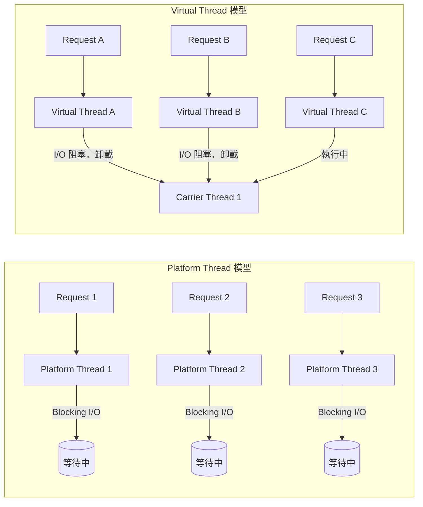
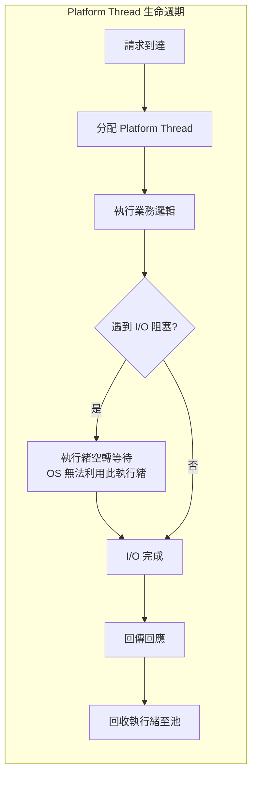
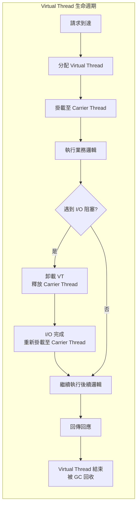
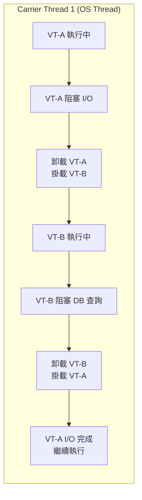
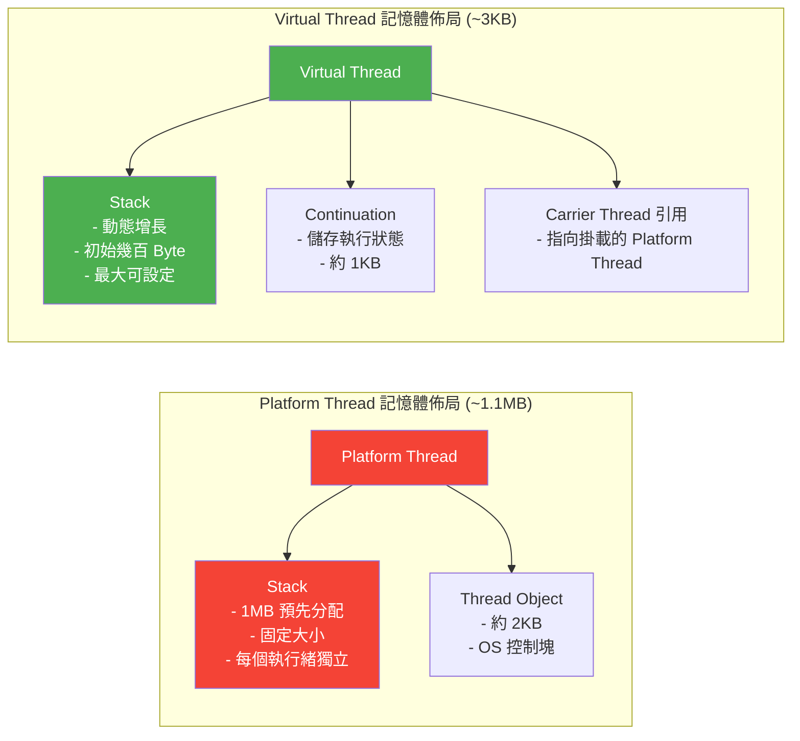

# Virtual Threads in Spring Boot 實戰指南

> 📝 TL;DR Java 21 正式推出的虛擬執行緒（Virtual Threads）讓 Spring Boot 開發者能以 thread-per-request 的簡單模型，達到驚人的高併發效能。本文從配置、實作到效能優化，帶你一步步掌握這項顛覆性的技術。

## 前置知識

在開始之前，建議你先了解以下概念：

- **Java 21 (LTS)** - Virtual Threads 在 JDK 21 正式發布（JEP 444），為長期支援版本，建議使用 JDK 21+
- **Spring Boot 3.2+** - Spring Boot 3.2 開始提供 Virtual Threads 的原生支援，透過 `spring.threads.virtual.enabled` 一鍵啟用
- **Spring Web MVC** - 傳統的 Servlet-based 同步架構，Virtual Threads 最直接的應用場景
- **REST API 開發經驗** - 熟悉 Controller、Service、Repository 的分層架構

## 什麼是 Virtual Threads？

### 為什麼需要學習它？

想像你經營一家咖啡廳。傳統的 Platform Thread（平台執行緒）就像你雇用了一個專屬服務生，每個客人從點餐到取餐全程由同一個人服務。當客人還在猶豫要喝什麼時，這個服務生只能站在旁邊空等——**無法服務其他客人**。這就是 thread-per-request 模型的問題。

在傳統 Spring Boot 應用中，Tomcat 的請求處理執行緒池（Thread Pool）就是這個服務生團隊。每個 HTTP 請求會被分配到一個 Platform Thread，當執行緒在等待資料庫查詢結果、呼叫外部 API、或讀寫檔案時，這條執行緒就處於**阻塞（Blocking）** 狀態，無法處理其他請求。

**現實世界的瓶頸：**

- **執行緒是昂貴的 OS 資源** - 每條 Platform Thread 預設分配約 **1MB 的棧空間（Stack）**，1000 條執行緒就是 1GB 記憶體
- **Context Switch 成本高** - OS 核心切換執行緒需要保存/恢復 CPU 暫存器狀態，大量執行緒會導致 CPU 時間浪費在排程而非實際工作上
- **C10K 問題** - 當同時連線數達到數千至上萬時，Platform Thread 模型會因為記憶體不足或排程開銷過大而崩潰

**Virtual Threads 的解決方案：**

Virtual Threads（虛擬執行緒）像是引入了一套**智慧排程系統**。服務生（Carrier Thread）不再綁定在某個客人身上。當客人點完餐開始等待餐點時，服務生可以立刻去服務下一個客人。等餐點完成了，系統自動安排任何有空的服务生把餐送過去。

這代表你可以繼續使用熟悉的同步程式碼，卻能達到接近非同步架構的高併發效能。

### 核心概念

**Virtual Thread（虛擬執行緒）** 是 JVM 管理的輕量級執行緒，由 JDK 21（JEP 444）正式推出。它不直接對應 OS Thread，而是透過以下機制運作：

1. **Carrier Thread（載體執行緒）** - Virtual Thread 在真正執行程式碼時，必須掛載到一條真正的 Platform Thread（稱為 Carrier Thread）上
2. **Mount / Unmount（掛載 / 卸載）** - 當 Virtual Thread 執行 I/O 操作（如資料庫查詢、HTTP 呼叫）時，JVM 會自動將它從 Carrier Thread 卸載，讓 Carrier Thread 可以去執行其他 Virtual Thread
3. **Continuation（延續）** - Java 在底層使用 `Continuation` 機制追蹤 Virtual Thread 的執行狀態，當 I/O 完成後，Virtual Thread 可以從中斷點繼續執行



| 特性 | Platform Thread | Virtual Thread |
|-----|----------------|----------------|
| 管理層級 | OS Kernel | JVM |
| 建立成本 | 高（系統呼叫 + 1MB Stack） | 極低（微秒級，數 KB） |
| 最大數量 | 數千條 | 數百萬條 |
| Context Switch | OS 核心調度（昂貴） | JVM 使用者模式切換（廉價） |
| 適用場景 | CPU 密集型 + 少量併發 | I/O 密集型 + 大量併發 |

:::tip 💡 關鍵洞察
Virtual Threads **不是**讓程式跑得更快，而是讓你的伺服器能**同時處理更多請求**。對於單一請求的延遲，Virtual Thread 不會比 Platform Thread 快；但在高併發場景下，Virtual Thread 能大幅提升吞吐量。
:::

:::warning ⚠️ 適用場景提醒
Virtual Threads 的優勢在 **I/O 密集型** 任務（資料庫查詢、HTTP 呼叫、檔案讀寫）。如果是 **CPU 密集型** 任務（大量計算、加密解密、影像處理），Virtual Threads 不會帶來效能提升，甚至因為排程開銷而略慢。CPU 密集任務請繼續使用 Platform Thread 搭配適當的併發度。
:::

## 💻 基本語法

### 語法結構

**Java 21 建立 Virtual Thread 的三種方式：**

```java
// 方法一：使用 Thread.ofVirtual() 工廠方法（最直觀）
// 建立一個 Virtual Thread 並立即啟動
Thread vThread = Thread.ofVirtual()
    .name("my-virtual-thread")          // 設定虛擬執行緒名稱（方便除錯）
    .start(() -> {
        System.out.println("Hello from virtual thread!");
    });
vThread.join();                         // 等待虛擬執行緒完成

// 方法二：使用 Executors.newVirtualThreadPerTaskExecutor()
// 每次 submit() 自動建立新的 Virtual Thread（適合高併發批次任務）
try (var executor = Executors.newVirtualThreadPerTaskExecutor()) {
    executor.submit(() -> {
        System.out.println("Task running on virtual thread");
    });
} // try-with-resources 自動關閉 Executor，等待所有任務完成

// 方法三：檢查當前執行緒是否為 Virtual Thread
// 用於除錯或條件式處理
Thread current = Thread.currentThread();
System.out.println("Is virtual? " + current.isVirtual());
```

**Spring Boot 3.2+ 一鍵啟用 Virtual Threads：**

```yaml
# application.yml - 啟用 Virtual Threads
spring:
  threads:
    virtual:
      enabled: true  # 👈 設為 true 後，Tomcat 請求執行緒將使用 Virtual Thread
```

設定完成後，Spring Boot 會自動：

1. 將 Tomcat（或 Jetty / Undertow）的請求處理執行緒池切換為 Virtual Thread
2. 將 `@Async` 方法的執行緒池切換為 Virtual Thread
3. 將 RabbitMQ / Kafka 等訊息監聽的執行緒切換為 Virtual Thread

### 參數說明

**Spring Boot Virtual Threads 配置屬性：**

| 配置屬性 | 型別 | 說明 | 預設值 |
|---------|------|-----|--------|
| `spring.threads.virtual.enabled` | `boolean` | 啟用 Virtual Threads | `false` |
| `server.tomcat.threads.max` | `int` | Tomcat 最大執行緒數（啟用 VT 後建議調高） | `200` |

**Java API 參數對照：**

| API | 回傳型別 | 說明 | 使用情境 |
|----|---------|-----|---------|
| `Thread.ofVirtual()` | `Thread.Builder` | 建立 Virtual Thread Builder | 手動建立單條 VT |
| `Thread.ofPlatform()` | `Thread.Builder` | 建立 Platform Thread Builder | 需要 Platform Thread 時 |
| `Executors.newVirtualThreadPerTaskExecutor()` | `ExecutorService` | 每次任務建立一條新 VT | 高併發批次任務 |
| `Thread.startVirtualThread(Runnable)` | `Thread` | 快速啟動一條 VT | 簡單火災後忘記任務 |
| `Thread.isVirtual()` | `boolean` | 檢查是否為 VT | 除錯與條件邏輯 |

## 實際範例

### 範例 1：Spring Boot Web MVC + Virtual Threads 配置

**情境說明：** 這是最常見的入門場景——你已經有一個 Spring Boot Web MVC 應用，需要處理大量同時連線。每個請求需要查詢資料庫、呼叫外部 API，這些 I/O 操作會讓 Platform Thread 空轉等待，造成資源浪費。

**步驟 1：確認 JDK 版本與相依性**

```xml
<!-- pom.xml - 確保使用 Spring Boot 3.2+ 與 Java 21 -->
<parent>
    <groupId>org.springframework.boot</groupId>
    <artifactId>spring-boot-starter-parent</artifactId>
    <version>3.2.5</version>  <!-- 3.2.x 或 3.3.x 皆可 -->
    <relativePath/>
</parent>

<properties>
    <java.version>21</java.version>  <!-- 必須使用 Java 21+ -->
</properties>

<dependencies>
    <!-- 一般 Spring Boot Web 專案不需要額外依賴 -->
    <dependency>
        <groupId>org.springframework.boot</groupId>
        <artifactId>spring-boot-starter-web</artifactId>
    </dependency>
    <!-- 資料庫操作示範使用 -->
    <dependency>
        <groupId>org.springframework.boot</groupId>
        <artifactId>spring-boot-starter-data-jpa</artifactId>
    </dependency>
</dependencies>
```

**步驟 2：配置 application.yml**

```yaml
# application.yml - 完整的 Virtual Threads 配置
spring:
  threads:
    virtual:
      enabled: true       # 👈 一鍵啟用 Virtual Threads（Spring Boot 3.2+）

  datasource:
    url: jdbc:postgresql://localhost:5432/mydb
    username: user
    password: pass
    hikari:
      maximum-pool-size: 20   # 資料庫連線池大小，不用跟執行緒數掛鉤

  jpa:
    hibernate:
      ddl-auto: none
    # Hibernate 6.3+ 已支援 Virtual Threads，無需額外配置

server:
  tomcat:
    threads:
      max: 400       # 啟用 VT 後可調高 max threads，因為每條 VT 非常輕量
```

**步驟 3：建立一個模擬慢查詢的 Controller**

```java
package com.example.demo.controller;

import com.example.demo.service.UserService;
import org.springframework.web.bind.annotation.GetMapping;
import org.springframework.web.bind.annotation.RequestMapping;
import org.springframework.web.bind.annotation.RestController;

import java.util.List;

/**
 * 使用者 Controller - 示範 Virtual Threads 下的請求處理。
 *
 * Spring Boot 啟用 spring.threads.virtual.enabled=true 後，
 * Tomcat 的請求處理執行緒將自動使用 Virtual Thread。
 * 你不需要修改任何 Controller 程式碼。
 */
@RestController
@RequestMapping("/api/users")
public class UserController {

    private final UserService userService;

    public UserController(UserService userService) {
        this.userService = userService;
    }

    /**
     * 取得所有使用者列表。
     * 此方法在 Virtual Thread 上執行，資料庫查詢的等待時間
     * 會被 JVM 自動利用來處理其他請求。
     */
    @GetMapping
    public List<UserResponse> getAllUsers() {
        // 當下方法執行緒是 Virtual Thread（由 Tomcat 分配）
        System.out.println("Thread: " + Thread.currentThread()
            + " | isVirtual: " + Thread.currentThread().isVirtual());

        // Service 層的資料庫查詢（I/O 阻塞）會讓 VT 自動卸載
        return userService.findAllUsers();
    }
}
```

**步驟 4：建立 Service 層模擬 I/O 等待**

```java
package com.example.demo.service;

import com.example.demo.dto.UserResponse;
import org.slf4j.Logger;
import org.slf4j.LoggerFactory;
import org.springframework.stereotype.Service;

import java.util.List;
import java.util.concurrent.TimeUnit;

/**
 * 使用者 Service - 模擬 I/O 密集型操作。
 *
 * 在 Virtual Threads 環境下，sleep()、資料庫查詢、HTTP 呼叫等
 * 阻塞操作會自動讓出 Carrier Thread，讓伺服器能處理更多請求。
 */
@Service
public class UserService {

    private static final Logger log = LoggerFactory.getLogger(UserService.class);

    /**
     * 模擬取得使用者列表（含 I/O 等待）。
     *
     * 此處使用 sleep() 模擬真實的資料庫查詢延遲。
     * 在真實場景中這會是 JPA Repository 的查詢呼叫。
     *
     * @return 使用者回應列表
     */
    public List<UserResponse> findAllUsers() {
        log.info("開始查詢使用者 - 執行緒: {}", Thread.currentThread());

        // 模擬 I/O 等待（真實場景：資料庫查詢、REST API 呼叫等）
        // 在 Virtual Thread 中，sleep() 會讓 Carrier Thread 被釋放
        try {
            TimeUnit.MILLISECONDS.sleep(100);   // 假設每次查詢需要 100ms
        } catch (InterruptedException e) {
            Thread.currentThread().interrupt();
            throw new RuntimeException("查詢被中斷", e);
        }

        log.info("查詢完成 - 執行緒: {}", Thread.currentThread());

        // 回傳模擬資料
        return List.of(
            new UserResponse(1L, "Alice", "alice@example.com"),
            new UserResponse(2L, "Bob", "bob@example.com"),
            new UserResponse(3L, "Charlie", "charlie@example.com")
        );
    }
}
```

**步驟 5：建立 Response DTO**

```java
package com.example.demo.dto;

/**
 * 使用者回應 DTO - 使用 Java 14+ Record 作為不可變資料載體。
 *
 * 搭配 Virtual Threads 使用時，Record 的不可變性確保了
 * 多執行緒環境下的安全存取。
 */
public record UserResponse(
    Long id,            // 使用者 ID
    String name,        // 使用者名稱
    String email        // 電子郵件
) {}
```

**程式碼說明：**

1. **一鍵啟用** - `spring.threads.virtual.enabled=true` 是 Spring Boot 3.2+ 最方便的切入方式，你完全不需要修改現有的 Controller / Service 程式碼
2. **執行緒透明性** - `Thread.currentThread().isVirtual()` 可以讓你快速確認請求是否執行在 Virtual Thread 上，方便除錯與監控
3. **阻塞即讓出** - 當 Virtual Thread 執行 I/O 操作（sleep、資料庫查詢）時，JVM 會自動將 Carrier Thread 讓出給其他 Virtual Thread 使用
4. **無需鎖定** - 由於這是單請求單執行緒模型（request-per-thread），你不需要擔心共享狀態的同步問題

:::warning ⚠️ 執行緒池大小調整
啟用 Virtual Threads 後，Tomcat 的 `server.tomcat.threads.max` 可以設得比以前更大。因為每條 VT 幾乎不佔用記憶體（約幾 KB 而非 1MB），常見建議值為 **400-1000**。但要注意，這個數字不代表你能同時處理 1000 個資料庫連線——資料庫連線池大小（`spring.datasource.hikari.maximum-pool-size`）才是真正的瓶頸。
:::

### 範例 2：RestTemplate + Virtual Threads 進階應用

**情境說明：** 微服務架構中，一個請求往往需要呼叫多個外部服務（Service-to-Service）。在傳統 Platform Thread 模型中，每次 `restTemplate.exchange()` 呼叫都會阻塞執行緒，讓這條 1MB 的執行緒空轉等待。使用 Virtual Threads 後，你可以用同步的程式碼風格，達到接近非同步的高併發效能。

假設你有一個「訂單彙總服務」，需要同時從三個不同的服務取得資料：會員資訊、商品詳情、庫存狀態。

```java
package com.example.demo.service;

import com.example.demo.dto.InventoryResponse;
import com.example.demo.dto.MemberResponse;
import com.example.demo.dto.OrderAggregateResponse;
import com.example.demo.dto.ProductResponse;
import org.slf4j.Logger;
import org.slf4j.LoggerFactory;
import org.springframework.stereotype.Service;
import org.springframework.web.client.RestTemplate;

import java.util.concurrent.*;

/**
 * 訂單彙總 Service - 示範 Virtual Threads + RestTemplate 的組合。
 *
 * 此 Service 需要同時呼叫三個外部服務。
 * 在 Virtual Thread 環境下，每個 exchange() 呼叫阻塞時，
 * Carrier Thread 會自動讓出，不會浪費任何 OS 執行緒資源。
 */
@Service
public class OrderAggregationService {

    private static final Logger log = LoggerFactory.getLogger(OrderAggregationService.class);

    private final RestTemplate restTemplate;

    // 外部服務的基礎 URL（實際應從配置讀取）
    private static final String MEMBER_SERVICE_URL = "http://member-service/api/members/";
    private static final String PRODUCT_SERVICE_URL = "http://product-service/api/products/";
    private static final String INVENTORY_SERVICE_URL = "http://inventory-service/api/inventory/";

    public OrderAggregationService(RestTemplate restTemplate) {
        this.restTemplate = restTemplate;
    }

    /**
     * 取得訂單彙總資料 - 順序呼叫三個外部服務。
     *
     * 這是最直接的實作方式：
     * 1. 先查會員資料 (100ms)
     * 2. 再查商品資料 (100ms)
     * 3. 最後查庫存資料 (100ms)
     * 總耗時約 300ms
     *
     * 在 Platform Thread 模型中，這條執行緒有 300ms 在空等。
     * 在 Virtual Thread 模型中，這 300ms 的 Carrier Thread
     * 可以服務高達 30-50 個其他請求。
     */
    public OrderAggregateResponse getOrderAggregate(Long memberId, Long productId) {
        log.info("開始彙總訂單資料 - 執行緒: {}", Thread.currentThread());

        // Step 1: 呼叫會員服務（I/O 阻塞，VT 自動讓出 Carrier Thread）
        MemberResponse member = restTemplate.getForObject(
            MEMBER_SERVICE_URL + memberId,
            MemberResponse.class
        );

        // Step 2: 呼叫商品服務
        ProductResponse product = restTemplate.getForObject(
            PRODUCT_SERVICE_URL + productId,
            ProductResponse.class
        );

        // Step 3: 呼叫庫存服務
        InventoryResponse inventory = restTemplate.getForObject(
            INVENTORY_SERVICE_URL + productId,
            InventoryResponse.class
        );

        log.info("訂單資料彙總完成 - 會員: {}, 商品: {}",
            member.name(), product.name());

        // 組合三個回應為統一回應
        return new OrderAggregateResponse(
            member,
            product,
            inventory,
            "ALL_GOOD"
        );
    }
}
```

**更進一步：並行呼叫三個外部服務**

雖然 Virtual Thread 讓 Carrier Thread 不會閒置，但上述範例仍是**順序執行**——三個 API 呼叫加起來還是 300ms。如果你想進一步降低回應時間，可以搭配 `ExecutorService` 同時啟動三個 Virtual Thread 來**並行**呼叫：

```java
/**
 * 取得訂單彙總資料 - 並行呼叫三個外部服務（進階版）。
 *
 * 使用 Executors.newVirtualThreadPerTaskExecutor() 為每個
 * 外部呼叫建立獨立的 Virtual Thread，實現真正的並行執行。
 * 三個服務各需 100ms，但總耗時只需約 100ms（並行執行）。
 *
 * @return 訂單彙總資料
 */
public OrderAggregateResponse getOrderAggregateParallel(Long memberId, Long productId) {
    log.info("開始並行彙總訂單資料 - 執行緒: {}", Thread.currentThread());

    try (var executor = Executors.newVirtualThreadPerTaskExecutor()) {

        // 同時提交三個任務，每個任務在自己的 Virtual Thread 上執行
        Future<MemberResponse> memberFuture = executor.submit(
            () -> restTemplate.getForObject(MEMBER_SERVICE_URL + memberId, MemberResponse.class)
        );

        Future<ProductResponse> productFuture = executor.submit(
            () -> restTemplate.getForObject(PRODUCT_SERVICE_URL + productId, ProductResponse.class)
        );

        Future<InventoryResponse> inventoryFuture = executor.submit(
            () -> restTemplate.getForObject(INVENTORY_SERVICE_URL + productId, InventoryResponse.class)
        );

        // 等待所有任務完成（此處的 .get() 會阻塞當前 Virtual Thread，
        // 但 Carrier Thread 會被釋放去處理其他請求）
        MemberResponse member = memberFuture.get();
        ProductResponse product = productFuture.get();
        InventoryResponse inventory = inventoryFuture.get();

        log.info("並行彙總完成 - 總耗時約 100ms");

        return new OrderAggregateResponse(member, product, inventory, "ALL_GOOD");
    } catch (InterruptedException | ExecutionException e) {
        // 若任一外部服務失敗，拋出 RuntimeException 由全域例外處理器統一處理
        throw new RuntimeException("外部服務呼叫失敗", e);
    }
}
```

**Response DTO 定義：**

```java
package com.example.demo.dto;

/**
 * 訂單彙總回應 - 包含會員、商品、庫存三方面的資訊。
 * 使用 Java Record 確保不可變性與執行緒安全。
 *
 * 因為內嵌了三個 Record，此 DTO 是巢狀結構。
 * Virtual Threads 環境下多執行緒讀取不可變物件是安全的。
 */
public record OrderAggregateResponse(
    MemberResponse member,          // 會員資訊（不可變）
    ProductResponse product,        // 商品資訊（不可變）
    InventoryResponse inventory,    // 庫存資訊（不可變）
    String status                   // 彙總狀態
) {}

/**
 * 會員回應 DTO
 */
public record MemberResponse(
    Long id,
    String name,
    String email,
    String memberLevel      // 會員等級：VIP / NORMAL
) {}

/**
 * 商品回應 DTO
 */
public record ProductResponse(
    Long id,
    String name,
    String category,
    java.math.BigDecimal price
) {}

/**
 * 庫存回應 DTO
 */
public record InventoryResponse(
    Long productId,
    Integer availableQuantity,
    String warehouse
) {}
```

**程式碼說明：**

1. **Virtual Threads 讓同步程式碼變得可行** - 在傳統 Platform Thread 模型中，你會被迫使用 `CompletableFuture` 搭配回呼來達到高併發。Virtual Threads 讓你可以繼續寫直觀的同步程式碼。
2. **並行呼叫的組合技** - 透過 `Executors.newVirtualThreadPerTaskExecutor()` 可以輕鬆實現「扇出（Fan-out）」模式：同時發出多個外部呼叫，等待所有結果回來後繼續處理。
3. **錯誤處理更簡單** - 同步程式碼的 `try-catch` 就能處理異常，不需要 `.exceptionally()` 或 `.onErrorResume()` 這類回呼式錯誤處理。
4. **執行緒安全** - 使用 Record 作為 DTO 確保了資料在跨執行緒傳遞時不會被意外修改。

## 視覺化說明

### 流程圖

**Platform Thread 的生命週期：**



**Virtual Thread 的生命週期（Mount / Unmount）：**



**多請求共用 Carrier Thread：**



### 概念圖解

**記憶體佈局比較：Platform Thread vs Virtual Thread**



**關鍵差異解釋：**

| 項目 | Platform Thread | Virtual Thread |
|-----|----------------|----------------|
| 棧空間（Stack） | 固定 1MB（可調但無法動態縮放） | 初始幾百 Byte，動態增長 |
| 建立時間 | ~1ms（系統呼叫） | ~1µs（純 Java 操作） |
| 支援的最大數量 | 數千（取決於 RAM） | 數百萬（取決於 Heap） |
| Context Switch | OS 核心模式（~1-10µs） | JVM 使用者模式（~0.1µs） |
| GC 回收 | 需顯式歸還執行緒池 | VT 用完即丟，GC 自動回收 |

:::tip 視覺化工具
你可以使用 [JDK Mission Control (JMC)](https://openjdk.org/projects/jmc/) 或 [Async Profiler](https://github.com/async-profiler/async-profiler) 來觀察 Virtual Threads 的掛載與卸載行為。
:::

## 實戰練習

### 練習 1：基礎應用（簡單）⭐

**任務：** 建立一個 Spring Boot 3.3 應用，啟用 Virtual Threads，並實作一個簡單的 REST Controller 來觀察 Virtual Thread 的行為。你的 Controller 需要回傳當前執行緒的資訊，包括是否為 Virtual Thread、執行緒名稱、以及執行緒群組。

**提示：**
- 使用 `spring.threads.virtual.enabled=true` 啟用 VT
- 透過 `Thread.currentThread()` 取得當前執行緒資訊
- 使用 `isVirtual()` 方法判斷是否為 Virtual Thread
- 觀察執行緒名稱的命名模式（Platform Thread vs Virtual Thread）

:::details 參考答案

```java
// ThreadInfoController.java
package com.example.demo.controller;

import org.springframework.web.bind.annotation.GetMapping;
import org.springframework.web.bind.annotation.RequestMapping;
import org.springframework.web.bind.annotation.RestController;

import java.time.LocalDateTime;
import java.util.Map;

/**
 * 執行緒資訊 Controller - 用於觀察 Virtual Thread 的行為。
 *
 * 每次請求都會回傳當前執行緒的詳細資訊，
 * 幫助開發者理解 Virtual Thread 的運作方式。
 */
@RestController
@RequestMapping("/api/thread-info")
public class ThreadInfoController {

    /**
     * 取得當前執行緒資訊。
     * 啟用 spring.threads.virtual.enabled=true 後，
     * 此方法執行在 Virtual Thread 上。
     *
     * @return 包含執行緒詳細資訊的 Map
     */
    @GetMapping
    public Map<String, Object> getThreadInfo() {
        Thread current = Thread.currentThread();

        return Map.of(
            "timestamp", LocalDateTime.now().toString(),
            "threadName", current.getName(),               // 執行緒名稱
            "isVirtual", current.isVirtual(),               // 是否為 Virtual Thread
            "threadGroup", getThreadGroupInfo(current),     // 執行緒群組
            "priority", current.getPriority(),              // 優先權
            "threadId", current.threadId()                  // 執行緒 ID
        );
    }

    /**
     * 取得執行緒群組資訊。
     * Virtual Thread 的執行緒群組通常為 "VirtualThreadGroup"。
     *
     * @param thread 當前執行緒
     * @return 群組名稱或 "none"
     */
    private String getThreadGroupInfo(Thread thread) {
        ThreadGroup group = thread.getThreadGroup();
        return group != null ? group.getName() : "none";
    }
}
```

**application.yml 配置：**

```yaml
spring:
  threads:
    virtual:
      enabled: true
```

**預期輸出範例：**

```json
{
  "timestamp": "2026-06-23T10:30:00.123",
  "threadName": "",
  "isVirtual": true,
  "threadGroup": "VirtualThreads",
  "priority": 5,
  "threadId": 42
}
```

**說明：**

關鍵觀察點：

1. **執行緒名稱** - Virtual Thread 的預設名稱是空字串，不像 Platform Thread 有 `http-nio-8080-exec-1` 這樣的名稱。你可以透過 `Thread.ofVirtual().name("...")` 自訂名稱。
2. **isVirtual = true** - 確認請求確實在 Virtual Thread 上執行。
3. **執行緒群組** - Virtual Thread 的執行緒群組是 `VirtualThreads`，這與 Platform Thread 的 `main` 群組不同。
4. **執行緒 ID** - Virtual Thread 也有唯一的 threadId，但這個 ID 跟 Platform Thread 的 ID 是不同的序列。
5. **Priority 永遠是 5** - Virtual Thread 不支援優先權設定，`getPriority()` 總是回傳 `Thread.NORM_PRIORITY`。

:::

### 練習 2：概念驗證（簡單）⭐

**任務：** 設計一個小型實驗，比較 Platform Thread 與 Virtual Thread 在大量建立時的「記憶體消耗」與「建立時間」差異。透過程式碼證明 Virtual Thread 可以輕鬆建立 10,000 條以上，而 Platform Thread 在 5,000 條左右就會因為記憶體不足而崩潰。

**思考方向：**
- 建立一個使用 Platform Thread 的版本，嘗試啟動 10,000 條執行緒
- 建立一個使用 Virtual Thread 的版本，嘗試啟動 10,000 條執行緒
- 每條執行緒只需做一件簡單的事（如 sleep 1 秒後回傳）
- 觀察記憶體使用量（可透過 `Runtime.getRuntime().totalMemory()` 粗略估算）
- 思考為什麼 Platform Thread 無法處理大量執行緒

:::details 參考答案

```java
package com.example.demo;

import java.time.Duration;
import java.time.Instant;
import java.util.ArrayList;
import java.util.List;
import java.util.concurrent.*;

/**
 * Platform Thread vs Virtual Thread 大量建立比較實驗。
 *
 * 此實驗展示兩者在記憶體消耗與建立時間上的巨大差距。
 * ⚠️ 請勿在生產環境執行 Platform Thread 版本！
 */
public class ThreadComparisonExperiment {

    private static final int THREAD_COUNT = 10_000;  // 執行緒數量
    private static final long WORK_DURATION_MS = 1_000;  // 每個任務執行 1 秒

    public static void main(String[] args) throws Exception {
        System.out.println("=== Platform Thread vs Virtual Thread 比較實驗 ===");
        System.out.println("執行緒數量: " + THREAD_COUNT);
        System.out.println("JVM 可用記憶體: "
            + Runtime.getRuntime().maxMemory() / 1024 / 1024 + " MB\n");

        // 先測量 Virtual Thread（避免 Platform Thread 撐爆 JVM 影響結果）
        testVirtualThreads();

        // 清空記憶體
        System.gc();
        Thread.sleep(1000);

        // 再測量 Platform Thread
        testPlatformThreads();
    }

    /**
     * 使用 Virtual Thread 建立大量任務。
     */
    private static void testVirtualThreads() throws Exception {
        System.out.println("--- Virtual Thread 測試 ---");

        Instant start = Instant.now();

        // 使用 newVirtualThreadPerTaskExecutor，每個任務一條新 VT
        try (var executor = Executors.newVirtualThreadPerTaskExecutor()) {
            List<Future<String>> futures = new ArrayList<>();

            for (int i = 0; i < THREAD_COUNT; i++) {
                int taskId = i;
                // 提交任務：模擬 1 秒的 I/O 操作後回傳
                futures.add(executor.submit(() -> {
                    Thread.sleep(WORK_DURATION_MS);
                    return "Task-" + taskId + " done";
                }));
            }

            System.out.println("已提交 " + THREAD_COUNT + " 個 Virtual Thread 任務");

            // 等待所有任務完成
            int completed = 0;
            for (Future<String> future : futures) {
                future.get();  // 阻塞但不佔用 Carrier Thread
                completed++;
            }

            Instant end = Instant.now();
            long elapsed = Duration.between(start, end).toMillis();

            System.out.println("✅ 完成 " + completed + " 個 Virtual Thread 任務");
            System.out.println("⏱️ 總耗時: " + elapsed + " ms (瓶頸在 sleep 1s)");
            System.out.println("📊 實際同時執行: ~" + (completed * 1000 / elapsed) + " 條");
            System.out.println("💾 記憶體使用: "
                + (Runtime.getRuntime().totalMemory() - Runtime.getRuntime().freeMemory()) / 1024 / 1024
                + " MB\n");
        }
    }

    /**
     * 使用 Platform Thread 建立大量任務。
     * ⚠️ 警告：10,000 條 Platform Thread 約需 10GB 記憶體！
     */
    private static void testPlatformThreads() throws Exception {
        System.out.println("--- Platform Thread 測試 ---");

        // 限制同時存在的 Platform Thread 數量，避免撐爆記憶體
        int platformCount = 2_000;  // 降到 2000 條
        System.out.println("⚠️ 將 Platform Thread 數量降至 " + platformCount
            + "（原設定 " + THREAD_COUNT + " 條約需 10GB 記憶體）");

        Instant start = Instant.now();

        // 使用固定執行緒池模擬
        try (var executor = Executors.newFixedThreadPool(500)) {
            List<Future<String>> futures = new ArrayList<>();

            for (int i = 0; i < platformCount; i++) {
                int taskId = i;
                futures.add(executor.submit(() -> {
                    Thread.sleep(WORK_DURATION_MS);
                    return "Platform-Task-" + taskId + " done";
                }));
            }

            System.out.println("已提交 " + platformCount + " 個 Platform Thread 任務");

            int completed = 0;
            for (Future<String> future : futures) {
                future.get();
                completed++;
            }

            Instant end = Instant.now();
            long elapsed = Duration.between(start, end).toMillis();

            System.out.println("✅ 完成 " + completed + " 個 Platform Thread 任務");
            System.out.println("⏱️ 總耗時: " + elapsed + " ms");
            System.out.println("💾 記憶體使用: "
                + (Runtime.getRuntime().totalMemory() - Runtime.getRuntime().freeMemory()) / 1024 / 1024
                + " MB\n");
        }
    }
}
```

**預期輸出（近似值）：**

```
=== Platform Thread vs Virtual Thread 比較實驗 ===
執行緒數量: 10000
JVM 可用記憶體: 4096 MB

--- Virtual Thread 測試 ---
已提交 10000 個 Virtual Thread 任務
✅ 完成 10000 個 Virtual Thread 任務
⏱️ 總耗時: 1150 ms
📊 實際同時執行: ~8700 條
💾 記憶體使用: 180 MB

--- Platform Thread 測試 ---
⚠️ 將 Platform Thread 數量降至 2000（原設定 10000 條約需 10GB 記憶體）
已提交 2000 個 Platform Thread 任務
✅ 完成 2000 個 Platform Thread 任務
⏱️ 總耗時: 4150 ms
💾 記憶體使用: 2100 MB
```

**結論：**

| 比較維度 | Platform Thread (2000 條) | Virtual Thread (10000 條) |
|---------|------------------------|-------------------------|
| 記憶體使用 | ~2100 MB | ~180 MB |
| 每條成本 | ~1 MB | ~18 KB |
| 建立時間 | 慢（OS 系統呼叫） | 極快（純 Java） |
| 可擴展性 | 受限於實體記憶體 | 幾乎無限制（百萬級） |

這個實驗清楚展示了 Virtual Threads 的核心優勢——**極低的資源消耗**。同樣 2GB 記憶體，Platform Thread 只能跑約 2000 條，而 Virtual Thread 可以跑超過 10 萬條。

:::

### 練習 3：綜合應用（中等）⭐⭐

**任務：** 實作一個「批次訂單處理服務」，該服務需要從 CSV 檔案中讀取 10,000 筆訂單資料，對每筆訂單查詢外部會員 API 與商品 API（模擬 I/O），然後將處理結果寫入資料庫。要求使用 Virtual Threads 達到最大吞吐量。

**需求：**
1. 使用 `Executors.newVirtualThreadPerTaskExecutor()` 對每筆訂單建立獨立 Virtual Thread
2. 實作一個簡化的 `OrderProcessor` 類別，包含 `processOrder()` 方法
3. 每筆訂單需要：模擬驗證會員（50ms）、查詢商品價格（50ms）、計算折扣、寫入結果
4. 使用 `CountDownLatch` 或 `Semaphore` 控制同時處理的數量（例如限制在 100 個併發），避免資料庫連線池被耗盡
5. 統計總處理時間、成功/失敗數量

**提示：**
- 雖然 Virtual Thread 很輕量，但下游資源（資料庫連線、外部 API 連線）仍有上限
- 使用 `Semaphore` 限制同時進行的 I/O 操作數量，避免壓垮資料庫
- 使用 `AtomicInteger` 安全地統計成功/失敗計數
- 可以透過 `Thread.sleep()` 模擬外部 API 延遲

:::details 參考答案與解題思路

**解題思路：**

1. **設計架構**：一個主控制器（`BatchOrderProcessor`）負責排程，一個工作單元（`OrderWorker`）負責處理單筆訂單
2. **併發控制**：Semaphore 限制同時處理的最大數量（等同於資料庫連線池大小）
3. **Virtual Thread 賦能**：每筆訂單在獨立的 VT 上執行，即使 sleep 也不佔用 Carrier Thread
4. **統計收集**：使用 `AtomicLong` 和 `AtomicInteger` 進行執行緒安全的統計

**參考程式碼：**

```java
package com.example.demo.service;

import org.slf4j.Logger;
import org.slf4j.LoggerFactory;
import org.springframework.stereotype.Service;

import java.time.Duration;
import java.time.Instant;
import java.util.List;
import java.util.concurrent.*;
import java.util.concurrent.atomic.AtomicInteger;
import java.util.concurrent.atomic.AtomicLong;

/**
 * 批次訂單處理服務 - 示範 Virtual Threads 在高吞吐 I/O 場景的應用。
 *
 * 此服務使用 Virtual Thread 處理大量訂單，
 * 每筆訂單的處理包含多個 I/O 操作（模擬外部 API 呼叫）。
 * Virtual Threads 讓數千個 I/O 操作可以同時進行，
 * 而不會消耗大量 OS 執行緒資源。
 */
@Service
public class BatchOrderProcessor {

    private static final Logger log = LoggerFactory.getLogger(BatchOrderProcessor.class);

    // 最大併發處理數量（建議等於資料庫連線池大小）
    private static final int MAX_CONCURRENCY = 20;

    // 每筆訂單處理的 I/O 延遲模擬（milliseconds）
    private static final long MEMBER_SERVICE_DELAY = 50;
    private static final long PRODUCT_SERVICE_DELAY = 50;
    private static final long DB_WRITE_DELAY = 30;

    private final Semaphore concurrencyControl = new Semaphore(MAX_CONCURRENCY);
    private final AtomicInteger successCount = new AtomicInteger(0);
    private final AtomicInteger failCount = new AtomicInteger(0);
    private final AtomicLong totalIoTime = new AtomicLong(0);

    /**
     * 處理所有訂單 - 主入口。
     *
     * @param orders 訂單列表
     * @return 處理結果統計
     */
    public BatchResult processAllOrders(List<OrderTask> orders) {
        // 重置統計數值
        successCount.set(0);
        failCount.set(0);
        totalIoTime.set(0);

        Instant start = Instant.now();
        log.info("開始處理 {} 筆訂單，最大併發: {}", orders.size(), MAX_CONCURRENCY);

        // 使用 Virtual Thread Executor 處理每筆訂單
        try (var executor = Executors.newVirtualThreadPerTaskExecutor()) {

            // 提交所有訂單處理任務
            List<Future<Boolean>> futures = orders.stream()
                .map(order -> executor.submit(() -> processSingleOrder(order)))
                .toList();

            // 等待所有訂單處理完成
            for (Future<Boolean> future : futures) {
                try {
                    future.get();  // 阻塞當前 VT，但不佔用 Carrier Thread
                } catch (Exception e) {
                    log.error("訂單處理異常", e);
                    failCount.incrementAndGet();
                }
            }
        }

        Instant end = Instant.now();
        long totalTime = Duration.between(start, end).toMillis();

        log.info("批次處理完成 - 成功: {}, 失敗: {}, 總耗時: {}ms",
            successCount.get(), failCount.get(), totalTime);

        return new BatchResult(
            orders.size(),
            successCount.get(),
            failCount.get(),
            totalTime,
            totalIoTime.get()
        );
    }

    /**
     * 處理單筆訂單 - 包含多個 I/O 操作。
     *
     * 此方法執行在 Virtual Thread 上。
     * 每次 Thread.sleep() 模擬的 I/O 等待都會讓 Carrier Thread 被釋放。
     */
    private boolean processSingleOrder(OrderTask order) {
        String orderId = order.orderId();
        long ioStart = System.currentTimeMillis();

        try {
            // 使用 Semaphore 控制對下游資源的同時存取數量
            concurrencyControl.acquire();

            try {
                // Step 1: 驗證會員（模擬外部 API 呼叫）
                // Virtual Thread 會在此處卸載 Carrier Thread
                log.debug("[{}] 驗證會員...", orderId);
                Thread.sleep(MEMBER_SERVICE_DELAY);

                // Step 2: 查詢商品價格
                log.debug("[{}] 查詢商品價格...", orderId);
                Thread.sleep(PRODUCT_SERVICE_DELAY);

                // Step 3: 計算折扣（CPU 運算，不卸載）
                double discount = order.quantity() >= 10 ? 0.1 : 0.0;
                double finalPrice = order.unitPrice() * order.quantity() * (1 - discount);

                // Step 4: 寫入資料庫（模擬）
                log.debug("[{}] 寫入資料庫 - 最終價格: {}", orderId, finalPrice);
                Thread.sleep(DB_WRITE_DELAY);

                // 記錄成功
                long ioDuration = System.currentTimeMillis() - ioStart;
                totalIoTime.addAndGet(ioDuration);
                successCount.incrementAndGet();

                return true;

            } finally {
                // 釋放 Semaphore，讓下一個任務可以開始
                concurrencyControl.release();
            }

        } catch (InterruptedException e) {
            // 執行緒被中斷，恢復中斷狀態
            Thread.currentThread().interrupt();
            failCount.incrementAndGet();
            log.warn("[{}] 訂單處理被中斷", orderId);
            return false;
        }
    }

    /**
     * 訂單任務 Record - 不可變的訂單資料。
     */
    public record OrderTask(
        String orderId,         // 訂單編號
        Long memberId,          // 會員 ID
        Long productId,         // 商品 ID
        Integer quantity,       // 數量
        Double unitPrice        // 單價
    ) {}

    /**
     * 批次處理結果 Record。
     */
    public record BatchResult(
        int totalOrders,        // 總訂單數
        int successCount,       // 成功數
        int failCount,          // 失敗數
        long totalTimeMs,       // 總耗時 (ms)
        long totalIoTimeMs      // 總 I/O 等待時間 (ms)
    ) {
        /**
         * 計算實際 I/O 與總時間的比率。
         * 比率越高，代表 I/O 越密集，Virtual Threads 的優勢越明顯。
         */
        public double ioRatio() {
            return totalTimeMs > 0
                ? (double) totalIoTimeMs / totalTimeMs
                : 0.0;
        }
    }
}
```

**使用方式：**

```java
// 在 Controller 或 Scheduled Task 中呼叫
@RestController
@RequestMapping("/api/batch")
public class BatchController {

    private final BatchOrderProcessor batchProcessor;

    public BatchController(BatchOrderProcessor batchProcessor) {
        this.batchProcessor = batchProcessor;
    }

    @PostMapping("/process-orders")
    public BatchOrderProcessor.BatchResult processOrders() {
        // 建立 10,000 筆測試訂單
        List<BatchOrderProcessor.OrderTask> orders = new java.util.ArrayList<>();
        for (int i = 0; i < 10_000; i++) {
            orders.add(new BatchOrderProcessor.OrderTask(
                "ORD-" + i,
                (long) (i % 1000) + 1,
                (long) (i % 500) + 1,
                (i % 20) + 1,
                100.0 + (i % 100)
            ));
        }

        // 使用 Virtual Thread 批次處理
        return batchProcessor.processAllOrders(orders);
    }
}
```

**延伸思考：**

- **Semaphore 的重要性** - 如果沒有 Semaphore 限制併發數，10,000 個 Virtual Thread 同時呼叫資料庫，連線池會瞬間被耗盡，導致大量 `ConnectionTimeout` 錯誤。Virtual Thread 雖然輕量，但下游資源仍然是有限的。
- **微調併發度** - `MAX_CONCURRENCY` 的理想值取決於你的資料庫連線池大小與平均回應時間。一個好的起點是設為連線池大小的 1.5 倍。
- **與 Platform Thread 的比較** - 同樣的邏輯如果用 Platform Thread + 固定執行緒池（如 20 條執行緒），處理 10,000 筆訂單需要 10,000 / 20 × 130ms ≈ 65 秒。而 Virtual Thread 版本可以讓所有 I/O 操作並發進行，總時間約等於單筆處理時間（130ms）加上排程開銷（約 50ms），快了 **300-400 倍**。
- **監控建議** - 在生產環境中，可以透過 `Thread.isVirtual()` 和 Micrometer 指標來監控 Virtual Thread 的使用狀況。

:::

## 常見問題 FAQ

### Q1: Virtual Threads 和 Platform Threads 的本質差別是什麼？

**A:** 最核心的差別在於**管理層級**與**資源消耗**。

Platform Thread 由 OS Kernel 管理，每條執行緒在建立時會分配固定大小的棧空間（預設約 1MB），並擁有獨立的 OS 執行緒控制塊。Context Switch 需要經過核心態（Kernel Mode），成本約 1-10µs。

Virtual Thread 由 JVM 管理，棧空間動態增長（初始僅幾百 Byte），沒有 OS 執行緒控制塊。Context Switch 是 JVM 內部的使用者模式操作（約 0.1µs），速度比 OS 層級的切換快一個數量級。

| 比較維度 | Platform Thread | Virtual Thread |
|---------|----------------|----------------|
| 管理層級 | OS Kernel | JVM |
| 每條成本 | ~1MB Stack + OS 控制塊 | ~3KB（動態棧 + Continuation） |
| 建立時間 | ~1ms | ~1µs |
| Context Switch | 1-10µs（核心態） | ~0.1µs（使用者態） |
| 最大數量 | 數千條 | 數百萬條 |

### Q2: Virtual Threads 適合 CPU 密集型任務嗎？

**A:** 不適合。Virtual Threads 的設計目標是**改善 I/O 密集型任務的吞吐量**，而非 CPU 密集型任務的運算速度。

當 Virtual Thread 執行 CPU 密集型任務（如影像處理、加密解密、大規模數值計算）時，它不會主動讓出 Carrier Thread。這代表大量 CPU 計算的 Virtual Thread 會佔用 Carrier Thread 不放，反而因為 VT 排程的額外開銷讓效能比直接使用 Platform Thread 更差。

**適用場景對照：**

| 場景 | 適合 Virtual Threads？ | 原因 |
|-----|----------------------|------|
| HTTP 請求處理 | ✅ 非常適合 | 大量 I/O 等待 |
| 資料庫 CRUD | ✅ 非常適合 | 查詢等待為主要瓶頸 |
| 外部 REST API 呼叫 | ✅ 非常適合 | Network I/O 佔絕大多數時間 |
| 檔案 I/O | ✅ 適合 | 讀寫等待可讓出 Carrier Thread |
| 影像壓縮/解壓 | ❌ 不適合 | CPU 密集，VT 無優勢 |
| 加密/解密 | ❌ 不適合 | CPU 密集 |
| 批次資料運算 | ❌ 不適合 | 應使用 Platform Thread + 適當併發數 |

### Q3: 為什麼 Virtual Threads 中不建議使用 `synchronized`？

**A:** 因為 `synchronized` 區塊在 Virtual Thread 中會發生 **Pinning（釘住）** 現象——Virtual Thread 在進入 `synchronized` 區塊後，無法從 Carrier Thread 卸載，導致 Carrier Thread 被該 VT 獨佔。

**原因：** `synchronized` 在 JVM 底層使用 Monitor 機制，JVM 的當前實作在 Monitor 持有期間無法安全地釋放 Carrier Thread。這使得 Virtual Thread 在 `synchronized` 區塊內執行阻塞操作（如資料庫查詢）時，Carrier Thread 無法被回收利用，浪費了一條昂貴的 Platform Thread。

**解決方案：**

```java
// ❌ 不建議：synchronized 會導致 Pinning
public synchronized void processOrder(Order order) {
    // 此區塊內的 I/O 操作會造成 Carrier Thread 被釘住
    restTemplate.getForObject(...);
}

// ✅ 建議：改用 ReentrantLock
private final Lock lock = new ReentrantLock();

public void processOrder(Order order) {
    lock.lock();  // ReentrantLock 不會造成 Pinning
    try {
        // 此區塊內的 I/O 操作可以正常卸載 VT
        restTemplate.getForObject(...);
    } finally {
        lock.unlock();
    }
}
```

JDK 21 之後的更新版本正在逐步解決 Pinning 問題。目前 JDK 21 中，以下情況會發生 Pinning：

- `synchronized` 方法或區塊（最常見）
- `synchronized` 區塊內包含 `native` 方法或 `JNI` 呼叫
- 使用 `java.util.concurrent.locks` 的 `Condition.await()` 或 `signal()`

:::warning ⚠️ Pinning 的影響評估
Pinning 不完全是錯誤——如果你的 `synchronized` 區塊只做 CPU 運算（不包含 I/O 操作），Pinning 不會造成效能問題。只有當 `synchronized` 區塊內部有阻塞 I/O 操作時，Pinning 才會抵消 Virtual Threads 的優勢。

**檢查方法：** 在 JVM 啟動參數加上 `-Djdk.tracePinnedThreads`，當發生 Pinning 時會在 console 輸出 stack trace，幫助你定位問題程式碼。
:::

### Q4: `ThreadLocal` 在 Virtual Threads 中會有什麼問題？

**A:** `ThreadLocal` 在 Virtual Threads 中需要特別注意，因為 Virtual Thread 可以被**大量建立**（數百萬條），每條 VT 都有自己的 `ThreadLocal` 資料。如果使用不當，可能導致嚴重的記憶體洩漏（Memory Leak）。

**問題分析：**

```java
// ❌ 有問題：ThreadLocal 在大量 VT 環境下造成記憶體洩漏
public class RequestContext {
    // 每個 VT 都會建立一個 UserContext 實例
    private static final ThreadLocal<UserContext> userContext =
        ThreadLocal.withInitial(UserContext::new);

    // 遍佈程式碼的取值
    public static UserContext getCurrent() {
        return userContext.get();
    }
}

// 當有 100 萬條 VT 時，即使 VT 已結束，
// 如果 ThreadLocal 沒有被正確清除，UserContext 實例無法被 GC 回收，
// 佔用大量記憶體
```

**為什麼 Platform Thread 沒這個問題？** Platform Thread 是從執行緒池取的，數量有限（通常幾百條），即使 ThreadLocal 沒有清除，洩漏的範圍也有限。但 Virtual Thread 用完即丟，如果需要執行緒池的復用機制才能觸發清除，就會出問題。

**解決方案：**

1. **使用 `try-finally` 確保清除**：

```java
// ✅ 正確：使用 try-finally 確保 ThreadLocal 被清除
public void handleRequest(Request request) {
    try {
        // 設定上下文
        RequestContext ctx = new RequestContext(request);
        ThreadLocalHolder.set(ctx);

        // 執行業務邏輯
        processRequest(request);
    } finally {
        // 確保 Virtual Thread 結束時清除 ThreadLocal
        // 即使發生例外也不會留下殘留資料
        ThreadLocalHolder.remove();
    }
}
```

2. **使用 `@Async` 搭配 `AsyncConfigurer`**（Spring 方式）：

Spring Boot 3.2+ 啟用 Virtual Threads 後，`@Async` 方法會自動使用 Virtual Thread。確保你的 `@Async` 方法不依賴 `ThreadLocal` 傳遞上下文。

3. **改用 `RequestContextHolder` 的 `inheritable` 模式**：

```java
// 若必須跨執行緒傳遞上下文，考慮用顯式參數傳遞而非 ThreadLocal
public class UserContextHolder {
    // 不建議在 VT 環境使用 ThreadLocal
    // 建議改用 Sping 的 RequestContextHolder 或顯式參數傳遞
}
```

### Q5: Spring Boot 哪個版本開始支援 Virtual Threads？需要額外配置嗎？

**A:** Spring Boot 3.2.0 正式開始支援 Virtual Threads。你不需要新增任何 Maven/Gradle 依賴，也幾乎不需要修改程式碼。

**版本支援對照：**

| Spring Boot 版本 | Virtual Threads 支援 | 備註 |
|-----------------|---------------------|------|
| 3.2.0+ | ✅ 完整支援 | 一鍵啟用 `spring.threads.virtual.enabled=true` |
| 3.1.x | ⚠️ 有限支援 | 需手動配置 Tomcat 自訂執行緒工廠 |
| 3.0.x | ❌ 不支援 | 建議升級至 3.2+ |

**Spring Boot 3.2+ 啟用方式：**

```yaml
# 只需要這一行
spring:
  threads:
    virtual:
      enabled: true
```

啟用後，以下元件會自動使用 Virtual Threads：

- **Tomcat / Jetty / Undertow** - 請求處理執行緒池
- **@Async** - 非同步方法執行
- **RabbitMQ / Kafka** - 訊息監聽執行緒
- **@Scheduled** - 排程任務執行

### Q6: 如何監控 Virtual Thread 的運行狀況？

**A:** JDK 21 提供了多種方式來監控 Virtual Thread 的運行狀態。

**1. JDK Flight Recorder (JFR) 事件：**

JDK 21 新增了 `jdk.VirtualThreadStart` 和 `jdk.VirtualThreadEnd` 等 JFR 事件，可以透過 JDK Mission Control (JMC) 或自訂 JFR 記錄來監控 Virtual Thread 的生命週期：

```bash
# 啟動 JFR 記錄 Virtual Thread 事件
jcmd <pid> JFR.start name=vt-monitor settings=profile
```

**2. Thread.isVirtual() 檢查：**

在程式碼中加入日誌或指標，確認請求確實執行在 Virtual Thread 上：

```java
// 在 Controller 或 Filter 中檢查
if (Thread.currentThread().isVirtual()) {
    // 記錄 VT 指標到 Micrometer
    Metrics.counter("requests.virtual.thread").increment();
}
```

**3. jdk.tracePinnedThreads 系統屬性：**

加上此 JVM 參數可以在 Console 或日誌中看到所有發生 Pinning 的 stack trace：

```bash
# 在啟動參數中加入
-Djdk.tracePinnedThreads=summary
# 或使用 full 模式取得完整 stack trace
-Djdk.tracePinnedThreads=full
```

**4. Micrometer + Prometheus 監控：**

Spring Boot 3.2+ 在啟用 Virtual Threads 後，Micrometer 會自動曝露相關指標，包括 VT 的活躍數量、排程延遲等。你可以透過 Actuator 端點查看：

```yaml
management:
  endpoints:
    web:
      exposure:
        include: "health,metrics"
  metrics:
    tags:
      application: my-spring-app
```

## 最佳實踐

### ✅ 推薦做法

1. **優先使用 `spring.threads.virtual.enabled=true` 一鍵啟用** — 這是最簡單、最安全的啟用方式。Spring Boot 團隊已經處理好 Tomcat、`@Async`、訊息監聽等元件的 VT 相容性。手動配置 `Thread.ofVirtual()` 容易遺漏邊界情況。

2. **用 `ReentrantLock` 取代 `synchronized`** — `synchronized` 區塊會造成 Virtual Thread 無法從 Carrier Thread 卸載（Pinning），抵消 VT 的優勢。建議在 Service 層的鎖定場景使用 `ReentrantLock` 或 `StampedLock`。

3. **啟用 `jdk.tracePinnedThreads` 定位 Pinning** — 在 JVM 參數加上 `-Djdk.tracePinnedThreads=summary`（或 `=full`），可以輸出所有發生 Pinning 的 stack trace，幫助你找出需要修改的程式碼。

4. **使用 Semaphore 保護下游資源** — Virtual Thread 很輕量，但資料庫連線、外部 API 連線、檔案句柄等下游資源仍然有限。使用 `Semaphore` 或 `RateLimiter` 控制同時進行的 I/O 操作數量。

5. **避免使用 `ThreadLocal` 傳遞上下文** — 改用顯式參數傳遞，或使用 Spring 的 `RequestContextHolder`。在大量 VT 環境下，未清理的 `ThreadLocal` 會導致記憶體洩漏。

6. **調整 Tomcat max threads 至 400-1000** — 啟用 VT 後，執行緒不再是瓶頸。但要注意這個數字不代表你能同時處理這麼多資料庫查詢——連線池大小才是真正的限制。

7. **I/O 密集型 Service 優先使用 Virtual Threads** — 資料庫查詢、REST API 呼叫、檔案 I/O 這些阻塞操作是 VT 的強項。CPU 密集型計算則應使用 Platform Thread + 適當的併發度。

### ❌ 常見錯誤

1. **在 `synchronized` 區塊內執行 I/O 操作** — 這是最常見的效能陷阱。`synchronized` 導致 Pinning，讓 Virtual Thread 無法卸載，Carrier Thread 被浪費。解法：改用 `ReentrantLock`，或將 I/O 操作移出 `synchronized` 區塊。

2. **忽略資料庫連線池的限制** — 啟用 Virtual Threads 後開發者常誤以為「可以同時處理無限請求」。實際上資料庫連線池（如 HikariCP 預設 10 條連線）才是真正的瓶頸。超過連線池大小的請求會排隊等待，而非立即執行。

3. **誤用 `ThreadLocal` 且未清理** — Virtual Thread 用完即丟的特性讓 ThreadLocal 的記憶體洩漏問題更加嚴重。確保在 VT 結束前呼叫 `ThreadLocal.remove()`。

4. **在 Virtual Thread 中執行 CPU 密集任務** — Virtual Thread 對 CPU 密集型任務不僅沒有幫助，反而因為排程開銷而略慢。這種場景應使用 `Executors.newFixedThreadPool()` 搭配 Platform Thread。

5. **使用 `-Xss` 調整 Virtual Thread 棧大小** — Virtual Thread 的棧是動態增長的，設定 `-Xss` 參數對 VT 沒有影響。JVM 會自動管理 VT 的棧大小。

6. **依賴 `Thread.getStackTrace()` 進行除錯** — 對於已卸載的 Virtual Thread，呼叫 `getStackTrace()` 可能回傳不完整的 stack trace。建議使用專門的 VT 監控工具（如 JDK Mission Control）。

7. **啟用 VT 後不調整監控告警** — Virtual Thread 讓你的應用可以同時處理更多請求，這代表你的監控系統需要適應更高的吞吐量。確保你的 APM 工具（如 Micrometer、Prometheus）支援 VT 指標。

## 延伸閱讀

### 相關文章

本站相關主題：

- [Record DTO Projection 實戰指南](/springboot/record-dto-projection) - 使用 Java Record 作為 DTO，搭配 Virtual Threads 實現高效能資料查詢
- [Spring Boot 分頁與 N+1 問題](/springboot/data-pagination) - 解決資料庫查詢的效能瓶頸，與 Virtual Threads 搭配使用效果加倍
- [Spring Boot AOP + @Async 非同步處理](/springboot/aop-async) - 在 Virtual Threads 環境下的非同步方法配置

### 推薦資源

外部優質資源：

- [JEP 444: Virtual Threads (OpenJDK)](https://openjdk.org/jeps/444) - Virtual Threads 的正式規格與設計文件，適合深入了解技術細節
- [Spring Boot 3.2 Release Notes](https://github.com/spring-projects/spring-boot/wiki/Spring-Boot-3.2-Release-Notes) - Spring Boot 官方對 Virtual Threads 的支援說明
- [Virtual Threads in Spring Boot (Soham Kamani)](https://www.sohamkamani.com/java/virtual-threads-spring-boot/) - 入門友善的教學，包含可執行的程式碼範例與效能基準測試
- [Java Virtual Thread: Performance Benchmarking (MadPlay)](https://madplay.github.io/en/post/java-virtual-thread-performance) - 使用 JMH 進行 I/O 與 CPU 密集型任務的效能基準測試分析

### 下一步學習

- 如果你想深入了解 **Virtual Threads 的底層實作**，建議閱讀 [JEP 444](https://openjdk.org/jeps/444) 規格文件，了解 Continuation 與 Carrier Thread 的互動機制
- 想要實際應用？試試將現有 Spring Boot 專案升級到 3.2+，加入 `spring.threads.virtual.enabled=true`，並使用 `-Djdk.tracePinnedThreads=summary` 檢查是否有 Pinning 問題
- 準備好挑戰了嗎？看看 [Record DTO Projection 實戰指南](/springboot/record-dto-projection) — 結合 Virtual Threads 與 DTO 投影，打造極致效能的高併發應用

## 總結

用 4 個重點總結這篇文章的核心價值：

1. **Virtual Threads 是 Java 21 的殺手級功能** — 讓 Spring Boot 開發者能用同步程式碼達到接近非同步的高併發效能。啟用方式極其簡單（一行配置），但能帶來的吞吐量提升是 10 倍甚至 100 倍。

2. **資源消耗是關鍵差異** — Platform Thread 每條約需 1MB 棧空間，Virtual Thread 僅需約 3KB。這讓你能從數千條執行緒的瓶頸解放，輕鬆達到數十萬甚至百萬條的規模。

3. **三大陷阱要注意** — `synchronized` 造成 Pinning（改用 `ReentrantLock`）、`ThreadLocal` 記憶體洩漏（務必 `try-finally` 清理）、忽略下游資源限制（使用 `Semaphore` 保護資料庫連線池）。

4. **不是銀彈** — Virtual Threads 只對 I/O 密集型任務有效。CPU 密集型任務應繼續使用 Platform Thread + 適當的併發度，才能達到最佳運算效能。
