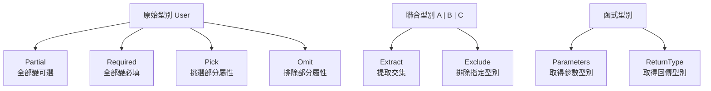

# TypeScript 工具類型實戰指南

> 📝 TL;DR：TypeScript 內建了一堆工具類型，讓你不用自己寫重複的型別定義。Pick 挑選、Omit 排除、Partial 變可選、Record 建立物件... 用好這些，你的型別定義會乾淨很多。

## 這篇你會學到

1. TypeScript 工具類型是什麼？為什麼要用？
2. 常用工具類型：Pick、Omit、Partial、Required
3. 進階工具類型：Record、Extract、Exclude、ReturnType
4. 實戰範例：API 回傳型別、表單處理
5. 什麼時候該用哪個？

## 前置知識

這篇要懂這些才不會卡住：

- TypeScript 基礎（型別註解、介面、型別別名）
- 知道 `type` 和 `interface` 的差異（其實差不多，用 `type` 就對了）
- 理解什麼是「可選屬性」（`?` 這個符號）

如果你連 `type User = { name: string }` 都看不懂... 先去翻 TypeScript 入門吧，不然我講 `Pick<T, K>` 你會以為是打電動的指令 XD

## 工具類型是什麼？

TypeScript 內建了一組「工具類型」（Utility Types），用來轉換現有的型別。

比如你有一個 `User` 型別：

```ts
type User = {
  id: string;
  name: string;
  email: string;
  age: number;
};
```

現在你想要一個「更新使用者」的型別，但所有欄位都是可選的。你可以：

```ts
// ❌ 蠻幹法：重寫一遍
type UpdateUser = {
  id?: string;
  name?: string;
  email?: string;
  age?: number;
};

// ✅ 聰明法：用 Partial
type UpdateUser = Partial<User>;
```

工具類型就是讓你少寫重複的程式碼。

## 型別關係圖



## 常用工具類型

### Pick：挑選屬性

`Pick<T, K>` 從型別 T 中挑選指定的屬性 K。

```ts
type User = {
  id: string;
  name: string;
  email: string;
  age: number;
};

// 只挑 name 和 age
type UserNameAndAge = Pick<User, 'name' | 'age'>;
// 等於 { name: string; age: number; }

// 實際應用：API 只回傳部分欄位
function getUserName(user: Pick<User, 'id' | 'name'>) {
  return user.name;
}

getUserName({ id: '1', name: 'Lucas' }); // ✅ OK
getUserName({ id: '1', name: 'Lucas', email: 'a@b.c' }); // ❌ 多餘屬性
```

**使用場景：**
- API 回傳的資料只需要部分欄位
- 表單只需要填寫部分資料

### Omit：排除屬性

`Omit<T, K>` 從型別 T 中排除指定的屬性 K。跟 Pick 相反。

```ts
type User = {
  id: string;
  name: string;
  email: string;
  age: number;
};

// 排除 id（建立使用者時不需要 id）
type CreateUserData = Omit<User, 'id'>;
// 等於 { name: string; email: string; age: number; }

// 實際應用：建立使用者
function createUser(data: Omit<User, 'id'>): User {
  const id = crypto.randomUUID();
  return { id, ...data };
}

createUser({ name: 'Lucas', email: 'a@b.c', age: 20 }); // ✅
createUser({ id: '1', name: 'Lucas', email: 'a@b.c', age: 20 }); // ❌ 不能有 id
```

**使用場景：**
- 建立資料時排除 id（通常由後端產生）
- 更新資料時排除某些不可變的欄位

### Partial：全部變可選

`Partial<T>` 把型別 T 的所有屬性都變成可選。

```ts
type User = {
  id: string;
  name: string;
  email: string;
};

type PartialUser = Partial<User>;
// 等於 { id?: string; name?: string; email?: string; }

// 實際應用：更新使用者（部分更新）
function updateUser(id: string, data: Partial<User>) {
  // 只更新傳入的欄位
}

updateUser('1', { name: 'New Name' }); // ✅ 只改 name
updateUser('1', { name: 'New', email: 'new@mail.com' }); // ✅ 改兩個
updateUser('1', {}); // ✅ 什麼都不改也行
```

**使用場景：**
- 部分更新（PATCH 請求）
- 表單的初始值可能為空

### Required：全部變必填

`Required<T>` 跟 Partial 相反，把所有可選屬性都變必填。

```ts
type User = {
  id: string;
  name: string;
  age?: number; // 可選
  bio?: string; // 可選
};

type RequiredUser = Required<User>;
// 等於 { id: string; name: string; age: number; bio: string; }

// 實際應用：強制填寫所有欄位
function createFullUser(data: Required<Omit<User, 'id'>>) {
  // ...
}

createFullUser({ name: 'Lucas', age: 20, bio: 'Hello' }); // ✅
createFullUser({ name: 'Lucas' }); // ❌ 缺 age 和 bio
```

**使用場景：**
- 某些情況需要強制填寫所有欄位
- 表單驗證階段

## 進階工具類型

### Record：建立物件型別

`Record<K, V>` 建立一個物件型別，鍵是 K，值是 V。

```ts
// 鍵是 string，值是 number
type AgeMap = Record<string, number>;
// 等於 { [key: string]: number; }

const ages: AgeMap = {
  lucas: 20,
  amy: 25,
  john: 30
};

// 實際應用：路由配置
type Route = {
  path: string;
  component: string;
};

type Routes = Record<string, Route>;

const routes: Routes = {
  home: { path: '/', component: 'Home' },
  about: { path: '/about', component: 'About' }
};
```

**使用場景：**
- 字典/映射表
- 物件鍵值對配置

### Extract：提取交集

`Extract<T, U>` 從聯合型別 T 中提取屬於 U 的型別。

```ts
type Role = 'admin' | 'user' | 'moderator';
type SystemRole = 'admin' | 'user' | 'system' | 'guest';

// 取交集
type CommonRole = Extract<Role, SystemRole>;
// 等於 'admin' | 'user'

// 實際應用：只處理雙方都有的角色
function assignRole(role: Extract<Role, SystemRole>) {
  // role 只能是 'admin' 或 'user'
}

assignRole('admin'); // ✅
assignRole('moderator'); // ❌ SystemRole 沒有這個
```

### Exclude：排除型別

`Exclude<T, U>` 從聯合型別 T 中排除屬於 U 的型別。跟 Extract 相反。

```ts
type Role = 'admin' | 'user' | 'moderator';
type SystemRole = 'admin' | 'system';

// 從 Role 排除 SystemRole 有的
type NonSystemRole = Exclude<Role, SystemRole>;
// 等於 'user' | 'moderator'

// 實際應用：排除系統保留角色
type EditableRole = Exclude<Role, 'admin'>;
// 等於 'user' | 'moderator'
```

### ReturnType：取得回傳型別

`ReturnType<T>` 取得函式的回傳值型別。

```ts
function getUser() {
  return { id: '1', name: 'Lucas', age: 20 };
}

type User = ReturnType<typeof getUser>;
// 等於 { id: string; name: string; age: number; }

// 實際應用：不需要手動定義回傳型別
function fetchUsers() {
  return Promise.resolve([{ id: '1', name: 'Lucas' }]);
}

type UsersPromise = ReturnType<typeof fetchUsers>;
// Promise<{ id: string; name: string; }[]>
```

### Parameters：取得參數型別

`Parameters<T>` 取得函式參數的型別組成的元組。

```ts
function greet(name: string, age: number) {
  return `Hello, ${name}!`;
}

type GreetParams = Parameters<typeof greet>;
// 等於 [string, number]

// 實際應用：包裝函式時保留原參數型別
function wrappedGreet(...args: Parameters<typeof greet>) {
  console.log('Calling greet...');
  return greet(...args);
}
```

### NonNullable：移除 null 和 undefined

`NonNullable<T>` 從型別中移除 null 和 undefined。

```ts
type MaybeString = string | null | undefined;
type DefinitelyString = NonNullable<MaybeString>;
// 等於 string

// 實際應用：處理可能為空的值
function processValue(value: string | null) {
  const safeValue: NonNullable<typeof value> = value ?? 'default';
  // safeValue 是 string
}
```

### Awaited：解開 Promise

`Awaited<T>` 取得 Promise 內部的型別。

```ts
type AsyncResult = Promise<string>;
type Result = Awaited<AsyncResult>;
// 等於 string

// 巢狀 Promise 也會解開
type NestedPromise = Promise<Promise<number>>;
type NumberResult = Awaited<NestedPromise>;
// 等於 number（不是 Promise<number>）

// 實際應用：async 函式的回傳型別
async function fetchUser() {
  return { id: '1', name: 'Lucas' };
}

type User = Awaited<ReturnType<typeof fetchUser>>;
// { id: string; name: string; }
```

## 組合使用

工具類型可以組合起來用，威力更強：

### 組合範例 1：建立資料型別

```ts
type User = {
  id: string;
  name: string;
  email: string;
  role: 'admin' | 'user';
  createdAt: Date;
};

// 建立使用者：排除 id 和 createdAt
type CreateUserInput = Omit<User, 'id' | 'createdAt'>;

// 更新使用者：全部可選，排除不可變的欄位
type UpdateUserInput = Partial<Omit<User, 'id' | 'createdAt'>>;

// API 回傳：可能沒有 email
type UserResponse = Partial<Pick<User, 'email'>> & Omit<User, 'email'>;
```

### 組合範例 2：表單型別

```ts
type FormField = {
  value: string;
  error?: string;
  touched: boolean;
};

type FormFields<T> = Record<keyof T, FormField>;

type UserForm = {
  name: string;
  email: string;
  age: number;
};

type UserFormState = FormFields<UserForm>;
// {
//   name: { value: string; error?: string; touched: boolean; };
//   email: { value: string; error?: string; touched: boolean; };
//   age: { value: string; error?: string; touched: boolean; };
// }
```

## 實戰練習

### 練習 1：Pick 基礎（簡單）⭐

**任務：** 定義一個 `UserPreview` 型別，只包含 `id`、`name`、`avatar`。

```ts
type User = {
  id: string;
  name: string;
  avatar: string;
  email: string;
  password: string;
  createdAt: Date;
};

// 請在這裡定義 UserPreview
type UserPreview = // ???
```

:::details 參考答案

```ts
type UserPreview = Pick<User, 'id' | 'name' | 'avatar'>;
// 等於 { id: string; name: string; avatar: string; }
```
:::

### 練習 2：Omit 應用（簡單）⭐

**任務：** 定義一個 `CreateProductInput` 型別，排除 `id` 和 `createdAt`。

```ts
type Product = {
  id: string;
  name: string;
  price: number;
  description: string;
  createdAt: Date;
};

// 請在這裡定義 CreateProductInput
type CreateProductInput = // ???
```

:::details 參考答案

```ts
type CreateProductInput = Omit<Product, 'id' | 'createdAt'>;
// 等於 { name: string; price: number; description: string; }
```
:::

### 練習 3：組合應用（中等）⭐⭐

**任務：** 定義以下型別：

1. `UpdateUserInput`：更新使用者，所有欄位可選，但 `id` 不可變
2. `PublicUser`：公開的使用者資訊，排除 `password`

```ts
type User = {
  id: string;
  name: string;
  email: string;
  password: string;
  role: 'admin' | 'user';
};

// 1. UpdateUserInput
// 2. PublicUser
```

:::details 參考答案

```ts
// 1. 更新使用者：Partial + Omit
type UpdateUserInput = Partial<Omit<User, 'id'>>;
// { name?: string; email?: string; password?: string; role?: 'admin' | 'user'; }

// 2. 公開資訊：Omit
type PublicUser = Omit<User, 'password'>;
// { id: string; name: string; email: string; role: 'admin' | 'user'; }

// 實際應用
function updateUser(id: string, data: UpdateUserInput) {
  // ...
}

function getPublicProfile(user: User): PublicUser {
  const { password, ...public } = user;
  return public;
}
```
:::

## 工具類型速查表

| 工具類型 | 作用 | 用途 |
|----------|------|------|
| `Pick<T, K>` | 挑選屬性 | 只要部分欄位 |
| `Omit<T, K>` | 排除屬性 | 排除某些欄位 |
| `Partial<T>` | 全部變可選 | 部分更新 |
| `Required<T>` | 全部變必填 | 強制填寫 |
| `Record<K, V>` | 建立物件型別 | 字典/映射 |
| `Extract<T, U>` | 提取交集 | 取共同型別 |
| `Exclude<T, U>` | 排除型別 | 移除某些型別 |
| `ReturnType<T>` | 取得回傳型別 | 推導函式回傳 |
| `Parameters<T>` | 取得參數型別 | 推導函式參數 |
| `NonNullable<T>` | 移除 null/undefined | 確保非空 |
| `Awaited<T>` | 解開 Promise | 取得 Promise 內容 |

## 常見問題 FAQ

### Q: Pick 和 Omit 什麼時候用哪個？

A: 看你要選的屬性多還是少：

```ts
type User = { a: string; b: string; c: string; d: string; e: string };

// 只要 a 和 b → 用 Pick
type AB = Pick<User, 'a' | 'b'>;

// 只要 c、d、e → 用 Omit（排除 a 和 b）
type CDE = Omit<User, 'a' | 'b'>;

// 兩個結果一樣，選短的寫
```

### Q: 為什麼 Partial 的屬性前面有 `?`？

A: `?` 表示「可選」，意思是可以不填。`Partial` 就是把每個屬性都加 `?`。

```ts
type User = { name: string };  // 必填
type PartialUser = Partial<User>;  // { name?: string }
```

### Q: `Record<string, any>` 和 `object` 差在哪？

A:

```ts
// Record 比較精確
type StringMap = Record<string, string>;
// 值只能是 string

// object 太寬鬆
type AnyObject = object;
// 任何非原始型別都行
```

能用具體型別就用具體型別，`any` 和 `object` 能不用就不用。

### Q: 可以自訂工具類型嗎？

A: 可以！TypeScript 的工具類型都是用泛型實現的：

```ts
// 自己做一個 Nullable
type MyNullable<T> = T | null;

type MaybeString = MyNullable<string>;  // string | null

// 自己做一個 Readonly
type MyReadonly<T> = {
  readonly [K in keyof T]: T[K];
};

type ReadonlyUser = MyReadonly<{ name: string }>;
// { readonly name: string; }
```

## 延伸閱讀

### 本站相關文章

- [SQL GROUP BY 與 HAVING](/database/sql/sql-group-by-having) — 資料分組統計

### 外部資源

- [TypeScript 官方文件：Utility Types](https://www.typescriptlang.org/docs/handbook/utility-types.html)
- [TypeScript Handbook](https://www.typescriptlang.org/docs/handbook/)

---

把這些工具類型用熟，你的 TypeScript 會寫得比以前快很多。不用再複製貼上型別定義，一個 `Pick` 或 `Omit` 就搞定。:D
